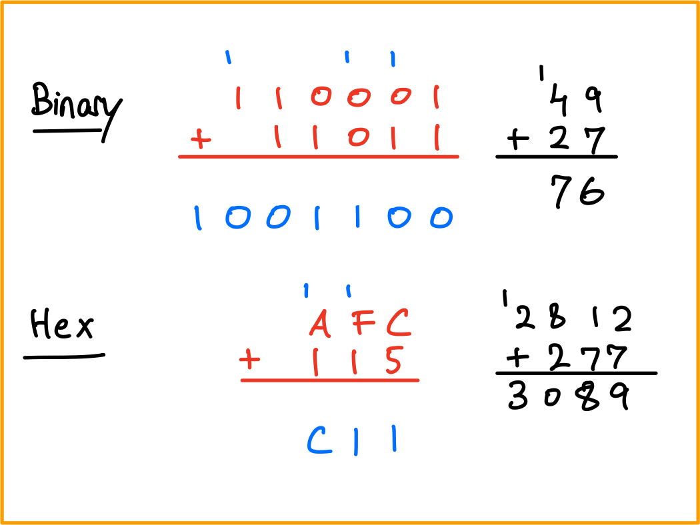
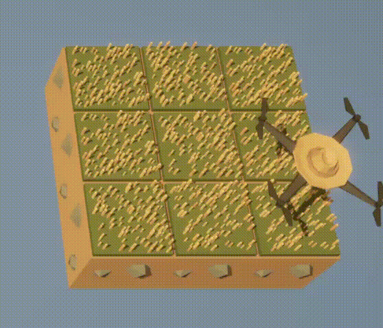
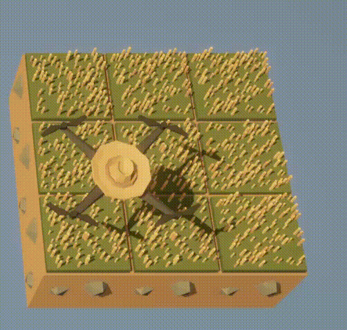

::: {.content-hidden unless-meta="solutions"}
# Solutions {.unnumbered}

:::

::: {.content-hidden when-meta="solutions"}

|              |                                              |
| ------------ | -------------------------------------------- | 
| Due Date     | Thu, Sep 17                                  | 
| Turn in link | Gradescope [code](https://moodle.swarthmore.edu/mod/lti/view.php?id=829963) and [PDF](https://moodle.swarthmore.edu/mod/lti/view.php?id=829963) | 
| URL          | `emadmasroor.github.io/E21-F26/Homework/HW2` |


[What to turn in]{.underline}

For this assignment, you will turn in a combined PDF file as well as multiple code files.

| PDF            | Code                       |
| -------------- | -------------------------- |
| 1              | 3                          |
| 2              | 4.5, 4.9, 4.12, 4.15, 4.16 |
| 4.4, 4.7, 4.11 |                            |

::: {.callout-warning}
For full credit, show how you arrived at your answers; don't just write the correct answer!
:::

:::

# Converting between number systems


## from Decimal to Binary

1. `100`

   ::: {.content-hidden unless-meta="solutions"}
   ::: {.callout-tip}
   ## Answer
   `0b1100100`
   :::
   :::
2. `1029`

   ::: {.content-hidden unless-meta="solutions"}
   ::: {.callout-tip}
   ## Answer
   `0b10000000101`
   :::
   :::
3. `476`

   ::: {.content-hidden unless-meta="solutions"}
   ::: {.callout-tip}
   ## Answer
   `0b111011100`
   :::
   :::
4. $1.4 \times 10^{3}$

   ::: {.content-hidden unless-meta="solutions"}
   ::: {.callout-tip}
   ## Answer
   `0b10101111000`
   :::
   :::


## from Binary to Decimal

1. `0b1011011`

   ::: {.content-hidden unless-meta="solutions"}
   ::: {.callout-tip}
   ## Answer
   $91$
   :::
   :::
2. `0b110010101`

   ::: {.content-hidden unless-meta="solutions"}
   ::: {.callout-tip}
   ## Answer
   $405$
   :::
   :::
3. `0b1000000001`

   ::: {.content-hidden unless-meta="solutions"}
   ::: {.callout-tip}
   ## Answer
   $513$
   :::
   :::
4. `0b10111`

   ::: {.content-hidden unless-meta="solutions"}
   ::: {.callout-tip}
   ## Answer
   $23$
   :::
   :::

## from Decimal to Hexadecimal

1. `1000`

   ::: {.content-hidden unless-meta="solutions"}
   ::: {.callout-tip}
   ## Answer
   `0x3E8`
   :::
   :::
2. `176`

   ::: {.content-hidden unless-meta="solutions"}
   ::: {.callout-tip}
   ## Answer
   `0xB0`
   :::
   :::
3. `42678`

   ::: {.content-hidden unless-meta="solutions"}
   ::: {.callout-tip}
   ## Answer
   `0xA6B6`
   :::
   :::
4. `81`

   ::: {.content-hidden unless-meta="solutions"}
   ::: {.callout-tip}
   ## Answer
   `0x51`
   :::
   :::

## from Hexadecimal to Decimal

1. `0x14E3`

   ::: {.content-hidden unless-meta="solutions"}
   ::: {.callout-tip}
   ## Answer
   $5,347$
   :::
   :::
2. `0xA10B`

   ::: {.content-hidden unless-meta="solutions"}
   ::: {.callout-tip}
   ## Answer
   $41,227$
   :::
   :::
3. `0x1000`

   ::: {.content-hidden unless-meta="solutions"}
   ::: {.callout-tip}
   ## Answer
   $4,096$
   :::
   :::
4. `0x1010`

   ::: {.content-hidden unless-meta="solutions"}
   ::: {.callout-tip}
   ## Answer
   $4,112$
   :::
   :::

# Base systems

## A new base: 7

1. Write down all numbers from 1 to 16 in base 7.

   ::: {.content-hidden unless-meta="solutions"}
   ::: {.callout-tip}
   ## Solution
   The numbers from one to sixteen in base 7 will be: $\{1,2,3,4,5,6,\}$ followed by the number $10$, which equals seven, and then $11$, which equals eight, and so on. In base 7, the sequence would be $$\{1,2,3,4,5,6,10,11,12,13,14,15,16,20,21,22\}$$
   :::
   :::

2. In base 7, what is the meaning of the symbol `66` ? Explain.

   ::: {.content-hidden unless-meta="solutions"}
   ::: {.callout-tip}
   ## Solution
   In base 7, this would need to be interpreted as follows.
   $$6 \times 7^0 + 6 \times 7^1 = 6_{10} + 42_{10} = 48_{10}$$
   Therefore, the symbol `66` in base 7 corresponds to the number forty-eight.
   :::
   :::

3. What is the largest possible four-'digit' number in base 7? Write the number in words, in decimal form, and in base-7 form.

   ::: {.content-hidden unless-meta="solutions"}
   ::: {.callout-tip}
   ## Solution
   The largest possible four-'digit' number in base 7 is $6666_7$. In decimal form, this would be 
   $$6 \times 7^0 + 6 \times 7^1 + 6 \times 7^2 + 6 \times 7^3 = 6_{10} + 42_{10} + 294_{10} + 2058_{10} = 2400_{10}.$$ In words, it is the number two thousand four hundred.
   :::
   :::



## Addition of binary and hexadecimal numbers

In grade school, you learned how to add two multi-digit numbers by hand. In case, you’ve forgotten, [here’s](https://www.youtube.com/watch?v=mAvuom42NyY) a video explaining this to elementary school students.

Your task in this problem is to carry out multi-'digit' addition, by hand, to binary and hexadecimal numbers. In the process, you will see the concept of ‘carrying over’ a digit (perhaps you learned the term ‘regrouping’) applies to numbers other than base ten.

As an example, the following sums have been computed for you below.

- `0b110001` + `0b11011`
- `0xAFC` + `0x115`

{width="50%"}

## Hex

1. `0xE5A` + `0x85A`

   ::: {.content-hidden unless-meta="solutions"}
   ::: {.callout-tip}
   ## Answer
   $5812$ in decimal form and `0x16B4` in hexadecimal form
   :::
   :::

2. `0xEE` + `0x99`

   ::: {.content-hidden unless-meta="solutions"}
   ::: {.callout-tip}
   ## Answer
   $391$ in decimal form and `0x187` in hexadecimal form
   :::
   :::

3. `0x100` + `0x20`

   ::: {.content-hidden unless-meta="solutions"}
   ::: {.callout-tip}
   ## Answer
   $288$ in decimal form and `0x120` in hexadecimal form
   :::
   :::

4. `0xB0` + `0xB`

   ::: {.content-hidden unless-meta="solutions"}
   ::: {.callout-tip }
   ## Answer
   $187$ in decimal form and `0xBB` in hexadecimal form
   :::
   :::

## Binary

1. `0b1011011` + `0b11011001`

   ::: {.content-hidden unless-meta="solutions"}
   ::: {.callout-tip}
   ## Answer
   $308$ in decimal form and `0b100110100` in hexadecimal form
   :::
   :::

2. `0b10011` + `0b100110001`

   ::: {.content-hidden unless-meta="solutions"}
   ::: {.callout-tip}
   ## Answer
   $324$ in decimal form and `0b101000100` in hexadecimal form
   :::
   :::

3. `0b10000000000` + `0b1011111`

   ::: {.content-hidden unless-meta="solutions"}
   ::: {.callout-tip}
   ## Answer
   $1119$ in decimal form and `0b10001011111` in hexadecimal form
   :::
   :::

4. `0b11010001001` + `0b110110110`

   ::: {.content-hidden unless-meta="solutions"}
   ::: {.callout-tip}
   ## Answer
   $2111$ in decimal form and `0b100000111111` in hexadecimal form
   :::
   :::



# Conditionals and loops

## Counter variables

Consider the following program, which counts the number of times pin A7 has been tapped and assigns `color1` to pixel number `k`, where `k` is the number of times pin A7 has been tapped. The code crashes if pin A7 is touched more than 10 times.

```{.python}
from adafruit_circuitplayground.express import cpx
import time
off = (0,0,0)
color1 = (10,30,10)
color2 = (30,10,10)
cpx.pixels.fill(off)
k = -1
while True:
    time.sleep(0.2)
    if cpx.touch_A7:
        k += 1
        cpx.pixels[k] = color1
        cpx.pixels[k-1] = off
```

Modify this code so that it has the same behavior for up to 10 taps, but for taps 11 through 20, a different color is assigned to the `p`th pixel, where `p` is `k-10`. Your code will still fail after the 21st tap is detected; that's fine.

::: {.content-hidden when-format="pdf"}

:::

::: {.content-hidden unless-meta="solutions"}
::: {.callout-tip}
## Solution

```{.python}
from adafruit_circuitplayground.express import cpx
import time
off = (0,0,0)
color1 = (10,30,10)
color2 = (30,10,10)
cpx.pixels.fill(off)
k = -1
while True:
    time.sleep(0.2)
    if cpx.touch_A7:
        k += 1
        if k < 10:
            cpx.pixels[k] = color1
            cpx.pixels[k-1] = off
        elif k < 20:
            cpx.pixels[k % 10] = color2
            cpx.pixels[(k % 10)-1] = off
```
:::
:::

## The `continue` keyword

The following progam was written with the intention of printing all numbers except for 9. However, the program currently fails at doing this. What one change will ensure that printing '9' is skipped? Turn in the new code.

```{.python}
import time
k = 0
while True:
    time.sleep(0.5)
    k += 1
    print(k)
    if k == 9:
        continue
```

::: {.content-hidden unless-meta="solutions"}
::: {.callout-tip}
## Solution

```{.python}
import time
k = 0
while True:
    time.sleep(0.5)
    k += 1
    if k == 9:
        continue
    print(k)
```
:::
:::

## The `break` keyword

In class, we saw that the following code allows us to terminate the inner `while` loop by touching pin A2.

```{.python}
from adafruit_circuitplayground.express import cpx
import time
k = 0
while True:
    time.sleep(1)
    k += 1
    print(f"Outer iteration {k}")
    if k % 3 == 0: # k ÷ 3 has remainder 0
        m = 0
        while True:
            time.sleep(1)
            m += 1
            print(f"Outer iteration {k}, inner iteration {m} ")
            if cpx.touch_A2:
                print("terminating")
                break
```

Change the code above so that it meets the following requirements:

- Touching A2 while in the inner loop should terminate inner loop.
- Touching A2 while in the outer loop should not do anything.
- Touching A7 alone while in the inner loop should now **also** terminate inner loop.
- Touching A7 _while pressing button B_ while in the outer loop should terminate the outer loop.

::: {.content-hidden unless-meta="solutions"}
::: {.callout-tip}
## Solution

```{.python}
from adafruit_circuitplayground.express import cpx
import time
counter1 = 0
while True:
    time.sleep(1)
    counter1 += 1
    print(f"Outer iteration {counter1}")
    if counter1 % 3 == 0: # k ÷ 3 has remainder 0
        counter2 = 0
        while True:
            time.sleep(1)
            counter2 += 1
            print(f"Outer iteration {counter1}, inner iteration {counter2}")
            if cpx.touch_A2:
                print("terminating inner loop")
                break
            elif cpx.touch_A7 and cpx.button_b:
                print("terminating inner loop")
                break
            elif cpx.touch_A7:
                print("terminating inner loop")
                break
        if cpx.touch_A7 and cpx.button_b:
            print("terminating outer loop")
            break
```
:::
:::

## The `time` functions

The function `time.monotonic()` can be used to measure intervals of time. For example, the following code measures how long after the red LED comes on the user presses button B. 

```{.python}
from adafruit_circuitplayground.express import cpx
import time
cpx.red_led = True
start_time = time.monotonic()
while True:
    time.sleep(0.01)
    if cpx.button_b:
        end_time = time.monotonic()
        interval = end_time - start_time
        break
print(f"Interval was {interval} seconds")
```

Rewrite the code above so that it executes the same functionality without using `break` or `if`.

::: {.content-hidden unless-meta="solutions"}
::: {.callout-tip}
## Solution

```{.python}
from adafruit_circuitplayground.express import cpx
import time
cpx.red_led = True
start_time = time.monotonic()
while not cpx.button_b:
    time.sleep(0.01)
end_time = time.monotonic()
interval = end_time - start_time
print(f"Interval was {interval} seconds")
```
:::
:::



# The Farmer Was Replaced

For this part of the assignment, you will have to make progress on the game [The Farmer Was Replaced](https://store.steampowered.com/app/2060160/The_Farmer_Was_Replaced/). You will be provided a gift card for the game soon.

Start a new game and complete the following tasks in order. Only the marked tasks require a submission; those that are not in bold are not associated with any submission.

::: {.callout-note}
It is important that you avoid unlocking any options other than the ones explicitly listed. If you accidentally unlock more features, you should re-start the game.
:::

1. Harvest (grass) five times
2. Unlock `while`
3. Use the `while` loop to harvest 200 units of hay.
4. ☞ Describe, in words, what the drone does using each of these snippets of code.
   - Option 1

     ```{.python}
     while True:
        do_a_flip()
        while True:
          harvest()
     ```
     ::: {.content-hidden unless-meta="solutions"}
     ::: {.callout-tip}
     ## Answer
     Drone does one flip, and after that continues harvesting for ever.
     :::
     :::
   - Option 2

     ```{.python}
     while True:
        harvest()
        while True:
          do_a_flip()
     ```
     ::: {.content-hidden unless-meta="solutions"}
     ::: {.callout-tip}
     ## Answer
     Drone harvests once, then does flips for ever.
     :::
     :::
   - Option 3

     ```{.python}
     while True:
        harvest()
        do_a_flip()
     ```
     ::: {.content-hidden unless-meta="solutions"}
     ::: {.callout-tip}
     ## Answer
     Drone harvests and flips in turn until the end of time.
     :::
     :::
   - Option 4

     ```{.python}
     while True:
        do_a_flip()
        harvest()
     ```
     ::: {.content-hidden unless-meta="solutions"}
     ::: {.callout-tip}
     ## Answer
     Drone harvests and flips in turn until the end of time, but starts with a flip instead of a harvest.
     :::
     :::
   - Option 5

     ```{.python}
     while True:
        do_a_flip()
     harvest()
     ```
     ::: {.content-hidden unless-meta="solutions"}
     ::: {.callout-tip}
     ## Answer
     Drone does flips for ever, never harvests.
     :::
     :::
   - Option 6

     ```{.python}
     while True:
        harvest()
     do_a_flip()
     ```

     ::: {.content-hidden unless-meta="solutions"}
     ::: {.callout-tip}
     ## Answer
     Drone harvests for ever, never does a flip.
     :::
     :::
5. ☞ Write code that executes a flip if a harvest isn't available, and harvests if possible.

   ::: {.content-hidden unless-meta="solutions"}
   ::: {.callout-tip}
   ## Answer
   The following code does the trick.
   ```{.python}
   if can_harvest():
      harvest()
   else:
      do_a_flip()
   ```
   :::
   :::

6. Unlock speed (1/5 only)
7. ☞ Explain why, after unlocking speed, the following code no longer works.
   ```{.python}
   while True:
      harvest()
   ```
   ::: {.content-hidden unless-meta="solutions"}
   ::: {.callout-tip}
   ## Answer
   Because there is not enough time for the grass to grow before it is harvested.
   :::
   :::
8. Unlock bush planting
9. ☞ Write a program that causes the drone to keep doing flips as it waits for bushes to grow, and  harvests them when they're ready to be harvested. It immediately plants a bush once it is done harvesting. 

   ::: {.content-hidden unless-meta="solutions"}
   ::: {.callout-tip}
   ## Answer
   The following code does the trick.
   ```{.python}
   while True:
    if can_harvest():
      harvest()
      plant(Entities.Bush)
    else:
      do_a_flip()
   ```
   :::
   :::

10. Expand the farm. It should now be size 3 x 1.
11. ☞ Describe in words what the following code does.

    ```{.python}
    while True:
        if can_harvest():
          harvest()
          plant(Entities.Bush)
        else:
          move(North)
    ```

    ::: {.content-hidden unless-meta="solutions"}
    ::: {.callout-tip}
    ## Answer
    This plants bushes on the entire 3 x 1 farm continuously, harvesting them as they grow.
    :::
    :::
12. ☞ We would like to write a program that makes good use of our agricultural resources by planting bushes on two of the plots and grass on the middle plot. It may be helpful to use the following snippet of code for this purpose.

    ```{.python}
    clear()
    plant(Entities.Bush)
    move(North)
    move(North)
    plant(Entities.Bush)
    move(North)
    ```

    Taking inspiration from the above code if necessary, write a script that, when run, continuously plants bushes on the two outer plots, allows grass to grow on the middle spot, and harvests all three plots one by one for ever. The first line in your code should be `clear()`

    ::: {.content-hidden unless-meta="solutions"}
    ::: {.callout-tip}
    ## Solution
    The following code does the trick.
    ```{.python}
    clear()
    while(True):
        if can_harvest():
            # Plant bush and harvest
            harvest()
            plant(Entities.Bush)
            move(North)
            # Harvest grass. grows automatically
            harvest()
            move(North)
            # Plant bush and harvest
            harvest()
            plant(Entities.Bush)
            move(North)
    ```
    :::
    :::

13. Unlock carrots.
14. Expand the farm one more time, getting to a 3 x 3 size.
15. ☞ Without using `for` loops, achieve the functionality shown by the following gif. It is possible to do so using just 9 lines of code. The first line should be `clear()`.

    ::: {.content-hidden when-format="pdf"}
    
    :::

    ::: {.content-hidden unless-meta="solutions"}
    ::: {.callout-tip}
    ## Solution
    The following code does the trick.
    ```{.python}
    clear()
    while True:
      till()
      move(East)
      till()
      move(East)
      till()
      move(East)
      move(North)
    ```
    :::
    :::
    
16. ☞ The following code, when executed, produces the functionality shown in the gif below.
    ```{.python}
    clear()
    till()
    move(East)
    till()
    move(East)
    till()
    move(East)
    while True:
      # First row
      if can_harvest():
        harvest()
      plant(Entities.Carrot)
      move(East)
      if can_harvest():
        harvest()
      plant(Entities.Carrot)
      move(East)
      if can_harvest():
        harvest()
      plant(Entities.Carrot)
      move(East)
      move(North)
      # Second row: Grass
      if can_harvest():
        harvest()
      move(East)
      if can_harvest():
        harvest()
      move(East)
      if can_harvest():
        harvest()
      move(East)
      move(North)
      # Third row
      if can_harvest():
        harvest()
      plant(Entities.Bush)
      move(East)
      if can_harvest():
        harvest()
      plant(Entities.Bush)
      move(East)
      if can_harvest():
        harvest()
      plant(Entities.Bush)
      move(East)
      move(North)
    ```

    ::: {.content-hidden when-format="pdf"}
    
    :::

    Modify the above code so that carrots are in the middle row and grass in the bottom row. The bushes should still be in the top row.

    ::: {.content-hidden unless-meta="solutions"}
    ::: {.callout-tip}
    # Solution
    ```{.python}
    clear()
    move(North)
    till()
    move(East)
    till()
    move(East)
    till()
    move(East)
    move(South)
    while True:
      # First row: Grass
      if can_harvest():
        harvest()
      move(East)
      if can_harvest():
        harvest()
      move(East)
      if can_harvest():
        harvest()
      move(East)
      move(North)
      # Second row: Carrots
      if can_harvest():
        harvest()
      plant(Entities.Carrot)
      move(East)
      if can_harvest():
        harvest()
      plant(Entities.Carrot)
      move(East)
      if can_harvest():
        harvest()
      plant(Entities.Carrot)
      move(East)
      move(North)
      # Third row
      if can_harvest():
        harvest()
      plant(Entities.Bush)
      move(East)
      if can_harvest():
        harvest()
      plant(Entities.Bush)
      move(East)
      if can_harvest():
        harvest()
      plant(Entities.Bush)
      move(East)
      move(North)
    ```
    :::
    :::


