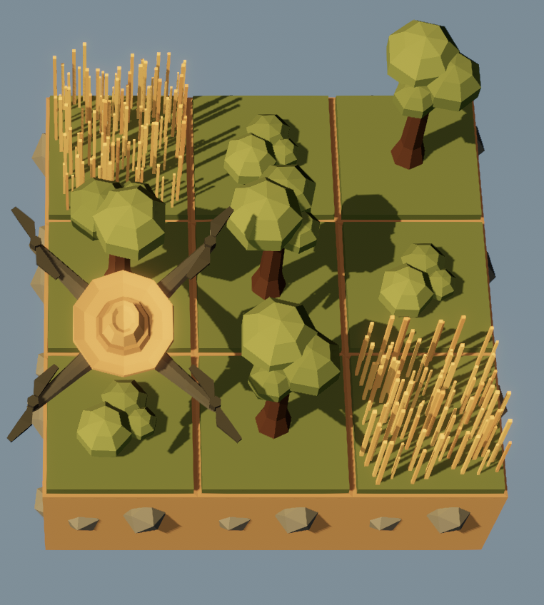
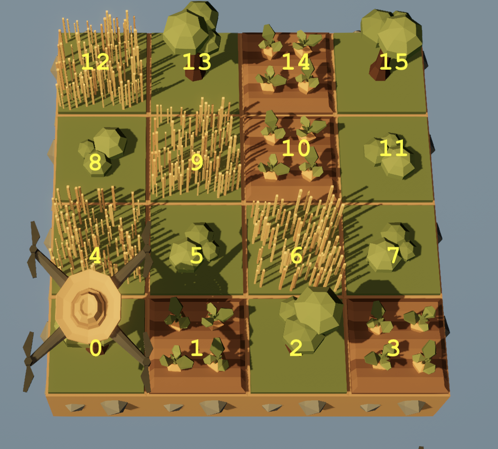
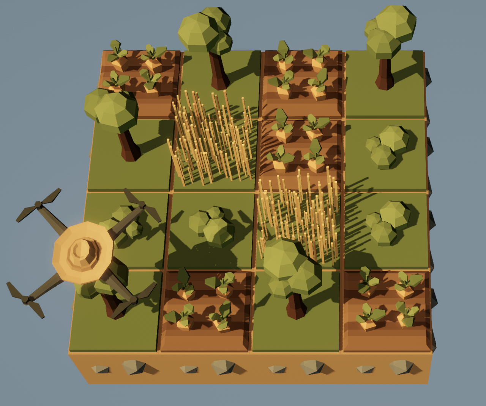
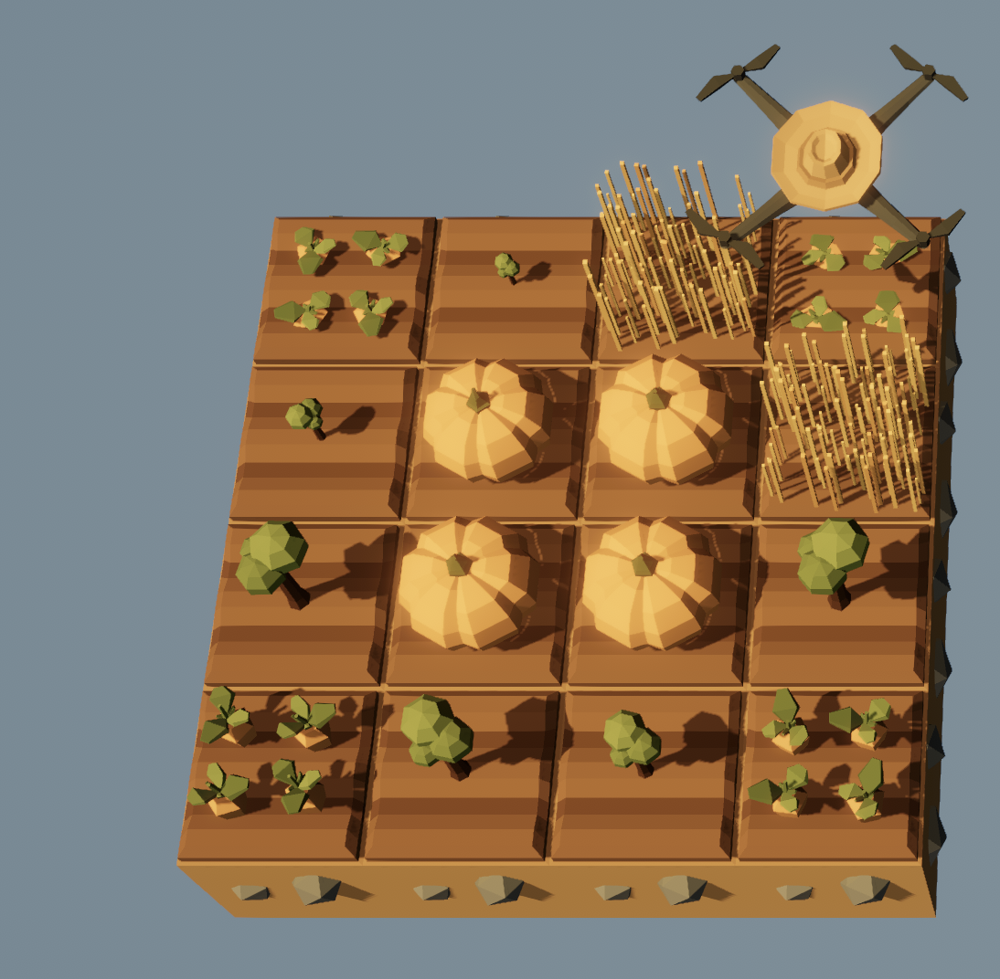

::: {.content-hidden unless-meta="solutions"}
# Solutions {.unnumbered}

:::

::: {.content-hidden when-meta="solutions"}

|              |                                              |
| ------------ | -------------------------------------------- | 
| Due Date     | Thu, Sep 24                                  | 
| Turn in link | Gradescope [code](https://moodle.swarthmore.edu/mod/lti/view.php?id=831400) and [PDF](https://moodle.swarthmore.edu/mod/lti/view.php?id=831402) | 
| URL          | `emadmasroor.github.io/E21-F26/Homework/HW3` |


[What to turn in]{.underline}

For this assignment, you will turn in a PDF file as well as multiple code files. Each entry in the following table should be its own `.py` file.


| Problem | Format |
| ------- | ------ |
| 1       | PDF    |
| 2       | Code   |
| 3.1     | Code   |
| 3.2     | Code   |
| 3.3     | Code   |
| 4.1     | Code   |
| 4.2     | Code   |
| 4.3     | Code   |

:::

# Accuracy and Precision of timing the Circuit Playground Express

When we want to use the Circuit Playground Express to execute a task once every `x` seconds, where `x` is a small number, a typical approach is to write a `for` or `while` loop that contains a statement of the form `time.sleep(x)`.

For example, the following code

```{.python}
from adafruit_circuitplayground.express import cpx
import time
for j in range(5):
    cpx.pixels[j] = (50,0,0)
    time.sleep(0.5)
```

will light up a NeoPixel approximately once every 0.5 seconds.

In this problem, you will attempt to measure how close to `x` the Circuit Playground Express can get when the delay time is made smaller and smaller. You will make use of the following script, which runs a loop for `N` steps with an attempted time delay of `x` and prints out the result. The loop doesn't actually execute any code other than `sleep`ing for `x` seconds (line 14) and recording the time (line 15).

:::{.callout-note}
## Lighting up the lights one by one

If you'd like to see this visually, you can substitute the following three lines in place of line 14:

```{.python}
cpx.pixels[j % 10] = (0,0,50)
time.sleep(delay)
cpx.pixels[j % 10] = (0,0,0)
```

However, this will slow down your board by a lot, so don't use this for your actual results. 
:::

```{.python}
import time
from adafruit_circuitplayground.express import cpx
from statisticalfunctions import stdev
def mean(list): return sum(list)/len(list) 

# Change these parameters
delay = 0.001
N = 200


times = [0] * N
intervals = [0] * (N-1)
# Start timing
start_time = time.monotonic()
for j in range(N):
    time.sleep(delay)
    times[j] = time.monotonic() - start_time
# Done timing

for j in range(N-1):
    intervals[j] = times[j+1]-times[j]

# Uncomment the following line to see all the intervals
# [print(x) for x in intervals]
print(f"Number of iterations N = {N}")
print(f"of target duration = \t {delay} seconds")
print(f"Mean interval size \t {mean(intervals):.6f} seconds")
print(f"which is off {delay} by \t {abs(mean(intervals)-delay)/delay * 100:.3f}%")
print(f"(Max-Min)/2 = \t \t {(max(intervals)-min(intervals))/2:.6f} seconds")
print(f"Largest interval : \t {max(intervals)} seconds")
print(f"Smallest interval : \t {min(intervals)} seconds")
```

Run the code in `HW3Timing.py` on your Circuit Playground Express six times, using the following values of `N` and `delay`:

1. `N = 20`, `delay = 0.1`
2. `N = 20`, `delay = 0.01`
3. `N = 20`, `delay = 0.001`
4. `N = 200`, `delay = 0.1`
5. `N = 200`, `delay = 0.01`
6. `N = 200`, `delay = 0.001`

::: {.callout-note}
## Example output

When the instructor ran `HW3Timing.py` with `N = 200` and `delay = 0.01`, the following output was printed to the shell:

```
Number of iterations N =    200
of target duration =        0.01 seconds
Mean interval size          0.010076 seconds
which is off 0.01 by        0.763%
(Max-Min)/2 =               0.001281 seconds
Largest interval :          0.01135254 seconds
Smallest interval :         0.008789064 seconds
```
:::

Record the results of your experiments in the following table. One entry has been filled out from the example output above; you should replace this, too, with your own values. You will use three numbers from the output of `HW3Timing.py` to populate this table:

1. The mean interval size,
2. The 'half-spread', which `HW3Timing.py` does for you by computing `(max(intervals)-min(intervals))/2`, and
3. The percent relative error.

Items 1 and 2 are combined in a result of the form $a \pm b$, where $a$ is the mean value and $b$ is the 'half-spread' reported by `HW3Timing.py`. Item 3 is recorded in a separate row underneath.

| Delay   | $N = 20$               | $N = 200$ |
| ------- | :----------------------:| :---------: |
| 0.1     |                        |           |
| % Error |                        |           |
| 0.01    | $0.010076 \pm 0.00128$ |           |
| % Error | $0.763 \%$             |           |
| 0.001   |                        |           |
| % Error |                        |           |


**Tasks**

1. Fill in the above table, and 
2. Comment on how accurately and how precisely the Circuit Playground Express is able to execute code at specified intervals, when the specified interval is `0.1` seconds, `0.01` seconds, and `0.001` seconds. How does this change when more intervals are carried out?


::: {.content-hidden unless-meta="solutions"}
::: {.callout-tip}
## Solutions

The following output was recorded.
```
Number of iterations N = 200
of target duration =     0.1 seconds
Mean interval size   0.099985 seconds
which is off 0.1 by      0.015%
(Max-Min)/2 =        0.001342 seconds
Largest interval :   0.1015625 seconds
Smallest interval :      0.09887696 seconds

Number of iterations N = 200
of target duration =     0.01 seconds
Mean interval size   0.010076 seconds
which is off 0.01 by     0.763%
(Max-Min)/2 =        0.0012817 seconds
Largest interval :   0.01135254 seconds
Smallest interval :      0.008789064 seconds

Number of iterations N = 200
of target duration =     0.001 seconds
Mean interval size   0.001125 seconds
which is off 0.001 by    12.501%
(Max-Min)/2 =        0.001831 seconds
Largest interval :   0.00366211 seconds
Smallest interval :      0.0 seconds

Number of iterations N = 20
of target duration =     0.1 seconds
Mean interval size   0.099982 seconds
which is off 0.1 by      0.018%
(Max-Min)/2 =        0.001831 seconds
Largest interval :   0.1015625 seconds
Smallest interval :      0.0979004 seconds

Number of iterations N = 20
of target duration =     0.01 seconds
Mean interval size   0.010151 seconds
which is off 0.01 by     1.511%
(Max-Min)/2 =        0.001342 seconds
Largest interval :   0.01171875 seconds
Smallest interval :      0.009033204 seconds

Number of iterations N = 20
of target duration =     0.001 seconds
Mean interval size   0.001092 seconds
which is off 0.001 by    9.221%
(Max-Min)/2 =        0.001098 seconds
Largest interval :   0.002441407 seconds
Smallest interval :      0.0002441407 seconds
```

Combining this information into a table, we get

| Delay   |         $N = 20$         |         $N = 200$         |
| ------- | :----------------------: | :-----------------------: |
| 0.1     |  $0.099982 \pm 0.00183$  |  $0.099985 \pm 0.001342$  |
| % Error |        $0.018\%$         |         $0.015 \%$        |
| 0.01    |  $0.010151 \pm 0.00134$  |  $0.010076 \pm 0.001281$  |
| % Error |        $1.511 \%$        |         $0.763\%$         |
| 0.001   |  $0.001092 \pm 0.00109$  |  $0.001125 \pm 0.001831$  |
| % Error |        $9.221 \%$        |         $12.501\%$        |

The above table shows that as we decrease the delay interval size from 0.1 seconds down to 0.001 seconds, the accuracy with which the Circuit Playground Express can deliver exactly that value decreases. This is shown by an increasing percentage error relative to the 'true' value of the interval duration. This pattern persists regardless of whether we use `200` or `20` iterations. 

It appears that increasing the number of iterations does not necessarily improve the accuracy. In the above table, the interval size of 0.001 seconds became more inaccurate (12.5 % error vs 9.2 % error) when the number of iterations was increased from 20 to 200. On the other hand, the interval size when `delay = 0.01` became more accurate when `delay = 0.01` and `N` was increased from 20 to 200. So it is unclear from this table whether adding more iterations increases the accuracy with which the CPX can deliver exact time intervals.

To see how precisely the CPX can deliver exact time intervals, we can examine the 'half-spread' given after the $\pm$ symbols in the above table. We see that the half-spread size seems to be roughly the same --- approximately `0.001` seconds --- for all six of the experiments carried out here. The precision does not seem to improve noticeably when more intervals are computed. Since the absolute value of 'half-spread' remains the same (~ 0.001 seconds) regardless of the length of the interval, we can say that larger intervals can be executed more precisely. This is because a half-spread of `0.001` seconds about a target value of `0.1` seconds is not very noticeable, but a half-spread of `0.001` seconds about a target value of `0.001` seconds is quite terrible.

:::
:::



# Collecting accelerometer data on the Circuit Playground Express

In class, we collected accelerometer data by `append`-ing each new reading to a list. This increases the size of the list each time a new data point is collected. In practice, programmers prefer to _pre-allocate_ lists by deciding ahead of time that the list needs `N` elements.

| Approach     | Initialize List    | Populate with entries                 |
| ------------ | ------------------ | ------------------------------------- |
| Append       | `list1 = []`       | `for i in range(10): list1.append(i)` |
| Pre-allocate | `list2 = [0] * 10` | `for i in range(10): list1[i] = i`    |


The accelerometer data-collection script below currently uses the first approach and appends data to an empty list. Re-write this script to **pre-allocate** the list instead of appending to an empty one.

If your dataset ends up having less than 100 data points, you must **trim** the list by removing all the zeros. To see how to do this, here are two hints:

- Read the [documentation for lists](https://docs.python.org/3/tutorial/datastructures.html#) to see how to remove elements
- Note that the statement `4 in [1,2,4,5]` is a Boolean that yields `True`, and `6 in [1,2,4,5]` is `False`.

::: {.callout-note}
## Requirements

- Set a delay time of `0.1` seconds.
- It should start collecting data immediately and end when button B is pressed or `N` data points have been collected, whichever happens first.
- Your code should print the value of each reading.
- After button B is pressed or `N` data points have been collected, your code should report how many zeros were removed. This number should be $0$ if `N` data points were collected.
:::

```{.python code-line-numbers="true"}
from adafruit_circuitplayground.express import cpx
from statisticalfunctions import stdev
import time

def magnitude(a,b,c):
    return (a**2 + b**2 + c**2)**(1/2)

# Create an empty list that will store the readings
readings = []

# Time delay between measurements
delay = 0.1
    
# Collect data
while True:
    accel   = magnitude(cpx.acceleration.x, cpx.acceleration.y,cpx.acceleration.z)
    print(accel)
    readings.append(accel)
    count_readings += 0
    time.sleep(delay)
    if cpx.button_b:
        break


# --- You should not need to make changes after this line --- #
true_value = 9.806
mean = sum(readings)/len(readings)
spread = abs(max(readings) - min(readings))/mean * 100
relative_error = abs(mean - true_value)/true_value * 100

print(f"After {len(readings)} readings, the accelerometer reports {mean:.3f} m/s^2 with standard deviation {stdev(readings):.3f} and a spread of {spread:.1f}%.")
print(f"The percent error relative to the true value is {relative_error:.2f}%.")
```

::: {.callout-warning}
If you see an error such as 
```
MemoryError: memory allocation failed, allocating 896 bytes
```
then you must reset your board by clicking the  button.
:::

::: {.content-hidden unless-meta="solutions"}
::: {.callout-note}

## Solution
```{.python}
from adafruit_circuitplayground.express import cpx
from statisticalfunctions import stdev
import time

def magnitude(a,b,c):
    return (a**2 + b**2 + c**2)**(1/2)

# Number of points
N = 100

# Create an empty list that will store the readings
readings = [0] * N

# Time delay between measurements
delay = 0.1
    
# Collect data
i = 0
while True:
    accel   = magnitude(cpx.acceleration.x, cpx.acceleration.y,cpx.acceleration.z)
    print(accel)
    readings[i] = accel
    i += 1
    time.sleep(delay)
    if cpx.button_b or i == N:
        break

# Trim data by deleting zeros
count_zero = 0
while True:
    if 0 in readings:
        count_zero += 1
        readings.remove(0)
    else:
        break
print(f"Removed {count_zero} zeros.")

true_value = 9.806
mean = sum(readings)/len(readings)
spread = abs(max(readings) - min(readings))/mean * 100
relative_error = abs(mean - true_value)/true_value * 100

print(f"After {len(readings)} readings, the accelerometer reports {mean:.3f} m/s^2 with standard deviation {stdev(readings):.3f} and a spread of {spread:.1f}%.")
print(f"The percent error relative to the true value is {relative_error:.2f}%.")
```
:::
:::



# Loops

## Executing an action once every `n` steps

Use the Circuit Playground Express to play each note from 220 Hz to 440 Hz in increments of 10 Hz (i.e., play 220, 230, 240 ,...), holding each note for 0.2 seconds. 

You may wish to consult the code provided below, which repeatedly plays 440 Hz 3 times for 0.5 seconds each.

```{.python}
from adafruit_circuitplayground.express import cpx
import time
delay = 0.2 # seconds
for i in range(3):
    cpx.start_tone(440)
    time.sleep(delay)
    cpx.stop_tone()
```

Write four independent programs that accomplish this objective using the following three approaches. Combine your code into a single `.py` file. Running your file should therefore repeat the same sound pattern four times.

1. By looping over a `range()` object (see documentation [here](https://docs.python.org/3/builtins/stdtypes.html#range)) for which you specify a step size other than the default of 1. Do **not** use indices in this approach, i.e., you should never need to use square brackets.
2. By looping over an iterable of the form `range(N)`, where `N` is the number of notes you need to play. You should use indices in this approach.
3. Using a `while` loop and not using any for loops.
4. Using a `for` loop over the iterable `range(441)`.

::: {.callout-warning}
Do **not** use lists anywhere in this problem.
:::

::: {.content-hidden unless-meta="solutions"}
::: {.callout-note}
## Solution

```{.python}
from adafruit_circuitplayground.express import cpx
import time

notes = range(220,450,10)
delay = 0.2 # seconds

# Approach 1 - without using indices
for note in range(220,450,10):
    print(note)
    cpx.start_tone(note)
    time.sleep(delay)
    cpx.stop_tone()
    
# Approach 2
for i in range(len(notes)):
    print(notes[i])
    cpx.start_tone(notes[i])
    time.sleep(delay)
    cpx.stop_tone()

# Approach 3
c = 0
while c < 23:
    print(notes[c])
    cpx.start_tone(notes[c])
    time.sleep(delay)
    cpx.stop_tone()
    c += 1

# Approach 4
notes = range(441)
for note in notes:
    if note >= 220 and (note % 10 == 0):
        print(note)
        cpx.start_tone(note)
        time.sleep(delay)
        cpx.stop_tone()
```
:::
:::

## Nested `for` loops

Download the file [`pixelpatterns.py`](pixelpatterns.py) and save it on the `CIRCUITPY` drive. To use this file, enter the following command on the Circuit Playground:
```{.python}
from pixelpatterns import *
```

You now have access to three functions: `pattern1()`, `pattern2()` and `pattern_random()`. You should try running these functions in the REPL so that you are aware of what they do.

Write a program for the Circuit Playground Express that prints the R, G, and B value of every pixel on a new line. You should run this program after running `pattern_random()` so that your program will output the correct R, G and B values for each pixel when a random pattern is used. 

::: {.callout-note}
You can test your program by running it after calling `pattern1()`. This way, you know that the expected values are:

```
Pixel number 0, index number 0 has value 29
Pixel number 0, index number 1 has value 23
Pixel number 0, index number 2 has value 49
Pixel number 1, index number 0 has value 11
...
```
:::

The output of your program should look like this, covering all 30 values:

```
Pixel number 0, index number 0 has value 76
Pixel number 0, index number 1 has value 5
...
Pixel number 3, index number 2 has value 21
Pixel number 4, index number 0 has value 73
...
Pixel number 9, index number 1 has value 2
Pixel number 9, index number 2 has value 14
```

::: {.content-hidden unless-meta="solutions"}
::: {.callout-note}
## Solution

```{.python}
from adafruit_circuitplayground.express import cpx
from pixelpatterns import *
pattern_random() # sets a random pattern
# Read the RGB value for each pixel
for pixel_num in [0,1,2,3,4,5,6,7,8,9]:
    # The variable `pixel_num` is now equal to
    # an integer between 0 and 9 inclusive
    for index in [0,1,2]:
        # The variable `index` is now equal to
        # an integer 0, 1 or 2
        print(f"Pixel number {pixel_num}, index number {index} has value {cpx.pixels[pixel_num][index]}")
```
:::
:::

## A `while` loop for decimal-to-binary conversion

Write a Python function that takes as input a string representing a decimal number and returns as output a string representing a binary number. The expected behavior of the required function is as follows:

```{.python}
>>> decimal_to_binary("1")
'1'
>>> decimal_to_binary("2")
'10'
>>> decimal_to_binary("3")
'11'
>>> decimal_to_binary("15")
'1111'
>>> decimal_to_binary("33")
'100001'
```

Put your code in a `.py` file and name your function `decimal_to_binary`. Your code should only define the function; you do not need to call it.

::: {.content-hidden when-meta="solutions"}
::: {.callout-note}
## Hints

- For decimal numbers, an object of type `str` (i.e., string) can be easily converted to an object of type `int` (i.e. integer) and vice versa. 
  ```{.python}
  >>> type("3")
  <class 'str'>
  >>> type(3)
  <class 'int'>
  >>> int("3")
  3
  >>> str(3)
  '3' 
  ```
- Using the `+` operator on two strings concatenates them.
  ```{.python}
  >>> '3' + '4'
  '34'
  >>> 3 + 4
  7
  ```
- It is possible to reverse a list in Python. One way to do this is the following.
  ```{.python}
  >>> a = [1,2,3,4]
    >>> b = list(reversed(a))
    >>> b
    [4, 3, 2, 1]
  ```
:::
:::



# The Farmer Was Replaced

## Planting by pattern on 3 x 3 {#sec-lists}

Write a function called `plant_pattern()` that accepts as argument a list such as the following:

```{.python}
pattern1 = [[Entities.Bush,Entities.Tree,Entities.Grass],
            [Entities.Tree,Entities.Tree,Entities.Bush],
            [Entities.Grass,Entities.Bush,Entities.Tree]]
```

and uses it to plant the following pattern:

{width="40%" fig-align="center"}

The following script illustrates the function in action.

```{.python}
def plant_pattern(pattern):
    # your code goes here.
    # no need to write a Return statement.

# An example pattern
pattern1 = [[Entities.Bush,Entities.Tree,Entities.Grass],
            [Entities.Tree,Entities.Tree,Entities.Bush],
            [Entities.Grass,Entities.Bush,Entities.Tree]]

# Start fresh
clear()

# Plant the pattern
plant_pattern(pattern1)
```

Turn in a `.py` file containing **only the function definition**. It will be tested on a different pattern during grading.

::: {.callout-note}

- You must unlock the following for this assignment:
  - Functions
  - Lists
  - Trees
- You should only have a 3 x 3 world for this assignment. If you accidentally unlocked more than this, please re-start the game and get back to a world size of 3 x 3.
:::

::: {.content-hidden unless-meta="solutions"}
::: {.callout-tip}
## Solution

The following code is a satisfactory solution. 

```{.python}
def plant_pattern(pattern):
    for i in range(len(pattern)):
        for j in range(len(pattern[i])):
            plant(pattern[i][j])
            move(East)
        move(North)

# An example pattern
pattern1 = [[Entities.Bush,Entities.Tree,Entities.Grass],
            [Entities.Tree,Entities.Tree,Entities.Bush],
            [Entities.Grass,Entities.Bush,Entities.Tree]]

# Start fresh
clear()

# Plant the pattern
plant_pattern(pattern1)
```

:::
:::


## Planting by pattern on 4 x 4

Write a script that plants crops (once --- you don't need a `while True` loop) on a 4x4 field using a pair of nested `for` loops, according to a list of locations for each plant. Each location has been given a number, and your script should check which plant goes in which location (use the `in` operator) before planting. 

The numbers refer to locations on the 4x4 farm as follows:

{width="50%" fig-align="center"}

Start from the following script.
```{.python}
# The following lists specify which crops are to be planted where.
# You may change these lists, but do not rename them. 
# Note: Do **not** put any number in more than one list.

carrots = [1,14,3,10]
bushes = [5,11,7]
grass = [9,4,6,12]
trees = [13,2,15,0,8]

# Your script should clear the farm before starting.
clear()
# Your code here
```

For example, if the lists were changed to:
```{.python}
carrots = [1,14,3,12,10]
bushes = [5,11,4,7]
grass = [9,6]
trees = [13,2,15,0,8]
```
then your script should plant the pattern in @fig-world.

{#fig-world width="50%" fig-align="center"}

::: {.callout-note}
## Unlocks

- Unlock anything that turns out to be necessary to complete this assignment.
:::

To successfully complete this assignment, you should check your script by modifying the lists at the top and ensuring that the correct plants are planted at the correct locations even when changes are made to the lists.


::: {.content-hidden unless-meta="solutions"}
::: {.callout-tip}
## Solution

The following script is a satisfactory solution to this problem.

```{.python}
carrots = [1,14,3,12,10]
bushes = [5,11,4,7]
grass = [9,6]
trees = [13,2,15,0,8]

counter = 0
clear()
for i in range(get_world_size()):
    for j in range(get_world_size()):
        # Harvest 
        if can_harvest(): 
            harvest()
        # Plant
        if counter in bushes:
            plant(Entities.Bush)
        elif counter in trees:
            plant(Entities.Tree)
        elif counter in grass:
            plant(Entities.Grass)
        elif counter in carrots:
            if get_ground_type() == Grounds.Grassland:
                till()
            plant(Entities.Carrot)
        counter += 1
        move(East)
    move(North)
```

:::
:::

## Dictionaries in TFWR

::: {.content-hidden when-meta="solutions"}
::: {.callout-note}
For this problem, please download [this zip file](Save-for-HW3.zip). Unzip it and place the resulting folder `Save-for-HW3` in the folder that opens when you go to Load > Open Folder within TFWR, under the directory 'Saves'. This will allow you to start the game from a point where the features needed for this assignment have been unlocked.

You should see `Save-for-HW3` as one of the saves that can be loaded from within the game.
:::
:::

In @sec-lists, we used a rather cumbersome kind of list to decide what to plant where. 

For this problem, use a dictionary that will allow you to write a function that accepts as argument a simpler list of one-character 'codes' for each plant. Here, 'p' stands for pumpkin, 't' for tree, 'b' for bush and 'g' for grass.

```{.python}
pattern2 = [["c", "t", "t", "c"],
			["t", "p", "p", "t"],
			["t", "p", "p", "g"],
			["c", "t", "g", "c"]]
```

Calling your function with `pattern2` as the argument should plant the crops as shown in @fig-pattern3. Note that the entire soil is tilled; you should incorporate this into your function.

{#fig-pattern3 width="50%" fig-align="center"}

Turn in code with an example pattern, a dictionary definition, a function definition, and a call to your function using the example pattern, all in one `*.py` file.

```{.python}
# Your example pattern
pattern3 = [["p", "p", "t", "g"],
            ["p", "p", "g", "t"],
            ["t", "g", "p", "p"],
            ["g", "t", "p", "p"]]

# Your dictionary definition

# Your function definition
def plant_pattern(pat):
    # Your code here

# Call your function
plant_pattern(pattern3)
```

::: {.content-hidden unless-meta="solutions"}
::: {.callout-tip}
## Solution

```{.python}
# An example pattern
pattern3 = [["c", "t", "t", "c"],
            ["t", "p", "p", "t"],
            ["t", "p", "p", "g"],
            ["c", "t", "g", "c"]]

# The dictionary definition
crops = {
    "p": Entities.Pumpkin,
    "t": Entities.Tree,
    "g": Entities.Grass,
    "c": Entities.Carrot
}

# Your function definition
def plant_pattern(pat):
    for i in range(get_world_size()):
        for j in range(get_world_size()):
            if get_ground_type() == Grounds.Grassland:
                till()
            if can_harvest():
                harvest()
            plant(crops[pattern3[j][i]])
            move(East)
        move(North)

# Call your function
clear()
while True:
    plant_pattern(pattern3)
```
:::
:::


