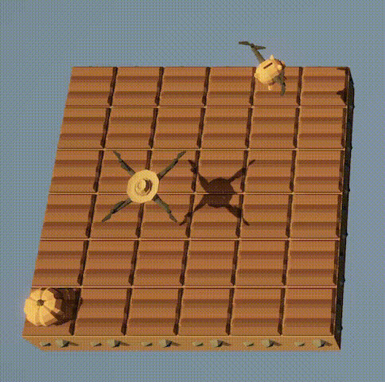
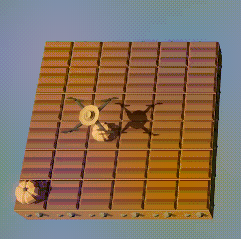

::: {.content-hidden unless-meta="solutions"}
# Solutions {.unnumbered}

:::

::: {.content-hidden when-meta="solutions"}

|              |                                              |
| ------------ | -------------------------------------------- | 
| Due Date     | Thu, Oct 01                                  | 
| Turn in link | Gradescope [code]() and [PDF]() | 
| URL          | `emadmasroor.github.io/E21-F26/Homework/HW4` |


[What to turn in]{.underline}

For this assignment, you will turn in a PDF file as well as multiple code files. Each entry in the following table should be its own `.py` file.

| Problem | Format |
| -- | -------- |
| 1       | Code: One `.py` file with **all three** function definitions. |
| 2       | PDF   |
| 3     | PDF   |
| 4     | Code: Three `.py` file, one for each of 4.1, 4.2 and 4.3  |


:::

# Python function to read IEEE floats

Computers store numbers in memory using a series of zeros and ones. These zeros and ones are then interpreted as floating-point numbers according to the standard scheme that we learned about in class.

In this question, you will write a Python function that can interpret a string of zeros and ones as a decimal number using the [IEEE standard](../../Lectures/Lec7). Your function should work for 16-bit, 32-bit and 64-bit numbers. 

::: {.callout-tip}

Name your function `readIEEEfloat`. It should take a single argument in the form of a string and should return the value as a number.

:::

:::: {.content-hidden when-meta="solutions"}

::: {.callout-hint}
You can access a subset of a list in Python using the square bracket `[]` notation.

```{.python}
>>> list1 = [56,78,34,-21,3,90,67,24]
>>> list1[2:5]
[34, -21, 3]
>>> list1[-1]
24
>>> list1[-2]
67
```
:::

In writing your function, you may wish to make use of the following functions as building blocks.

```{.python}
def bin_to_dec_int(num):
 # Converts binary integer to decimal integer
 # num is a string, interpreted as a binary integer.
 s = len(num)
 total_value = 0
 for index in range(s):
  power = s-index-1
  digit = int(num[index])
  value = (2 ** power) * digit
  total_value += value
 return total_value
```

```{.python}
def bin_to_dec_frac(num):
  # Converts binary fraction to decimal fraction.
  # num is a string of 0's and 1's. 
  # If num = 1010, this function interprets it as
  # 1 * (1/2)^1 + 0 * (1/2)^2 + 1 * (1/2)^3 + 0 * (1/2)^4.
  # The first bit multiplies (1/2). The second bit multiplies (1/4). The third bit multiplies (1/8), and so on.
  # for example, in the IEEE format, a 16-bit number could have the significand
  # 1.0011010101
  # This function can be used to read the string of bits AFTER the "decimal point" and
  # returns the value of the resulting fraction in decimal form as a 'float'.
  # The returned value must always be less than 1.
  s = len(num)
  total_value = 0
  for index in range(s):
    power = -index - 1
    digit = int(num[index])
    value = (2 ** power) * digit
    total_value += value
  return total_value
```

::::


::: {.content-hidden unless-meta="solutions"}
::: {.callout-tip}
## Solution

**Convert binary integer to decimal integer**

```{.python}
def bin_to_dec_int(num):
 # Converts binary integer to decimal integer
 # num is a string, interpreted as a binary integer.
 s = len(num)
 total_value = 0
 for index in range(s):
  power = s-index-1
  digit = int(num[index])
  value = (2 ** power) * digit
  total_value += value
 return total_value
```

**Convert binary fraction to decimal fraction**

```{.python}
def bin_to_dec_frac(num):
  # Converts binary fraction to decimal fraction.
  # num is a string of 0's and 1's. 
  # If num = 1010, this function interprets it as
  # 1 * (1/2)^1 + 0 * (1/2)^2 + 1 * (1/2)^3 + 0 * (1/2)^4.
  # The first bit multiplies (1/2). The second bit multiplies (1/4). The third bit multiplies (1/8), and so on.
  # for example, in the IEEE format, a 16-bit number could have the significand
  # 1.0011010101
  # This function can be used to read the string of bits AFTER the "decimal point" and
  # returns the value of the resulting fraction in decimal form as a 'float'.
  # The returned value must always be less than 1.
  s = len(num)
  total_value = 0
  for index in range(s):
    power = -index - 1
    digit = int(num[index])
    value = (2 ** power) * digit
    total_value += value
  return total_value
```

**Combine**

```{.python}
def readIEEEfloat(num):
  # Interpret num, type string, as a 16-bit, 32-bit or 64-bit binary number stored
  # in IEEE format. Return the answer as an object of type float.

  if len(num) == 16 or len(num) == 32 or len(num) == 64:
    # First, take out the sign bit
    signbit       = int(num[0])
    sign          = -1 if signbit == 1 else 1

    # Then, take out the exponent and significand bits
    if len(num) == 16:
      exponent      = bin_to_dec_int(num[1:6])
      significand   = bin_to_dec_frac(num[6:])
      bias = 15
    elif len(num) == 32:
      exponent      = bin_to_dec_int(num[1:9])
      significand   = bin_to_dec_frac(num[9:])
      bias = 127
    elif len(num) == 64:
      exponent      = bin_to_dec_int(num[1:12])
      significand   = bin_to_dec_frac(num[12:])
      bias = 1023
    
    # Then put it together.
    return sign * (1+significand) * 2 ** (exponent - bias)
  else:
    print("Input must be a string of length 16, 32 or 64")
    return None
```
:::
:::

# Floating-point numbers

## Conversion to fractional form

::: {.content-visible unless-meta="solutions"}
::: {.callout-note}
Show all your work for full credit
:::
:::

Interpret the following 16-bit floating-point numbers as irreducable fractions. Also write an approximate decimal representation of your fractions. 

   1. `0b1001110000101110`, a.k.a. `0x1C2E`
   2. `0b0100110001101010`, a.k.a. `0x4C6A`

::: {.content-visible when-meta="solutions"}
::: {.callout-tip}
## Solutions

1. We first divide up the 16 bits of `0b1001110000101110` into:
   - Sign bit: `1` --- this number is negative
   - Exponent bits: `00111` --- in decimal form, this is 7.
   - Significand bits: `0000101110`

   Using this information, we can write this number in the following way:
   $$-1.0000101110_2 \times 2^{7-15}$$
   which is equal to
   $$- \left( 1 + 2^{-5} + 2^{-7} + 2^{-8} + 2^{-9} \right) \times 2^{-8}$$
   We can now write it out as fractions:
   $$- \left( 1 + \frac{1}{32} + \frac{1}{128} + \frac{1}{256} + \frac{1}{512} \right) \times \frac{1}{256}$$
   $$= - \left( \frac{512}{512} + \frac{16}{512} + \frac{4}{512} + \frac{2}{512} + \frac{1}{512} \right) \times \frac{1}{256}$$
   $$= - \left( \frac{535}{512} \right) \times \frac{1}{256} = \boxed{- \frac{535}{131072}} \approx -0.00408$$

2. We first divide up the 16 bits of `0b0100110001101010` into:
   - Sign bit: `0` --- this number is positive
   - Exponent bits: `10011` --- in decimal form, this is 19.
   - Significand bits: `0001101010`

   Using this information, we can write this number in the following way:
   $$+1.0001101010_2 \times 2^{19-15}$$
   which is equal to
   $$\left( 1 + 2^{-4} + 2^{-5} + 2^{-7} + 2^{-9} \right) \times 2^{4}$$
   We can now write it out as fractions:
   $$\left( 1 + \frac{1}{16} + \frac{1}{32} + \frac{1}{128} + \frac{1}{512} \right) \times 16$$
   $$= \left( \frac{512}{512} + \frac{32}{512} + \frac{16}{512} + \frac{4}{512} + \frac{1}{512} \right) \times 16$$
   $$= \left( \frac{565}{512} \right) \times 16 = \boxed{\frac{565}{32}} \approx 17.656$$

:::
:::

## Large and small Numbers

Use the web app [Float Toy](https://evanw.github.io/float-toy/) to fill the following table. All numbers should be positive, and should be given in scientific notation in decimal form up to the number of significant figures given by the web app or up to 3 significant figures after the decimal point, whichever is smaller. 

::: {.content-hidden when-meta="solutions"}

| Number                                     | 16-bit | 32-bit | 64-bit |
| ------------------------------------------ | ------ | ------ | ------ |
| Smallest subnormal non-zero number         |        |        |        |
| Second smallest subnormal non-zero number  |        |        |        |
| Smallest normal$^*$ non-zero number        |        |        |        |
| Second smallest normal$^*$ non-zero number |        |        |        |
| Largest non-`NaN` number                   |        |        |        |
| Second largest non-`NaN` number                   |        |        |        |


$^*$ i.e., not subnormal.

:::

::: {.content-visible when-meta="solutions"}
::: {.callout-tip}
## Solutions

| Number                                     | 16-bit                 | 32-bit                  | 64-bit                   |
| ------------------------------------------ | ---------------------- | ----------------------- | ------------------------ |
| Smallest subnormal non-zero number         | $5.97 \times 10^{-8}$  | $1 \times 10^{-45}$     | $5 \times 10^{-324}$     |
| Second smallest subnormal non-zero number  | $1.2 \times 10^{-7}$   | $2.8 \times 10^{-45}$   | $1 \times 10^{-323}$     |
| Smallest normal$^*$ non-zero number        | $6.104 \times 10^{-5}$ | $1.175 \times 10^{-38}$ | $2.225 \times 10^{-308}$ |
| Second smallest normal$^*$ non-zero number | $6.11 \times 10^{-5}$  | $1.175 \times 10^{-38}$ | $2.225 \times 10^{-308}$ |
| Largest non-`NaN` number                   | $6.550 \times10^{4}$   | $3.376 \times10^{38}$   | $1.797 \times 10^{308}$  |
| Second largest non-`NaN` number            | $6.547 \times10^{4}$   | $3.376 \times10^{38}$   | $1.797 \times 10^{308}$  |


$^*$ i.e., not subnormal.

:::
:::



# Gap Size in floating point numbers

## Gaps between 16-bit floating-point binary numbers

We would like to tabulate the 'gap size', which can also be called the increment size, between floating-point numbers. Two of the values in this table have been filled from the relevant sections of Lecture 8 [here](../../Lectures/Lec8/#floating-point-numbers-on-the-number-line-1) and [here](../../Lectures/Lec8/#increments-of-floating-point-numbers).

| Between | and | the gap is | or equivalently |
| ------------ | -------- | ---------- | ------------- |
| $2^{-14}$ | $2^{-13}$ | ... | |
| $2^{-13}$ | $2^{-12}$ | ... |  |
| $2^{-12}$ | $2^{-11}$ | ... | |
| $2^{-11}$ | $2^{-10}$ | ... | |
| $2^{-10}$ | $2^{-9}$ | ... | |
| $2^{-9}$ | $2^{-8}$ | ... | |
| $2^{-8}$ | $2^{-7}$ | ... | |
| $2^{-7}$ | $2^{-6}$ | ... | |
| $2^{-6}$ | $2^{-5}$ | ... | |
| $2^{-5}$ | $2^{-4}$ | ... | |
| $2^{-4}$ | $2^{-3}$ | ... | |
| $2^{-3}$ | $2^{-2}$ | ... | |
| $2^{-2}$ | $2^{-1}$ | ... | |
| $2^{-1}$ | $2^{0}$ | ... | |
| $2^{0}$ | $2^{1}$ | ... | |
| $2^{1}$ | $2^{2}$ | ... | |
| $2^{2}$ | $2^{3}$ | ... | |
| $2^{3}$ | $2^{4}$ | $2^{-7}$ | $7.812 \times 10^{-3}$ |
| $2^{4}$ | $2^{5}$ | ... | |
| $2^{5}$ | $2^{6}$ | ... | |
| $2^{6}$ | $2^{7}$ | ... | |
| $2^{7}$ | $2^{8}$ | ... | |
| $2^{8}$ | $2^{9}$ | ... | |
| $2^{9}$ | $2^{10}$ | ... | |
| $2^{10}$ | $2^{11}$ | ... | |
| $2^{11}$ | $2^{12}$ | $2^{1}$ | $2$ |
| $2^{12}$ | $2^{13}$ | ... | |
| $2^{13}$ | $2^{14}$ | ... | |
| $2^{14}$ | $2^{15}$ | ... | |
| $2^{15}$ | $2^{16}$ | ... | |


::: {.content-hidden when-meta="solutions"}
::: {.callout-tip}
For the final column, use up to 3 places after the decimal point. If a number requires more precision than this, **truncate** the remaining figures (don't round).
:::
:::

::: {.content-visible when-meta="solutions"}



::: {.callout-tip}
## Solutions

| Between   | and       | the gap is | or equivalently |
| --------- | --------- | ---------- | --------------- |
| $2^{-14}$ | $2^{-13}$ | $2^{-24}$   | $3.051 \times 10^{-5}$ |
| $2^{-13}$ | $2^{-12}$ | $2^{-23}$     | $1.192 \times 10^{-7}$ |
| $2^{-12}$ | $2^{-11}$ | $2^{-22}$     | $2.384 \times 10^{-7}$ |
| $2^{-11}$ | $2^{-10}$ | $2^{-21}$      | $4.768 \times 10^{-7}$ |
| $2^{-10}$ | $2^{-9}$  | $2^{-20}$    | $9.536 \times 10^{-7}$ |
| $2^{-9}$  | $2^{-8}$  | $2^{-19}$   | $1.907 \times 10^{-6}$ |
| $2^{-8}$  | $2^{-7}$  | $2^{-18}$   | $3.814 \times 10^{-6}$ |
| $2^{-7}$  | $2^{-6}$  | $2^{-17}$   | $7.629 \times 10^{-6}$ |
| $2^{-6}$  | $2^{-5}$  | $2^{-16}$   | $1.525 \times 10^{-5}$ |
| $2^{-5}$  | $2^{-4}$  | $2^{-15}$  | $3.051 \times 10^{-5}$ |
| $2^{-4}$  | $2^{-3}$  | $2^{-14}$  | $6.103 \times 10^{-5}$ |
| $2^{-3}$  | $2^{-2}$  | $2^{-13}$    | $1.220 \times 10^{-4}$ |
| $2^{-2}$  | $2^{-1}$  | $2^{-12}$     | $2.441 \times 10^{-4}$ |
| $2^{-1}$  | $2^{0}$   | $2^{-11}$    | $4.882 \times 10^{-4}$ |
| $2^{0}$   | $2^{1}$   | $2^{-10}$    | $9.765 \times 10^{-4}$ |
| $2^{1}$   | $2^{2}$   | $2^{-9}$    | $1.953 \times 10^{-3}$ |
| $2^{2}$   | $2^{3}$   | $2^{-8}$    | $3.906 \times 10^{-3}$ |
| $2^{3}$   | $2^{4}$   | $2^{-7}$   | $7.812 \times 10^{-3}$ |
| $2^{4}$   | $2^{5}$   | $2^{-6}$     | $1.562 \times 10^{-2}$|
| $2^{5}$   | $2^{6}$   | $2^{-5}$     | $3.125 \times 10^{-2}$ |
| $2^{6}$   | $2^{7}$   | $2^{-4}$     | $6.250 \times 10^{-2}$ |
| $2^{7}$   | $2^{8}$   | $2^{-3}$     | $0.125$ |
| $2^{8}$   | $2^{9}$   | $2^{-2}$     | $0.25$ |
| $2^{9}$   | $2^{10}$  | $2^{-1}$    | $0.5$ |
| $2^{10}$  | $2^{11}$  | $2^{0}$     | $1$ |
| $2^{11}$  | $2^{12}$  | $2^{1}$    | $2$ |
| $2^{12}$  | $2^{13}$  | $2^{2}$    | $4$ |
| $2^{13}$  | $2^{14}$  | $2^{3}$     | $8$ |
| $2^{14}$  | $2^{15}$  | $2^{4}$        | $16$ |
| $2^{15}$  | $2^{16}$  | $2^{5}$    | $32$ |


:::
:::

## Precision for floats

The $\pm$ symbol is often used to indicate the precision of a known quantity. For floating point numbers, it is appropriate to use $x \pm y$ to represent a number, where $y$ is half of the gap size in that part of the number line.

For example, we saw in lecture 8 that between 8 and 16, 16-bit floating point numbers have a gap size of $1/128$ or $0.0078125$. Half of this number is $0.00390625$. If we now consider the 16-bit floating point number given by `0100100000001100`, its value can be found to be equal to $259/32 = 8.09375$. However, it would not be correct to write this number in decimal form with 5 significant figures after the decimal point. To see why, let us write it in $\pm$ notation as follows.

$$8.09375 \pm 0.00390625$$

Thus, the 16-bit float `0100100000001100` would be used by a computer to represent any number in the range from $8.09375-0.00390625$ to $8.09375+0.00390625$ shown above. For example,

- `8.09672`
- `8.09585`
- `8.09175`
- `8.09079`

are all within the range shown above. These numbers agree in the first two digits after the decimal point, but in subsequent places, they disagree. Therefore, when representing the floating-point number `0100100000001100` in decimal form, it would not be appropriate to write more significant figures after the second one after the decimal point. Thus, the correct way to express it in decimal form would be $\boxed{8.09}$, not $8.09375$.

Using the discussion above as a template, write the following floating-point numbers in fractional form and then in decimal form using the appropriate number of significant figures after the decimal point.

1. The 16-bit float given by `0b0001110000010000`

::: {.content-visible when-meta="solutions"}
::: {.callout-tip}
## Solution

Interpreting this number, we find that it is

$$1.0000010000_2 \times 2^{7-15} = \left( 1 + \frac{1}{2^6} \right) \times 2^{-8}$$

$$\frac{65}{64} \times \frac{1}{256} = \frac{65}{16384}$$

In decimal form, this can be written as `0.00396728515625000`. The gap size in this part of the number line, for 16-bit floats, is $2^{-18} \approx 0.000003814697$. Half of this number would be $0.00000190734$. 

We now compare the top and bottom of the range of possible values that this floating-point number is supposed to represent. These are: $0.00396919249$ and $0.00396537781$ respectively. These two agree up to the fifth place after the decimal point, but no further. Therefore, we should write this number as

$$0.00396 \quad \text{or} \quad 3.96 \times 10^{-3}.$$

Alternatively, you could also choose to round this up to $3.97 \times 10^{-3}$ because the sixth place after the decimal point is always 5 or greater.

:::
:::

2. The 16-bit float given by `0x3C10`

::: {.content-visible when-meta="solutions"}
::: {.callout-tip}
## Solution

Interpreting this number, we find that it is

$$\left( 1 + \frac{1}{2^{6}} \right) \times 2^{0}$$

$$\frac{65}{64} \times 1 = \frac{8388609}{536870912}$$

In decimal form, this can be written as `1.015625000`. The gap size in this part of the number line, for 16-bit floats, is $2^{-10} \approx 0.0009765625$. Half of this number would be $0.00048828125$. 

We now compare the top and bottom of the range of possible values that this floating-point number is supposed to represent. These are: $1.01611328125$ and $1.0151468$ respectively. These two agree up to the second place after the decimal point, but no further. Therefore, we should write this number as

$$1.01$$ and with no further significant figures.


:::
:::


# The Farmer Was Replaced

Download the save file [here](Save-for-HW4.zip) to complete this part of the homework.

## Zero location

Write a function called `zeroloc()` that takes the drone back to the bottom-left corner.

::: {.content-visible when-meta="solutions"}
::: {.callout-tip}
## Solution

```{.python}
def zeroloc():
  xdist = get_pos_x()
  ydist = get_pos_y()
  for i in range(xdist):
    move(West)
  for i in range(ydist):
    move(South)
  return None
```
:::
:::

## Random plants

Write a script that plants a random plant (out of five options: Grass, Tree, Bush, Carrot, and Pumpkin) on each spot of the 6x6 farm. It should only do this once, without repeating.

Your script should `import` your `zeroloc` function from a different file, i.e., the first line of your script should be something like `from <file name> import zeroloc`. 

The second line of your script should call the `zeroloc` function.

::: {.content-hidden when-meta="solutions"}
::: {.callout-tip}
- You may wish to make use of the `random()` function, which has been unlocked for you.
- In the game, dividing a given number (say, `4.2`) by 1 like this: `4.2 // 1` returns the largest integer less than the given number.
- It is recommended that you till the entire farm for this task. All five crops can be planted on tilled soil. 
- Dictionaries and/or Lists should come in handy here.
:::
:::

::: {.content-visible when-meta="solutions"}
::: {.callout-tip}
## Solution

```{.python}
from positioning import zeroloc
zeroloc()

crops = {
  "p": Entities.Pumpkin,
  "t": Entities.Tree,
  "g": Entities.Grass,
  "c": Entities.Carrot,
  "b": Entities.Bush
}

possible_crops = ["p","t","b","c","g"]

for row in range(get_world_size()):
  for col in range(get_world_size()):
    if get_ground_type() == Grounds.Grassland:
      till()
    if can_harvest():
      harvest()
    ind = random() *len(possible_crops) // 1 
    plant(crops[possible_crops[ind]])
    move(East)
  move(North)
```
:::
:::

## Waiting for crops to grow

Write a function called `plant_and_wait` that takes as argument a plant 'object', such as `Entities.Carrot`.

When this function is called with argument `Entities.Tree`, its behavior should be as shown in the gif below, i.e., it should plant a tree and do flips until the tree has fully grown, and then harvest it.

::: {.content-hidden when-format="pdf"}

:::

When this function is used to plant pumpkins, its behavior needs to be different. It should wait to check if the pumpkin grows up to be rotten, and if so, it should start over. As an illustration of this behavior, the following gif shows what your drone should do if you run the following code:

```{.python}
while True:
  plant_and_wait(Entites.Pumpkin)
```

::: {.content-hidden when-format="pdf"}

:::

::: {.callout-warning}
This function should not move the drone. It **should** till the soil if it is grassland (remember that tilling grass turns it into soil, but tilling soil turns it back into grass!)
:::

::: {.content-visible when-meta="solutions"}
::: {.callout-tip}
## Solution

```{.python}
def plant_and_wait(crop):
  if get_ground_type() == Grounds.Grassland:
    till()
  if not crop == Entities.Pumpkin:
    if can_harvest():
      harvest()
    plant(crop)
    while not can_harvest():
      do_a_flip()
    harvest()
  else:
    plant(crop)
    while not can_harvest():
      do_a_flip()
      if get_entity_type() == Entities.Dead_Pumpkin:
        print("Death")
        plant(Entities.Pumpkin)
    harvest()
```
:::
:::


