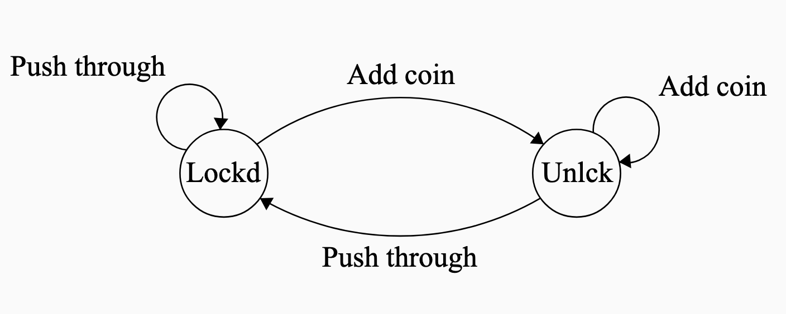
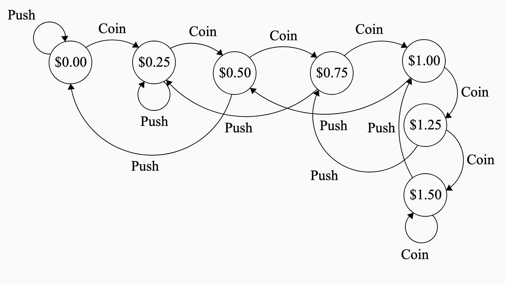
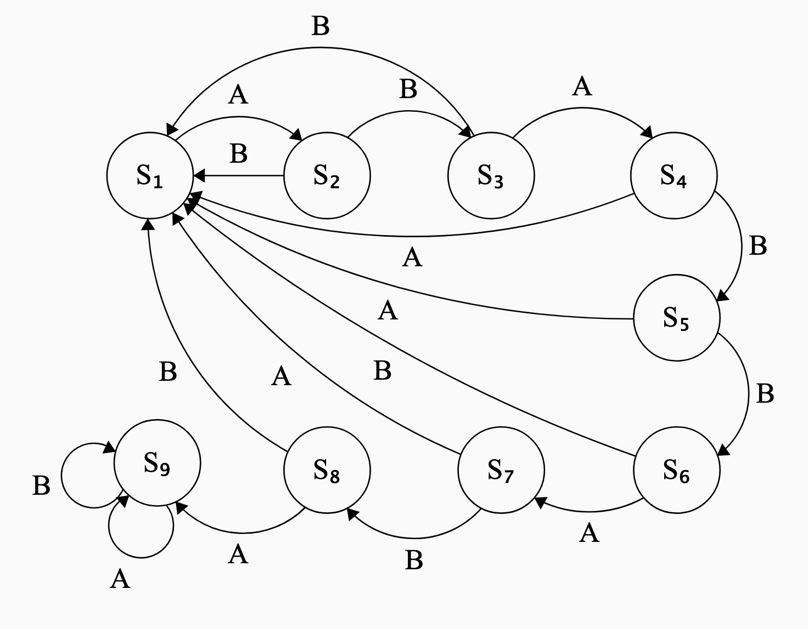

::: {.content-hidden unless-meta="solutions"}
# Solutions {.unnumbered}

:::

::: {.content-hidden when-meta="solutions"}

|              |                                              |
| ------------ | -------------------------------------------- | 
| Due Date     | Thu, Oct 22                                  | 
| Turn in link | Gradescope [PDF](https://moodle.swarthmore.edu/mod/lti/view.php?id=834330) and [Code](https://moodle.swarthmore.edu/mod/lti/view.php?id=834329)  | 
| URL          | `emadmasroor.github.io/E21-F26/Homework/HW6` |

[What to turn in]{.underline}

Combine all written HW into one PDF file.

| Problem | Format                                         |
| ------- | -------------- |
| 1       | Code: One `.py` file containing all TFWR code. |
| 2       | PDF                                            |
| 3       | PDF                                            |
| 4       | PDF                                            |
| 5       | Code: One `.py` file                           |

:::

# The Farmer Was Replaced

Download [the save file here](Save-for-HW6.zip) to ensure that you've unlocked all that's required for this assignment.

The Farmer Was Replaced now has 'Polyculture favorites'. To check if a particular plant has a 'Polyculture favorite', use the function `get_companion()` while your drone is hovering over a cell with a plant growing on it. The function `get_companion()` returns two outputs. The first output is the type of plant that would be this plant's 'Polyculture favorite', and the second output is a tuple of x-y values that tell you where this companion plant should go.

## A function to navigate to x,y {#sec-nav}

Write a function that accepts as argument a tuple of `(x,y)` values. When this function is called, your drone should navigate to the spot `(x,y)`.

## A function to plant companions

Write a function that 

1. Checks if a plant has a companion. If not, it doesn't do anything.
2. If it does have a companion, the drone navigates to the companion's favored location. You should make use of the function you wrote in @sec-nav.
3. Once it is at the favored location, it plants the desired companion plant at this location.
4. The drone then returns to the location of the first plant.

The above should work regardless of whether there is currently a plant at that location. Assume that the entire farm is tilled soil, not grassland, for this purpose.

# Two-state FSM

{#fig-coin fig-align="center" width="40%"}

## Four ways of representing a Finite State Machine

A coin-operated turnstile, shown in @fig-coin, is to be designed using a two-state finite-state machine. It has two states: Locked and Unlocked. There are two possible inputs that it can accept: (1) you can put a coin in it, and (2) you can push through the turnstile.

The turnstile operates as follows.

If the user enters a coin while the turnstile is locked, the turnstile becomes unlocked. Adding any more coins doesn't do anything; the turnstile remains locked. If the user pushes through the turnstile while it is unlocked, the turnstile lets him through and the turnstile locks again. If the user tries to push through the turnstile while it is locked, nothing happens and the turnstile stays locked.

Using the given states and inputs,

1. Construct a state-transition diagram. You are encouraged to make use of the 'Finite State Machine Designer' website [here](https://madebyevan.com/fsm/) to produce professional quality diagrams, but this is not necessary. Label your states and inputs descriptively with words, rather than numbers.

::: {.content-hidden unless-meta="solutions"}
::: {.callout-tip }
## Solution

The following state-transition diagram is an appropriate solution to this problem.

{fig-align="center" width="40%"}

:::
:::

2. Make a state-transition table. Use words, not numbers, to label your states and inputs.

::: {.content-hidden unless-meta="solutions"}
::: {.callout-tip }
## Solution

The following state-transition table is an appropriate solution to this problem.

| Current   State  | Coin      | Push    |
|------------------ |---------- |-------- |
| Locked            | Unlocked  | Locked  |
| Unlocked          | Unlocked  | Locked  |

:::
:::

3. Make a truth table using the following values as 'names' in binary: 

- the unlocked state is `0`,
- the locked state is `1`,
- adding a coin is encoded by `0`
- pushing the turnstile is encoded by `1`.

4. Make a logic diagram for this truth table using And, Or, and Not gates.

# Modified Finite State Machine

You are tasked with designing a new finite state machine that allows up to three people at a time to go through the turnstile at a cost of $0.50 each. The machine only accepts quarters. When two quarters have been entered into the turnstile, one person can pass through before the machine becomes locked again.. If four quarters are entered into the turnstile, two people can pass through before it becomes locked again. Entering more than $1.50 does not have any effect. So, for example, if $2.00 is entered into the machine, it will still only let three people pass, not four.

1. Draw the state transition diagram for this finite state machine, labeling each state with the number of cents/dollars that have been entered. Assume that the initial state is $0.00.

2. How many rows and columns will the state-transition table for this FSM have? You do not need to write it out.

3. Write out the truth table for this finite state machine. Each state should be labeled by the number of quarters it currently recognizes inside the machine, in binary. Entering a coin should be labeled `1` and pushing through should be labeled `0`.

::: {.content-hidden unless-meta="solutions"}
::: {.callout-tip }
## Solution

The state transition diagram for this finite state machine is as follows.

{fig-align="center" width="70%"}

- Because there are two inputs, the state transition table will have two columns (3 if you count the column with the states names)
- Because there are seven states, it will have seven rows (8 if you count the row with the input names.)

- The truth table will have 14 rows and will look like the following. Note that the states are labeled as follows:

  - $0.00 is `000`
  - $0.25 is `001`
  - $0.50 is `010`
  - $0.75 is `011`
  - $1.00 is `100`
  - $1.25 is `101`
  - $1.50 is `110`

  and the inputs are:

  - Push: `0`
  - Coin: `1`

| State   | Input   | New State   |
|-------  |-------  |-----------  |
| `000`   | `0`     | `000`       |
| `000`   | `1`     | `001`       |
| `001`   | `0`     | `001`       |
| `001`   | `1`     | `010`       |
| `010`   | `0`     | `000`       |
| `010`   | `1`     | `011`       |
| `011`   | `0`     | `001`       |
| `011`   | `1`     | `100`       |
| `100`   | `0`     | `010`       |
| `100`   | `1`     | `101`       |
| `101`   | `0`     | `011`       |
| `101`   | `1`     | `110`       |
| `110`   | `0`     | `100`       |
| `110`   | `1`     | `110`       |

:::
:::

# Logic Gates and Boolean expressions

## Equivalence of Boolean expressions

You may wish to consult this [trurth table generator](https://web.stanford.edu/class/cs103/tools/truth-table-tool/) for this assignment.

The following truth table expresses the relationship between 3 'inputs' a, b and c, and one 'output' d (this is why there are $2^3=8$ entries). Here, the word 'input' could refer to either a FSM's input or a FSM's current state. The word 'output', in a FSM context, refers to the next state of the FSM for that combination of inputs and states.

| a   | b   | c   | d   |
|---  |---  |---  |---  |
| F   | F   | F   | F   |
| F   | F   | T   | F   |
| F   | T   | F   | T   |
| F   | T   | T   | F   |
| T   | F   | F   | T   |
| T   | F   | T   | T   |
| T   | T   | F   | T   |
| T   | T   | T   | T   |

There are several different ways to express this truth table. For example, the following would work.

- d = (a and b and c) or (a and b and not c) or (a and not b and c) or (a and not b and not c) or (not a and b and not c)

This is an unnecessarily verbose way of describing this truth table. There is a much simpler expression that involves only **three** boolean operators when written out in English. Find a simpler expression of this truth table using at most three boolean operators.

::: {.callout-note}
The expression 'a and b and c' is an example of a Boolean expression with two operators. The expression '(a and not b) or c' has three operators.
:::

::: {.content-hidden unless-meta="solutions"}
::: {.callout-tip }
## Solution

The desired expression is that d equals `a or (b and not c)`. The parantheses are optional.
:::
:::

## Simplifying Truth Tables

The following truth table can be expressed in the following way: c = (not a and not b) or (not a and b). However, there is a much simpler Boolean expression that can be used here instead to relate c, the output, to a and b, the inputs. Find the most simple statement of how c depends on a and b. Then, draw the logic diagram for both the original statement c = (not a and not b) or (not a and b) and for your simplified statement.

| a   | b   | c   |
|---  |---  |---  |
| F   | F   | T   |
| F   | T   | T   |
| T   | F   | F   |
| T   | T   | F   |

::: {.content-hidden unless-meta="solutions"}
::: {.callout-tip }
## Solution

The desired expression is that c equals `not a`. The truth value of b is irrelevant.
:::
:::

# A new combination lock

Your task in this part of the homework assignment is to create a 'combination lock', similar to the one discussed in class, that 'unlocks' when the code `ABABBABA` is entered. The 'locked' state is shown with eight consecutive neopixels shown red; each correct entry (A or B) should sequentially turn the neopixels green, one by one. You do not need any states after the fully-unlocked state is reached.

1. Draw the State Transition Diagram for this system. Please use $S_1$, $S_2$, ... for your state names, and A/B for the input names.
2. Implement this on the Circuit Playground Express, similar to the code used [in class](../Lec11/#combination-lock).

::: {.content-hidden unless-meta="solutions"}
::: {.callout-tip }
## Solution

{fig-align="center" width="50%"}

:::
:::

