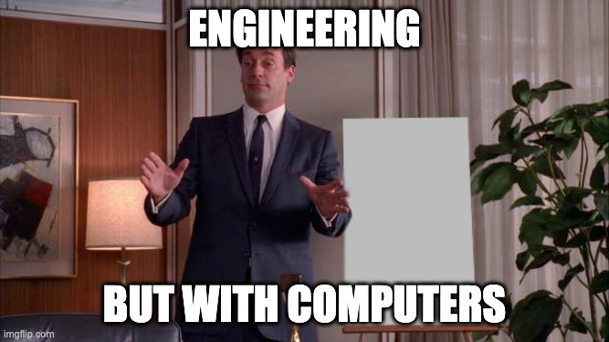

### Introductions - Prof. Masroor

- Prof. Emad Masroor
  - B.S. Mechanical Engineering, Cornell University 2017
  - Ph.D. Engineering Mechanics, Virginia Tech 2023
    - Thesis: _Vortex Dynamics in the Laminar Wakes of Bluff Bodies_
  - Visiting Assistant Professor at Swarthmore College since Fall 2023
  - Research interests broadly in Fluid Dynamics:
    - theoretical studies of vortex dynamics
    - experimental studies of wind-induced vibrations
    - numerical studies of fish locomotion

### Introductions - Prof. Masroor

::: {.nonincremental}
- Outside of work, I ...
  - live in Philadelphia
  - read about philosophy, history, science + enjoy literature
  - take piano lessons
  - travel (32/50 states) and take photographs
  - hike & backpack, esp. Appalachian Trail

{width="75%" center="true"}
:::

### Introductions - Students

::: {.nonincremental}

- Name, major, year
- Hometown
- What are your impressions of / expectations from E21?
- What is a topic/event/idea/person that you know a lot about?
:::

### Teaching Team

::: {.table-wrapper style="width:90%;"}

| Name         | Role            |
| ------------ | --------------- |
| Emad Masroor | Lec. Instructor |
| Matt Zucker  | Lab. Instructor |
| Visnuk Rith  | Wizard          |
| Samchan Lee  | Wizard          |
| Uneeb Hyder  | Wizard          |
| Hiba Aby     | Grader          |
| Huyen Nguyen | Grader          |
| Ellie Fermo  | Grader          |
| Kevin Sisk   | Grader          |

:::

### What is E21 about?

::: {.fragment}
::: {layout="[60, 40]"}

:::

- Outside Swarthmore, 'Computer Engineering' is a part of 'Electrical Engineering'
- A better definition for us: Engineering with computers
  - Relevant for all types of engineers
- Make stuff do stuff
:::

### What is E21 about?

### Logistics

**See the website**: [https://emadmasroor.github.io/E21-F26](https://emadmasroor.github.io/E21-F26)

- Lectures Tue / Thu SCI 101, may be moved to SCI 199
- Labs Mon / Thu Singer 221
- No midterms, no final exam
- Six tests, ~ every two weeks starting week 4
- Final Project

::: {.fragment}
|              | Use this for ...       |
| ------------- | ---------------------- |
| Moodle        | Submit HW, view scores |
| Gradescope    | Manage and submit HW   |
| Ed Discussion | Ask + Answer questions |
| Website       | **All Course Content** |

:::

### Circuit Playground Express

::: {layout="[60, 40]"}
• A versatile microcontroller for E21.   • The device is called 'Circuit Playground Express' (CPX)   • The software it runs is called Circuit Python

:::

Bring to lecture **and** lab!

### Installation Instructions

 - You do **not** need to download Python to your computer yet.
 - Install [Thonny Code Editor](https://thonny.org/) on your computer
 - Download and install `Circuit Python` on your [Circuit Playground Express]{.underline} using instructions [here](https://learn.adafruit.com/welcome-to-circuitpython/installing-circuitpython).
  1. Download `.UF2` file for CPX
  2. Double-tap RESET button while CPX is plugged in
  3. Drag and drop `.UF2` file onto `CPLAYBOOT` drive
  4. If you now see `CIRCUITPY` as an external drive instead of `CPLAYBOOT`, you are done!

### Integrated Development Environment (IDE)

- A 'development environment' is the program (or programs) you use to write code.
- It's possible to simply use Notepad as your Development Environment, but that's kinda lame
- Some options
  - VS Code (v. popular among Swat students)
  - A simple text editor with syntax highlighting (e.g. Sublime Text)
  - **Thonny**, Mu, other 'lightweight IDEs'
  - IDLE (official Python IDE)

### Two ways to run code on your board

::: {layout="[50, 50]"}

:::

::: {layout="[50, 50]"}
::: {.nonincremental}
- Once you're sure what you want to code
- Thoughtful, long-form coding
- Runs if and when you save `code.py`
- Persistent
:::

::: {.nonincremental}
- Trying things out
- Instant feedback if works
- Runs when you hit enter
- No memory
:::
:::

