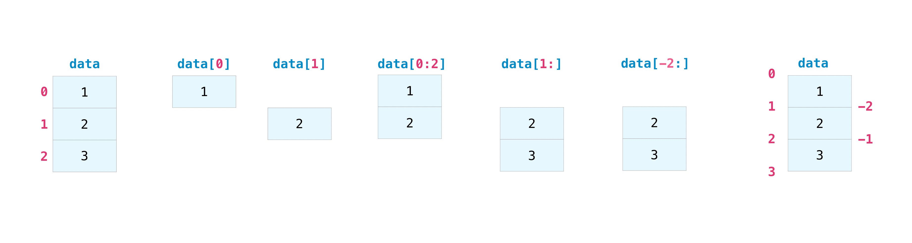
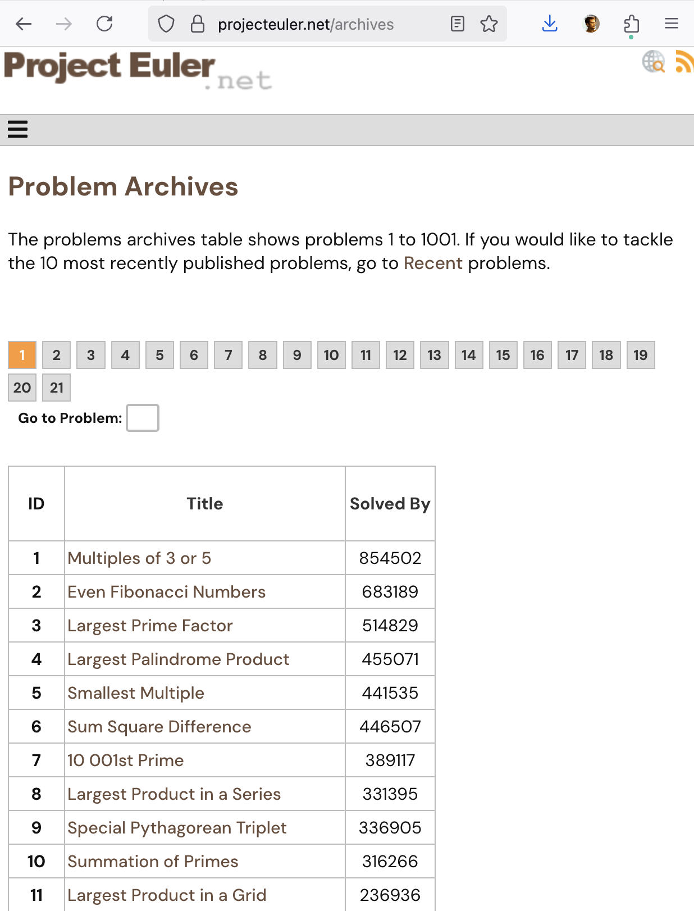

### Manipulating Data in `numpy`

[Download the data file [here](Temp_data.txt)]{.inclass} and look at the official documentation [here](https://numpy.org/doc/)

Consists of 3 days of temperature data recorded at half-hour intervals. First time (hours), then temperature in F.

::: {layout-ncol=2}
1. Reformat the data in the form of an N rows, 2 column `numpy` array.
2. Save the data as `csv` files for the three days separately.


:::


### Solution


- Obtain shape of dataset
  ```{.python}
  data = np.loadtxt("Temp_data.txt")
  np.shape(data)
  ```
  We find that the dataset is 290 entries long.
  ```{.python}
  (290,)
  ```
- Reshape it into 2 x 145 set.
  ```{.python}
  data2 = np.reshape(data,(2,145))
  ```
- Transpose it to have 145 rows and 2 columns
  ```{.python}
  data3 = np.transpose(data2)
  ```

### Initializing multi-dimensional arrays

Arrays in `numpy` can be initialized using:

:::: {.columns}

::: {.column width="50%"}

- `ones`
  ```{.python}
  np.ones((3,4))
  ```
  ```{.python}
  array([[1., 1., 1., 1.],
         [1., 1., 1., 1.],
         [1., 1., 1., 1.]])
  ```
- `zeros`
  ```{.python}
  np.zeros((5,2))
  ```
  ```{.python}
  array([[0., 0.],
         [0., 0.],
         [0., 0.],
         [0., 0.],
         [0., 0.]])
  ```
- Random numbers
  ```{.python}
  np.random.random((3,2))
  ```
  ```{.python}
  array([[0.73, 0.91],
       [0.47, 0.32],
       [0.89, 0.07]])
  ```
:::

::: {.column width="50%"}
::: {.callout-tip}
The **type** of an array can be changed using functions such as `numpy.float64`, `numpy.int64`, `np.bool()` etc.
:::
:::

::::

### Random number generation

It is often useful to generate random numbers.

- A single random number between 0 and 1: `numpy.random.random()`
- An array of 3 random numbers: `numpy.random.random(3)`
- Three rows and two columns of random numbers: `numpy.random.random((3,2))`
- A single random integer between 0 and `n`, not inclusive of `n`: `numpy.random.randint(n)`
- A single random integer between `m` and `n`, not inclusive of `n`: `numpy.random.randint(m,n)`

### Slice notation in `numpy` arrays

```{.python}
a = np.array([[0.95, 0.3 , 0.53, 0.55, 0.73],
           [0.12, 0.17, 0.03, 0.83, 0.34],
           [0.27, 0.9 , 0.26, 0.94, 0.55],
           [0.88, 0.26, 0.5 , 0.5 , 0.05]])
```

- Rows and columns can be selected using 'slices' of a `numpy` array

::: {style="position: relative; width: fit-content; margin-left: auto; margin-right: auto;"}

::: {.grid-table}
|  |  |  |  |  |
|---|---|---|---|---|
| 0.07 | 0.14 | 0.23 | 9.42 | 7.73 |
| 4.56 | 6.88 | 0.99 | 5.32 | 6.36 |
| 9.34 | 6.38 | 7.48 | 8.05 | 6.01 |
| 4.00 | 4.35 | 1.43 | 9.01 | 3.93 |
:::

::: {style="position: absolute; left: 0%; top: 50%; width: 100%; height: 25%; border: 3px solid red; pointer-events: none;"}
:::
::: {style="position: absolute; left: 60%; top: 0%; width: 20%; height: 100%; border: 3px solid orange; pointer-events: none;"}
:::
:::

- To select the [third row]{style="color: red;"}:
  ```{.python}
  a[2,:]
  ```
  'Row number 2, All columns'

- To select the [fourth column]{style="color: orange;"}:
  ```{.python}
  a[:,3]
  ```
  'All rows, column number 3'

### Slicing from ends



- This follows Python's usual conventions:
  - Indexing starts from zero
  - The last element is not included
    - The array `example[0:5]` is a subset of `example` with 5 elements starting from index `0`.
    - The array `example[2:4]` is a subset of `example` with 2 elements starting from index `2`.
- Slicing from ends can work in multiple dimensions.
- Negative numbers count from the end

### Cherry-picking an array

```{.python}
example = np.array([1.81, 8.17, 6.93, 1.54, 0.39, 4.96, 2.66, 6.03, 4.85, 6.43])
```

Create an array containing only the second, fourth, and seventh element of this array.

```{.python}
example[[1,3,6]]
```

[A list of integers can be used to access the `n`th elements of a `numpy`  array.]

### Practice with slicing arrays

Obtain the following subsets by **slicing** the given array (no cherry-picking)

:::: {style="position: relative; width: fit-content; margin-left: auto; margin-right: auto;"}

```{.python}
ex = np.array([[70, 96, 77, 89, 66, 78, 37,  4],
               [36, 46, 84, 19, 73, 24, 29, 25],
               [75, 66,  0, 67, 84, 16, 83, 21],
               [81, 35, 62,  5, 94, 75, 25, 76],
               [57, 31, 79, 86, 83, 54, 24,  5],
               [75, 71, 57, 58, 36, 89, 31, 17],
               [83, 94,  8, 22, 49, 74, 89, 79]])
```

::: {style="position: absolute; left: 55%; top: 55%; width: 30%; height: 15%; border: 3px solid red; pointer-events: none;"}
:::

::: {style="position: absolute; left: 71%; top: 70%; width: 22%; height: 12%; border: 3px solid blue; pointer-events: none;"}
:::

::: {style="position: absolute; left: 63%; top: 5%; width: 15%; height: 40%; border: 3px solid orange; pointer-events: none;"}
:::

::::

### Logical indexing

Logical indexing is a powerful feature of `numpy` (and MATLAB). In this approach, we index an array using **booleans**.

**Example:** Create an array containing only the values of `example` that are greater than 5.

```{.python}
example = np.array([1.81, 8.17, 6.93, 1.54, 0.39, 4.96, 2.66, 6.03, 4.85, 6.43])
```

- Without logical indexing:
  ```{.python}
  example[[1,2,-1,-3]]
  ```
  :::{.fragment}
  Manually pick out the second, third, last, and third-last elements.
  :::
- With logical indexing:
  ```{.python}
  example[example > 5]
  ```
  Let Python select for you based on an array of **boolean** values.

### A closer look at logical indexing


To understand logical indexing, let's look at `example>5` when `example` is a `numpy` array.

```{.python}
example = np.array([1.81, 8.17, 6.93, 1.54, 0.39, 4.96, 2.66, 6.03, 4.85, 6.43])
>>> example > 5
array([False,  True,  True, False, False, False, False,  True, False,
        True])
```

::: {.grid-table style="position: relative; width: fit-content; margin-left: auto; margin-right: auto;"}
|  |  |  |
|---|---|---|
| 1.81 | False | Exclude |
| 8.17 | **True** | Include |
| 6.93 | **True** | Include |
| 1.54 | False | Exclude |
| 0.39 | False | Exclude |
| 4.96 | False | Exclude|
| 2.66 | False | Exclude |
| 6.03 | **True** | Include |
| 4.85 | False | Exclude |
| 6.43 | **True** | Include|

:::

### Chaining together multiple boolean operations

Create an array whose elements contain all the elements of `example` that are smaller than 5 and whose units place is an even number.

::: {.content-hidden unless-meta="uncover"}

#### Without `numpy`
::: {layout-ncol=2}
```{.python}
# Make an empty array
answer = np.array([]) 
for i in range(len(example)):
 # Check if even
 if np.floor(example[i]) % 2 == 0:
  # Check if smaller than 5
  if example[i] < 5:
   # Append to your array
   answer = np.append(answer,example[i])
```

:::

#### Using `numpy`'s logical indexing

```{.python}
answer = example[(example < 5) & (np.floor(example) % 2 == 0)]
```
:::

- To chain two logical indexing commands together, need:
  - `&` for 'and': **both** of the two onditions apply
  - `|` for 'or': **any** of the two conditions apply


### Logical Indices can be used for other arrays {.scrollable}

- Once an array of booleans has been created, it is _independent_ of the array that was used to create it
- So you can use it to index **other** arrays if you want.

[**Example**]{.fragment}

- Select the rows of `c` for which the difference between `a` and `b` is less than 2.

::: {.columns}

::: {.column width="45%"}
::: {.fragment}
```{.python}
import numpy as np
np.set_printoptions(precision=2)
a = np.array([4.58, 7.17, 8.89, 6.79, 1.58, 1.84, 6.85, 1.06, 6.37, 5.28])
b = np.array([4.72, 6.83, 3.01, 4.76, 0.23, 7.88, 3.04, 0.78, 7.99, 7.69])
c = np.array([49, 99, 34, 13, 33,  1, 56, 39, 83, 77])

print(a)
print(b)
for i in range(len(a)):
    if abs(b[i] - a[i]) < 2:
        print(f"The {i}th elements of a and b are within 3 of each other")

```
This is incomplete and **does not use** logical indexing. [Use logical indexing]{.inclass} to accomplish this task.
:::
:::

::: {.column width="05%"}

:::
::: {.column width="50%"}
::: {.fragment}

|   `a`    |   `b`    |   `c`      |
|------ |------ |-------  |
| 4.58  | 4.72  | 49.00   |
| 7.17  | 6.83  | 99.00   |
| 8.89  | 3.01  | 34.00   |
| 6.79  | 4.76  | 13.00   |
| 1.58  | 0.23  | 33.00   |
| 1.84  | 7.88  | 1.00    |
| 6.85  | 3.04  | 56.00   |
| 1.06  | 0.78  | 39.00   |
| 6.37  | 7.99  | 83.00   |
| 5.28  | 7.69  | 77.00   |

:::
:::

:::

### Flip, Reshape, Transpose 

```{.python}
a = np.array([0.34, 0.56, 0.90])
b = np.array([[0.95, 0.3 , 0.53, 0.55, 0.73],
           [0.12, 0.17, 0.03, 0.83, 0.34],
           [0.27, 0.9 , 0.26, 0.94, 0.55],
           [0.88, 0.26, 0.5 , 0.5 , 0.05]])
```

- The `numpy.flip()` command reverses an array
  - Optional argument: `numpy.flip(example, axis=1)`
    ```{.python}
    np.flip(a)
    np.flip(b,axis=0)
    np.flip(b,axis=1)
    ```

- The `reshape()` command re-arranges data in an array:
  ```{.python}
  np.reshape(b,(10,2)) 
  ```
  Rearranges `b` into a matrix with 10 rows, 2 columns

- The `transpose` command reverses the rows and columns of a 2-D matrix
  ```{.python}
  np.transpose(b)
  ```


### Concatenating, i.e., stacking `numpy` arrays

Arrays can be _stacked_ vertically or horizontally.

```{.python}
a1 = np.array([[1, 1],
               [2, 2]])

a2 = np.array([[3, 3],
               [4, 4]])
```

::: {.columns}

::: {.column width="30%"}

- Vertically:
  ```{.python}
  np.vstack((a1, a2))
  ```
  ```
  array([[1, 1],
        [2, 2],
        [3, 3],
        [4, 4]])
  ```

- Horizontally:
  ```{.python}
  np.hstack((a1, a2))
  ```
  ```
  array([[1, 1, 3, 3],
         [2, 2, 4, 4]])
  ```

:::

::: {.column width="5%"}

:::

::: {.column width="65%"}

::: {.fragment}
[Task: What pairs of the following arrays can be `hstack`'ed and what pairs cannot be `hstack`ed ? Do the same for `vstack`]{.inclass}

```{.python}
a = np.array([[0.87, 0.47, 0.49],
              [0.12, 0.3 , 0.42],
              [0.78, 0.03, 0.75],
              [0.08, 0.33, 0.61]])
```

```{.python}
b = np.array([[0.55, 0.78],
              [0.09, 0.46],
              [0.03, 0.66]])
```

```{.python}
c = np.array([[0.65, 0.65, 0.1 , 0.64],
              [0.06, 0.5 , 0.68, 0.69]])
```

:::
:::
:::

### When stacking works and when it doesn't

[Write a function]{.inclass} that takes as input two `numpy` arrays (assumed to be 2-dimensional).

Your function should return a tuple of Booleans indicating:

1. Whether the two arrays can be `hstack`'ed
2. Whether the two arrays can be `vstack`'ed

```{.python}
def check_stacking(array1, array2):
  return (False, False)
```

Hint: use `numpy.shape()`

### Equally-spaced arrays in `numpy` {.scrollable}


- `arange` --- works like `range` but returns an array.
  - `arange(stop)`
  - `arange(start,stop)`
  - `arange(start,stop,step)`
  - Like `range`, does not include the last element!
- `linspace` --- works like MATLAB's `linspace`.
  - `linspace(1,5)` generates 50 numbers between 1 and 5 **both inclusive**.
  - `linspace(1,5,9)` generates 9 numbers betwen 1 and 5 both inclusive.
  - By default, the last value **is** included (just like MATLAB's `linspace`)
    - If you want to mimic the behavior of `arange`, `range`, etc. and remove the endpoint, you can pass as an optional argument `linspace(1,5,9,endpoint=False`
- `logspace` --- like `linspace` but on a log-log scale.

### Collective operators

`numpy` provides the functions `max`, `min`, `mean`, `std`, and `sum`.

::: {.callout-warning}
Some of these have the same name as built-in Python functions. e.g., `numpy.max()` is different from `max()`. 
:::

::: {.columns}

::: {.column width="45%"}
```{.python}
b =np.array([[3, 9, 3, 6, 2],
             [0, 9, 9, 6, 0],
             [5, 5, 5, 4, 6],
             [5, 5, 2, 4, 9]])
```

Use the documentation of these functions [here](https://numpy.org/doc/stable/user/absolute_beginners.html#more-useful-array-operations) and use `numpy` to:

1. [Find]{.inclass} the mean of each row
2. [Find]{.inclass} the sum of each coolumn

:::

::: {.column width="50%"}


::: {.callout-warning}
These and many other `numpy` functions can be called **either** using the syntax `a.mean()` **or** using the syntax `numpy.mean(a)`
:::

::: 
:::

### Project Euler: Programming Practice

:::{layout-ncol=2}
- [Project Euler](https://projecteuler.net/archives) is an open set of programming challenges that has been running since 2001. 
- Try problems 1, 6, or 7 depending on your level of programming profficiency
- `numpy` **may** come in handy


:::

### Plotting in Python: `matplotlib`

- Download the `matplotlib` library from Thonny's Tools > Manage Packages menu
- See the [official documentation](https://matplotlib.org/stable/index.html)

```{.python}
mport numpy as np
import matplotlib.pyplot as plt

xvals = np.linspace(0,2*np.pi,200)
yvals = np.sin(xvals)

plt.plot(xvals,yvals)
plt.show()
```
