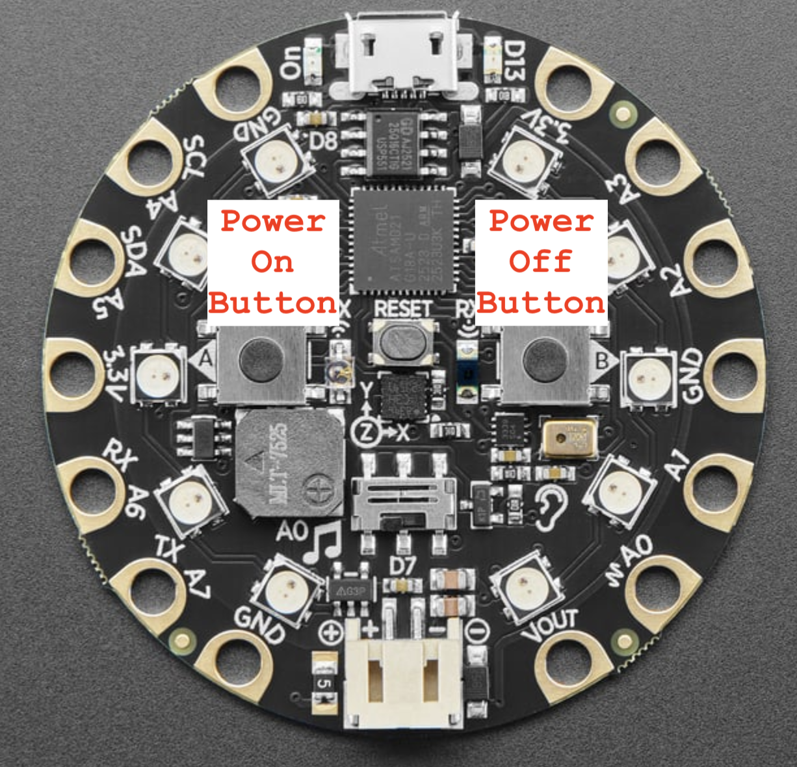
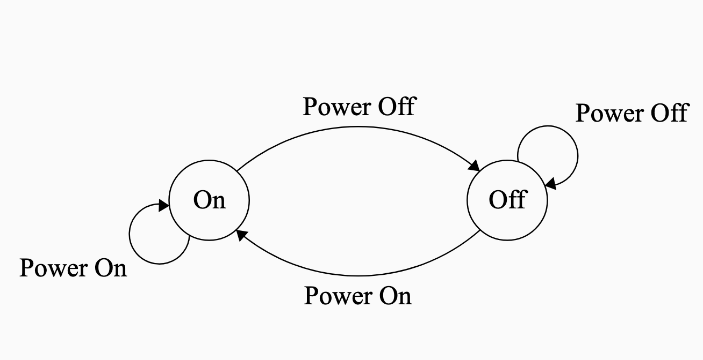
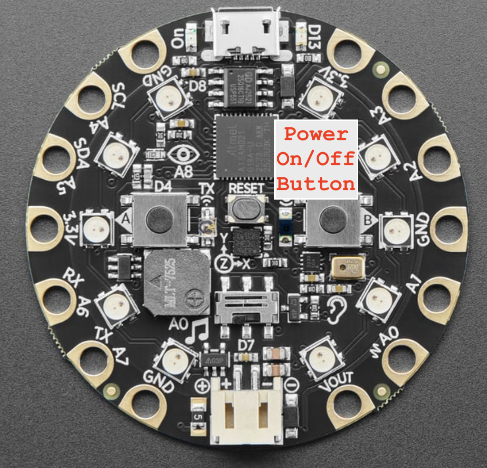
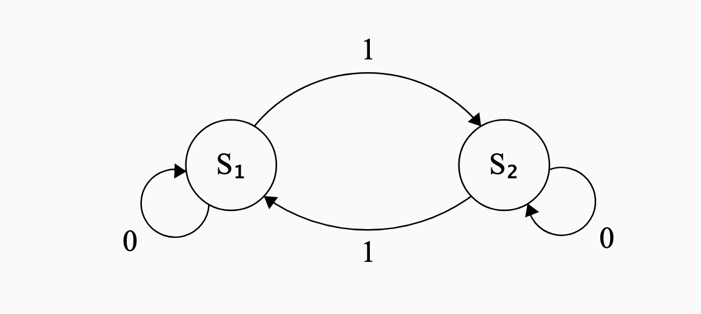
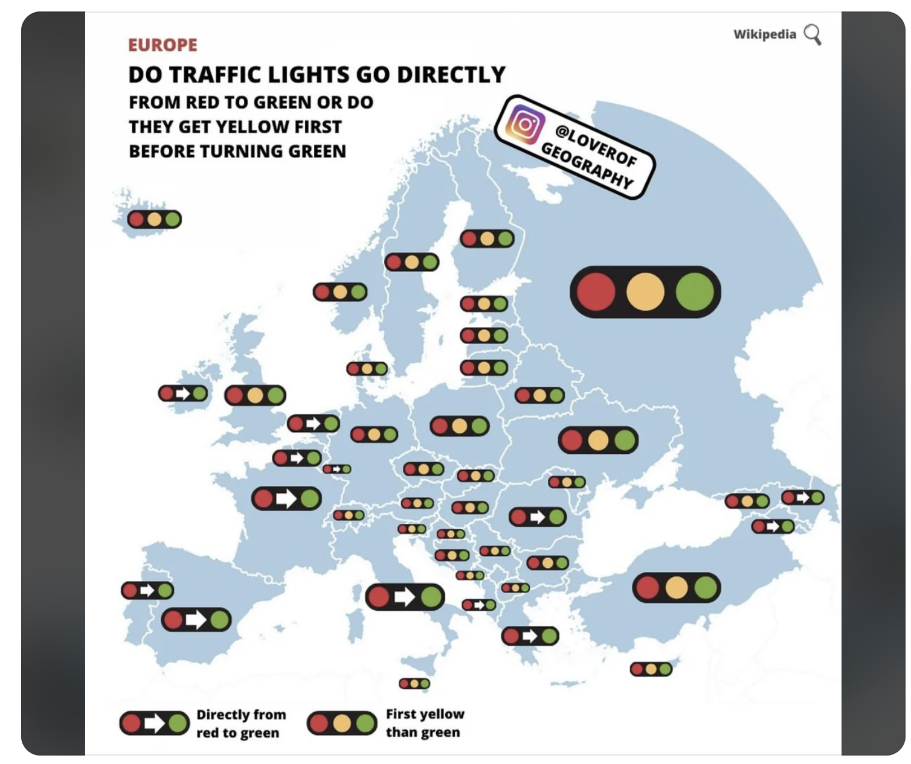
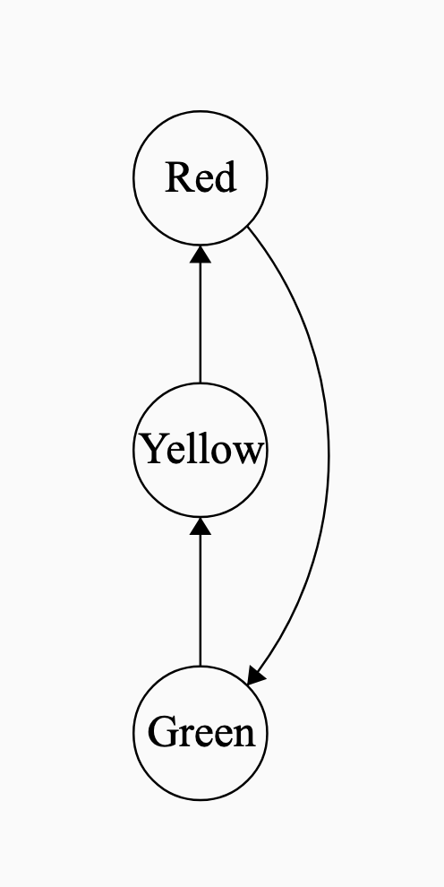
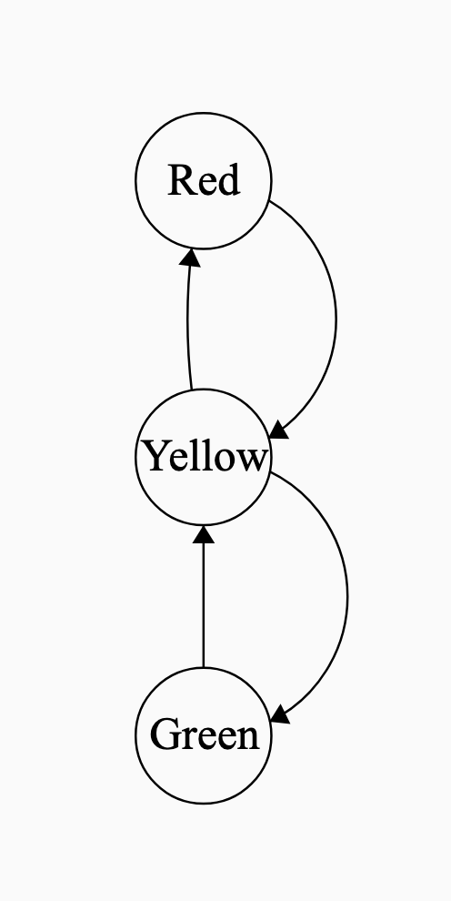
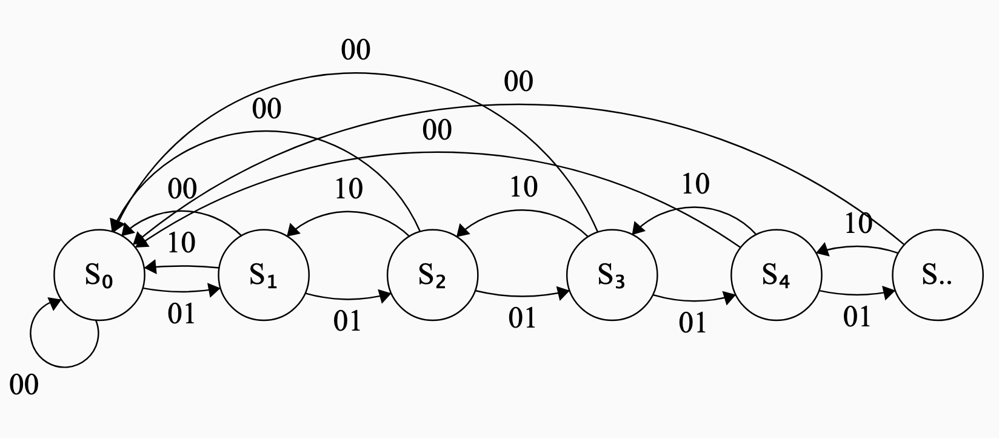

### Finite State Machines

- Finite State Machines (FSM) are an abstraction for computer hardware and software
- A FSM consists of:
  - A set of **states** $\mathcal{Q}$
  - A set of **transitions** $\mathcal{T}: q \rightarrow r$, where $q, r \in \mathcal{Q}$
    - The transitions are sometimes triggered by a set of inputs $\mathcal{P}$
- An **execution** of a FSM is a [sequence of states]{.underline} $$q_0 \rightarrow q_1 \rightarrow q_2 \rightarrow \dots (\rightarrow q_n)$$
  [that may or may not be finite.]{.fragment}

### A simple Finite State Machine

- Two states: $S_1$ and $S_2$
- One binary input, $1$ or $0$
- The transitions are shown in the following [state-transition diagram]{.emph}

{.bordered width="60%" fig-align="center" .fragment #fig-fsm}

- The arrows are labeled with the inputs
- Circles are the states

### Implementing a FSM on CPX

[Modify the code so that it follows the state transition diagram @fig-fsm.]{.inclass}

```{.python}
from adafruit_circuitplayground.express import cpx
import time

state = 1

while True:
    time.sleep(0.5)
    # Define what each state looks like
    if state == 1:
        cpx.pixels[5] = (0,0,50)
    elif state == 2:
        cpx.pixels[5] = (0,50,0)
    
    # Define transitions
    if state == 1 and cpx.button_a:
        state = 2
        continue
    
    if state == 2 and cpx.button_a:
        state = 1
        continue

        

```

### Reading a State-Transition Diagram

::: {.columns}

::: {.column width="50%"}
- When state $S_1$ receives input $0$, the system goes into state $S_2$
- When state $S_2$ receives input $1$, the system goes into state $S_1$
- Giving input $0$ to state $S_2$ or input $1$ to state $S_1$ does not change the state
  - but for completeness we make self-pointing arrows.
:::
::: {.column width="50%"}
{.bordered fig-align="center"}
:::

:::

### Interpreting a State-Transition Diagram

#### But what does this mean?

::: {.columns}

::: {.column width="50%"}
- A Finite State Machine is a 'mental model' for a real system
- A simple "power off/on button" for a light bulb.
  {width="60%"}
- States represent whether light is on/off
- Inputs: Button A, Button B
:::
::: {.column width="50%"}
{.bordered fig-align="center" .fragment}
:::

:::

### Another Finite State Machine

[Interpret the following state-transition diagram. What kind of system could it represent?]{.inclass}

::: {.columns}

::: {.column width="50%"}
::: {.content-hidden unless-meta="uncover"}

{width="60%"}

Inputs: 

- 1: Power Button Pressed
- 2: Power Button not pressed

:::
:::
::: {.column width="50%"}
{.bordered fig-align="center" }
:::

:::

### State Transition Diagrams with no input

- Helpful even when there's no input
- Traffic lights

  {width="40%"}

- FSM for U.S. traffic lights [and U.K. traffic lights]{.content-hidden unless-meta="uncover"}

  {width="15%"}   {width="15%" .content-hidden unless-meta="uncover"}

### Finite State Machine for a counter

- Keeps count up to $n$ steps.
  - State $S_1$ implies we have counted up to $1$.
  - State $S_n$ implies we have counted up to $n$.
- Three possible inputs to the system.
  1. Increment
  2. Decrement
  3. Reset

{width="90%" .content-hidden unless-meta="uncover"}

### Naming inputs and states using binary bits

- It is customary to use binary bits to label each input

  - `00`: Reset
  - `01`: Increment
  - `10`: Decrement

- If there are $p$ inputs, need $k$ bits to encode these inputs where $2^k \ge p > 2^{k-1}$

- It is also customary to use binary bits to label each state

  - `000`: $S_0$
  - `001`: $S_1$
  - `010`: $S_2$
  - `011`: $S_3$
  - `100`: $S_4$
  - `101`: $S_5$

### Requirements for a Finite State Machine / State-Transition Diagram

#### For a State Transition Diagram to be complete:

- If there are $m$ possible inputs, then there must be $m$ outgoing arrows from **each state**, exactly one for each input.
- There is no corresponding restriction on the number of incoming arrows to each state.

### Combination Lock

Run the following code to implement a FSM for a 4-step combination lock on the Circuit Playground Express.

Press some combination of A and B to unlock your device. All four lights green = unlocked!

```{.python}
from adafruit_circuitplayground.express import cpx
import time

state = 1

def wait_till_release_A():
    while cpx.button_a:
        print("release button to complete transition")
        time.sleep(0.5)
def wait_till_release_B():
    while cpx.button_b:
        print("release button to complete transition")
        time.sleep(0.5)

while True:
    time.sleep(0.05)
    # Define what each state looks like
    if state == 1:
        # Locked state
        for k in range(0,4):
            cpx.pixels[k] = (50,0,0)
    elif state == 2:
        # One correct entry
        for k in range(1,4):
            cpx.pixels[k] = (50,0,0)
        cpx.pixels[0] = (0,50,0)
    elif state == 3:
        # Two correct entry
        for k in range(2,4):
            cpx.pixels[k] = (50,0,0)
        for k in range(0,2):
            cpx.pixels[k] = (0,50,0)
    elif state == 4:
        # Three correct entry
        cpx.pixels[3] = (50,0,0)
        for k in range(0,3):
            cpx.pixels[k] = (0,50,0)
    elif state == 5:
        # Four correct entry -- unlocked !
        for k in range(0,4):
            cpx.pixels[k] = (0,50,0)
            
    if state == 1:
        if cpx.button_a:
            state = 2
            print("Button A pressed! moving from state 1 to state 2")
            wait_till_release_A()
        elif cpx.button_b:
            state = 1
            print("Button B pressed! moving from state 1 to state 1")
            wait_till_release_B()

    if state == 2:
        if cpx.button_a:
            state = 1
            print("Button A pressed! moving from state 1 to state 2")
            wait_till_release_A()
        elif cpx.button_b:
            state = 3
            print("Button B pressed! moving from state 1 to state 1")
            wait_till_release_B()

    if state == 3:
        if cpx.button_a:
            state = 1
            print("Button A pressed! moving from state 1 to state 2")
            wait_till_release_A()
        elif cpx.button_b:
            state = 4
            print("Button B pressed! moving from state 1 to state 1")
            wait_till_release_B()
    
    if state == 4:
        if cpx.button_a:
            state = 5
            print("Button A pressed! moving from state 1 to state 2")
            wait_till_release_A()
        elif cpx.button_b:
            state = 1
            print("Button B pressed! moving from state 1 to state 1")
            wait_till_release_B()
        
```

[Draw the state transition diagram for this]{.inclass}
