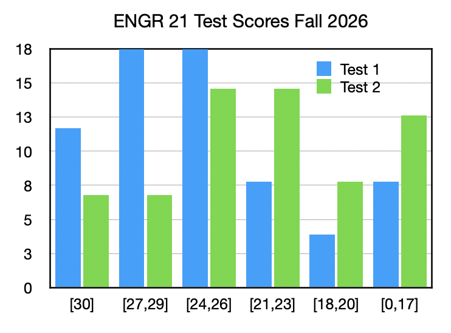
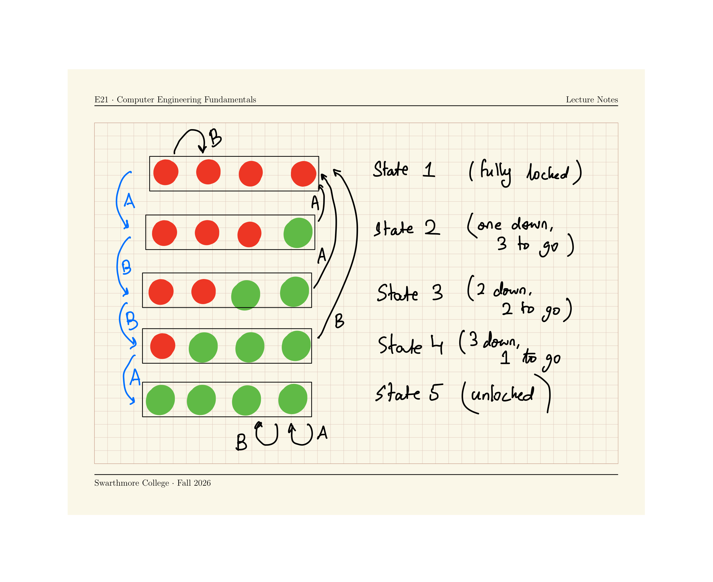
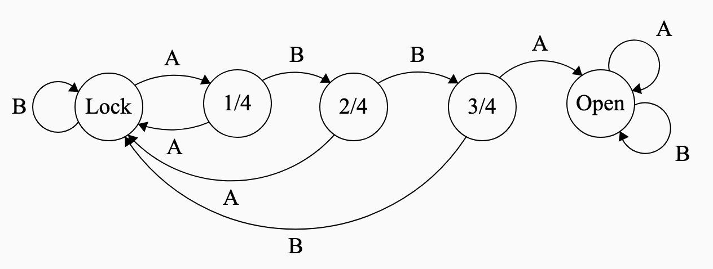
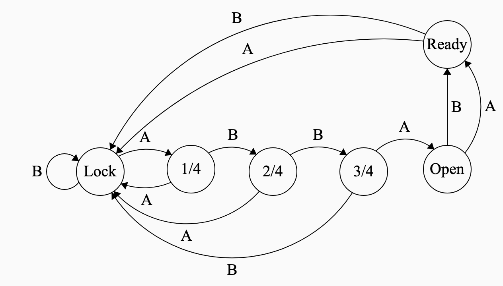
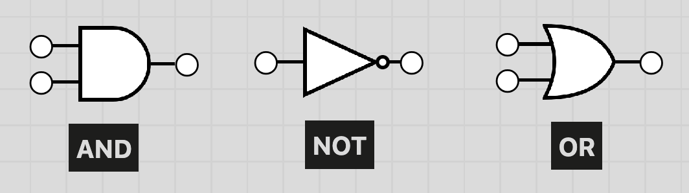
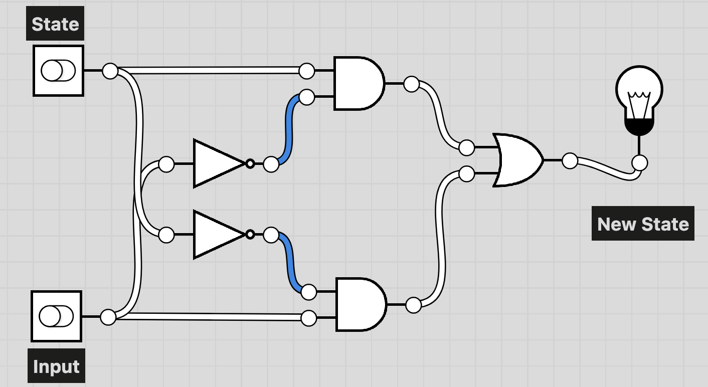
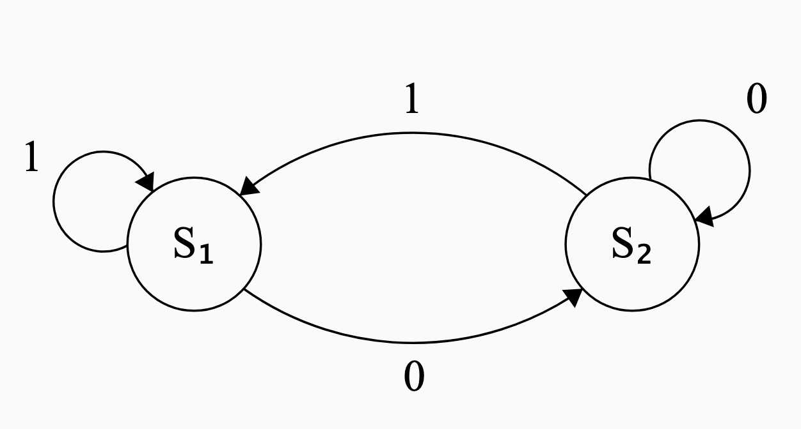

### Test 2 Discussion

::: {.content-hidden unless-meta="uncover"}

::: {.nonincremental}

{width="50%" fig-align="center"}

- Mean: 22.4
- Median: 23

:::

:::

### Combination Lock --- Review

Run the following code to implement a FSM for a 4-step combination lock on the Circuit Playground Express.

Press some combination of A and B to unlock your device. All four lights green = unlocked!

```{.python}
from adafruit_circuitplayground.express import cpx
import time

state = 1

def wait_till_release_A():
    while cpx.button_a:
        print("release button to complete transition")
        time.sleep(0.5)
def wait_till_release_B():
    while cpx.button_b:
        print("release button to complete transition")
        time.sleep(0.5)

while True:
    time.sleep(0.05)
    # Define what each state looks like
    if state == 1:
        # Locked state
        for k in range(0,4):
            cpx.pixels[k] = (50,0,0)
    elif state == 2:
        # One correct entry
        for k in range(1,4):
            cpx.pixels[k] = (50,0,0)
        cpx.pixels[0] = (0,50,0)
    elif state == 3:
        # Two correct entry
        for k in range(2,4):
            cpx.pixels[k] = (50,0,0)
        for k in range(0,2):
            cpx.pixels[k] = (0,50,0)
    elif state == 4:
        # Three correct entry
        cpx.pixels[3] = (50,0,0)
        for k in range(0,3):
            cpx.pixels[k] = (0,50,0)
    elif state == 5:
        # Four correct entry -- unlocked !
        for k in range(0,4):
            cpx.pixels[k] = (0,50,0)
            
    if state == 1:
        if cpx.button_a:
            state = 2
            print("Button A pressed! moving from state 1 to state 2")
            wait_till_release_A()
        elif cpx.button_b:
            state = 1
            print("Button B pressed! moving from state 1 to state 1")
            wait_till_release_B()

    if state == 2:
        if cpx.button_a:
            state = 1
            print("Button A pressed! moving from state 1 to state 2")
            wait_till_release_A()
        elif cpx.button_b:
            state = 3
            print("Button B pressed! moving from state 1 to state 1")
            wait_till_release_B()

    if state == 3:
        if cpx.button_a:
            state = 1
            print("Button A pressed! moving from state 1 to state 2")
            wait_till_release_A()
        elif cpx.button_b:
            state = 4
            print("Button B pressed! moving from state 1 to state 1")
            wait_till_release_B()
    
    if state == 4:
        if cpx.button_a:
            state = 5
            print("Button A pressed! moving from state 1 to state 2")
            wait_till_release_A()
        elif cpx.button_b:
            state = 1
            print("Button B pressed! moving from state 1 to state 1")
            wait_till_release_B()
        
```

[Draw the state transition diagram for this]{.inclass}

### State Transition Diagram for lock

`ABBA` opens the lock

{#fig-lock}

### State Transition Tables 

:::{#tbl-table}

| State         | Input:<br>A   | Input:<br>B   |
|-----------    |-------------  |-------------  |
| Locked        | 1 Correct     | Locked        |
| 1 Correct     | Locked        | 2 Correct     |
| 2 Correct     | Locked        | 3 Correct     |
| 3 Correct     | Unlocked      | Locked        |
| Unlocked      | Unlocked      | Unlocked      |

:::

- State transition **tables** are an alternative to state transition **diagrams** for showing how a Finite State Machine works
- Each row corresponds to a possible current state of the system.
- Each column corresponds to a possible input to the system.
- Each entry corresponds to the new state that results.

### Engineering Specifications to Finite State Machines

- The combination lock system is described by @tbl-table, @fig-lock, @fig-lock1
- Implement a **new engineering specification**:
    - After unlock, any key should light all four LEDs blue.
    - Any further key press should 'lock' it again.
- [Add new entries to the state-transition table and modify the code]{.inclass} to meet  this specification.

{#fig-lock1 width="80%" fig-align="center"}


### Modified Lock FSM

:::: {.content-visible when-meta="uncover"}

To accommodate the new specifications:

- Create a new state and add it to the table

  ::: {style="font-size: 16pt;"}
  | State         | Input:<br>A   | Input:<br>B   |
  |-----------    |-------------  |-------------  |
  | Locked        | 1 Correct     | Locked        |
  | 1 Correct     | Locked        | 2 Correct     |
  | 2 Correct     | Locked        | 3 Correct     |
  | 3 Correct     | Unlocked      | Locked        |
  | Unlocked      | **Ready**     | **Ready**     |
  | **Ready**     | Locked        | Locked        |

  :::


{#fig-lock1 width="60%" fig-align="center"}

::::

### Truth Tables for Finite State Machines

- A FSM can also be expressed as a truth table
- Need an encoding of the states and inputs using `0` and `1`.
- Let's use a simply FSM with one binary state variable and one binary input: the [retractable ball point pen](https://www.youtube.com/watch?v=MhVw-MHGv4s).
- **States:** Nib out (`1`), Nib retracted (`0`)
- **Input:** Press button (`1`), Don't press button (`0`)

::: {.fragment}

| State     | Input     | New State     |
|-------    |-------    |-----------    |
| 0         | 0         | 0             |
| 0         | 1         | 1             |
| 1         | 0         | 1             |
| 1         | 1         | 0             |

: Truth Table for Finite State Machine representing retractable pen {#tbl-a}

:::

### Logic Gates for Finite State Machines

{width="95%" fig-align="center"}

::: {layout-ncol=3}
`A AND B` is True **if and only if** _both_ `A` and `B` are `True` 

`NOT A` is True **if and only if** `A` is `False`.

`A OR B` is True **if and only if** _either_ `A` or `B` (or both) are `True`

:::


[These three logic gates can be used to implement truth tables, and therefore Finite State Machines]{.fragment}

### Implementing a Truth Table using Logic Gates

::: {layout-ncol=2}
| State     | Input     | New State     |
|-------    |-------    |-----------    |
| 0         | 0         | 0             |
| 0         | 1         | 1             |
| 1         | 0         | 1             |
| 1         | 1         | 0             |



:::

### Truth Tables for systems with more than 4 state-input combinations

Let's return to the 4-step combination lock.

| State         | Input:<br>A   | Input:<br>B   |
|-----------    |-------------  |-------------  |
| Locked        | 1 Correct     | Locked        |
| 1 Correct     | Locked        | 2 Correct     |
| 2 Correct     | Locked        | 3 Correct     |
| 3 Correct     | Unlocked      | Locked        |
| Unlocked      | **Ready**     | **Ready**     |
| **Ready**     | Locked        | Locked        |


To get a truth table for this, we:

- Encode each state as a binary number. Locked: `000`. 1 Correct: `001`. 2 Correct: `010`. 3 Correct: `011`. Unlocked: `100`. Ready: `101`.
- Encode each input as a binary number: A = `0` and B = `1`
- The choice of encoding is arbitrary, but will determine what the truth table looks like.

### Truth Table for combination lock `ABBA`

::: {.columns}
::: {.column width="40%"}
| State | Input | New State |
| ----- | ----- | --------- |
| `000` | `0`   | ?         |
| `000` | `1`   | ?         |
| `001` | `0`   | ?         |
| `001` | `1`   | ?         |
| `010` | `0`   | ?         |
| `010` | `1`   | ?         |
| `011` | `0`   | ?         |
| `011` | `1`   | ?         |
| `100` | `0`   | `101`     |
| `100` | `1`   | `101`     |
| `101` | `0`   | `000`     |
| `101` | `1`   | `000`     |
:::

::: {.column width="20%"}

:::

::: {.column width="40%"}
::: {style="font-size:16pt;"}
| State   | Input A <br> `0` | Input A <br> `1` |
| ------- | ----------- | ----------- |
| ◯ ◯ ◯ ◯ | ✓ ◯ ◯ ◯     | ◯ ◯ ◯ ◯     |
| ✓ ◯ ◯ ◯ | ◯ ◯ ◯ ◯     | ✓ ✓ ◯ ◯     |
| ✓ ✓ ◯ ◯ | ◯ ◯ ◯ ◯     | ✓ ✓ ✓ ◯     |
| ✓ ✓ ✓ ◯ | ✓ ✓ ✓ ✓     | ◯ ◯ ◯ ◯     |
| ✓ ✓ ✓ ✓ | Ready       | Ready       |
| Ready   | ◯ ◯ ◯ ◯     | ◯ ◯ ◯ ◯     |
:::

Definitions:

::: {style="font-size:16pt;"}
| State   | Encoding | Meaning  |
| ------- | -------- | -------- |
| ◯ ◯ ◯ ◯ | `000`    | Locked   |
| ✓ ◯ ◯ ◯ | `001`    | 1 down   |
| ✓ ✓ ◯ ◯ | `010`    | 2 down   |
| ✓ ✓ ✓ ◯ | `011`    | 3 down   |
| ✓ ✓ ✓ ✓ | `100`    | Unlocked |
| Ready   | `101`    | Ready    |

[Fill in the new state column]{.inclass}


:::
:::


:::

### A simple Finite State Machine: Building its State Transition Table

{width="50%" fig-align="center"}

- Let's build the state-transition table for this FSM.
- Naming convention: $S_1$ is `0`, $S_2$ is `1`.

| State       | Input `0` | Input `1` |
| ----------- | --------- | --------- |
| `0` | [`1`]{.fragment}       | [`0`]{.fragment}       |
| `1` | [`1`]{.fragment}       | [`0`]{.fragment}       |

### A simple Finite State Machine: Building its Truth Table

{width="50%" fig-align="center"}

- Let's build the truth table for this FSM.
- Naming convention: $S_1$ is `0`, $S_2$ is `1`.

| State       | Input  | New State |
| ----------- | --------- | --------- |
| `0` | `0`      | [`1`]{.fragment}       |
| `0` | `1`      | [`0`]{.fragment}       |
| `1` | `0`     | [`1`]{.fragment}       |
| `1` | `1`      | [`0`]{.fragment}       |

### A simple Finite State Machine: Implementing it with Logic Gates {.scrollable}

::: {layout-ncol=2}
{width="50%" fig-align="center"}

| State (A)       | Input (B)  | New State |
| ----------- | --------- | --------- |
| `0` | `0`      | `1`       |
| `0` | `1`      | `0`       |
| `1` | `0`     | `1`       |
| `1` | `1`      | `0`       |

:::

[Draw a logic-gate diagram for this truth table using `AND` `OR` and `NOT`]{.inclass}

::: {.content-hidden unless-meta="uncover"}

Strategy:

- Look for a combination of _and_, _or_ and _not_ statements that describe the **new state** column in terms of the other two columns.
- Write out a boolean statement in words.

  [New State is `1` if [State and Input are both `0`]{.underline}, _or_ if [State is `1` and Input is `0`]{.underline}.]{.emph}
- Write down the conditions needed for New State to be `1`.

  = `(not A and not B) or (A and not B)`.
- Otherwise, New State is assumed to be `0` because of the **law of excluded middle**


:::

### Practice with Finite State Machines

{#fig-fsmnew width="50%" fig-align="center"}

[Make a state-transition table, a truth table, a logic diagram and Python code for the Finite State Machine in @fig-fsmnew]{.inclass}


