### Lab Section Assignments

See [Google Sheet](https://docs.google.com/spreadsheets/d/1HvjXx8n-77pGVphuhDs-Ih6Q8M8EpT8X141fMiJJnDc/edit?gid=0#gid=0) sent out by Prof. Zucker!


### Materials you should have 

:::{.nonincremental}

::: {layout="[30, 30, 30]"}
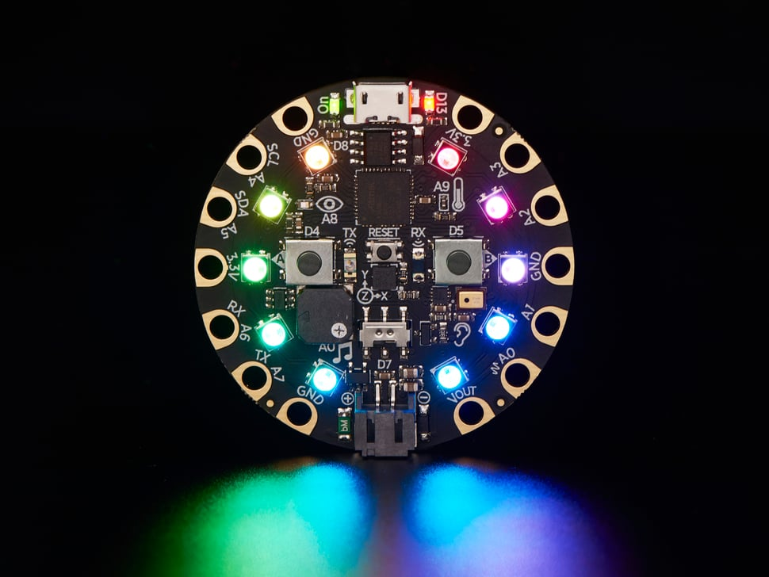

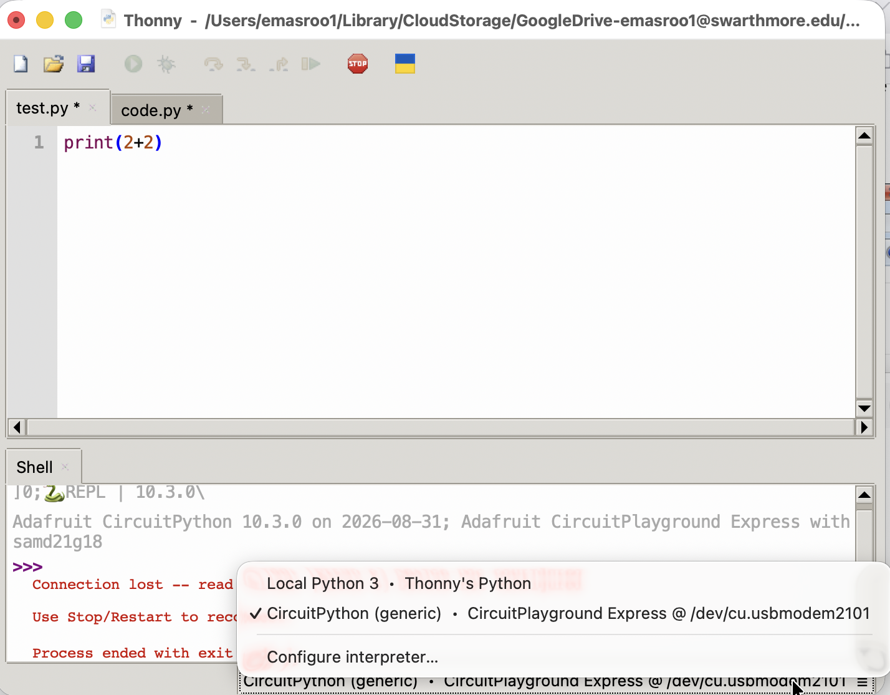

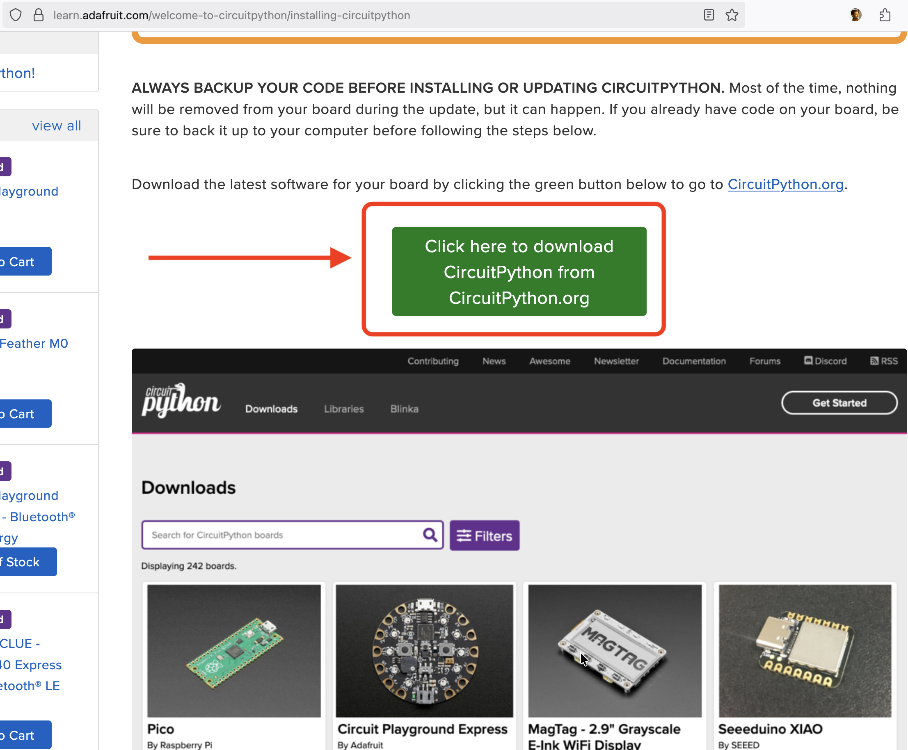
:::

\* Drag-and-drop UF2 file onto CPLAYBOOT drive; if you see CIRCUITPY as an external drive, you have succeeded. Find instructions on [Lecture 1 page](../Lec1/#installation-instructions).

Also:

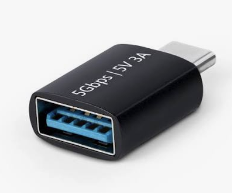{width="30%" fig-align="left"}

:::


### Integrated Development Environment (IDE)

- A 'development environment' is the program (or programs) you use to write code.
- It's possible to simply use Notepad as your Development Environment, but that's kinda lame
- Some options
  - VS Code (v. popular among Swat students)
  - A simple text editor with syntax highlighting (e.g. Sublime Text)
  - **Thonny**, Mu, other 'lightweight IDEs'
  - IDLE (official Python IDE)

### Two ways to run code on your board

::: {layout="[50, 50]"}


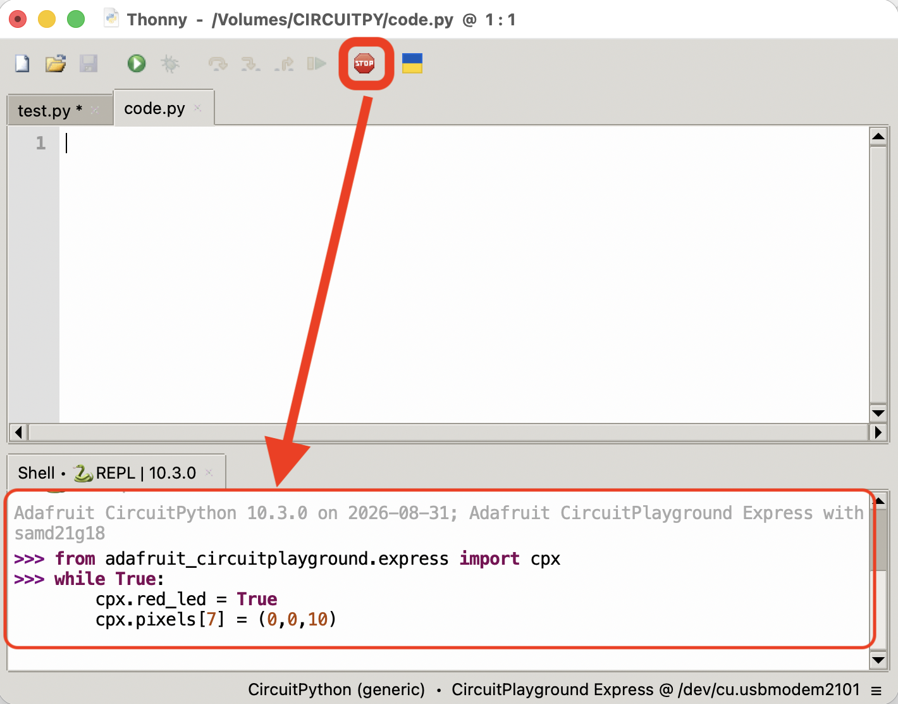
:::

::: {layout="[50, 50]"}
::: {.nonincremental}
- Once you're sure what you want to code
- Thoughtful, long-form coding
- Runs if and when you save `code.py`
- Persistent
:::

::: {.nonincremental}
- Trying things out
- Instant feedback if works
- Runs when you hit enter
- No memory
:::
:::

### Let's start with the CPX in interactive mode

1. Disconnect and reconnect CPX.
2. Open Thonny Code Editor. You should see "CircuitPython (generic)" here.

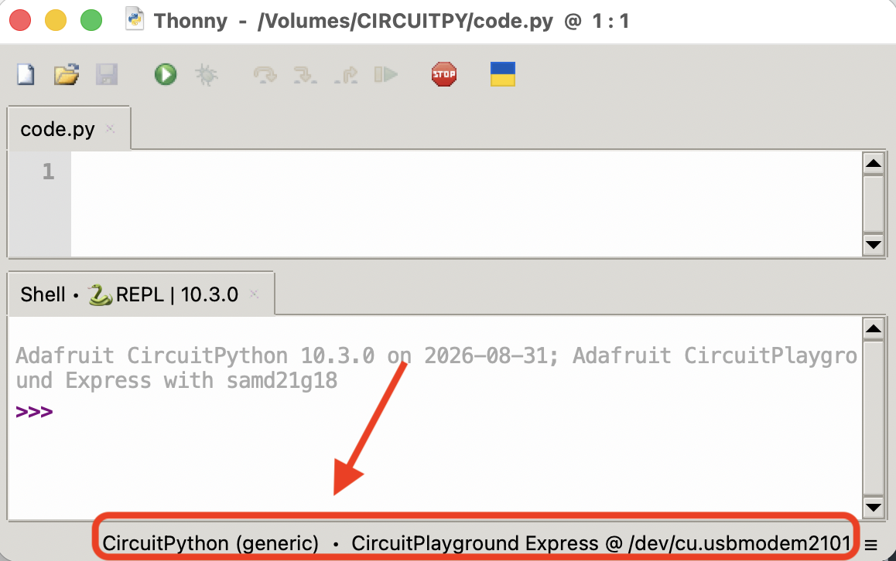{width="45%" fig-align="left" .fragment} {width="37%" fig-align="right" .fragment}

3. Click 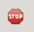. You should now see white lights 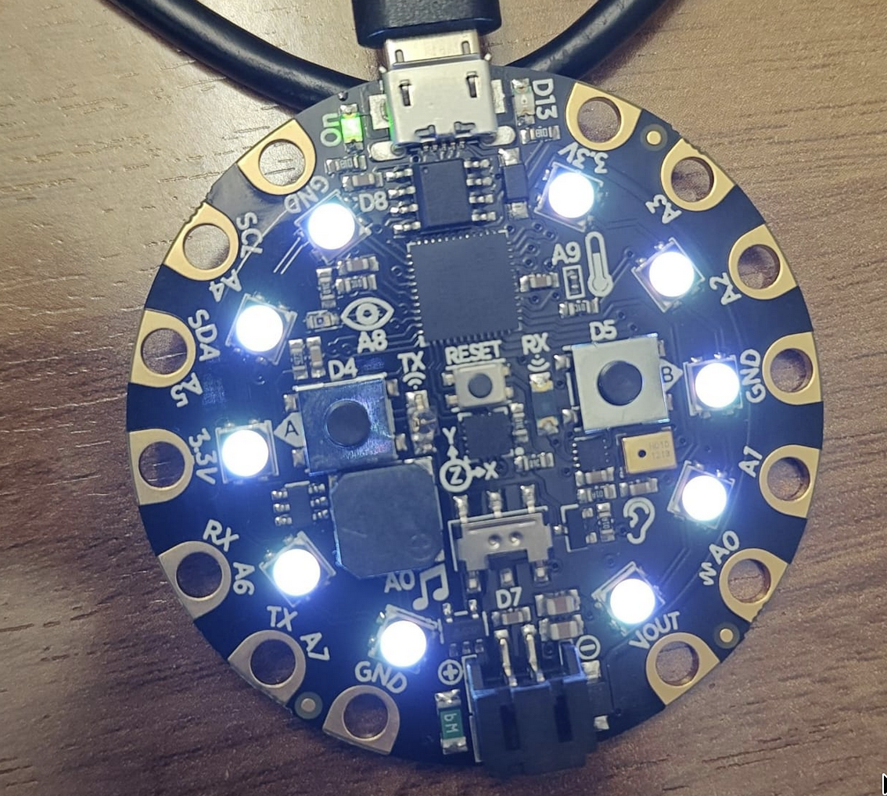{width="20%"}

### Using your Circuit Playground Express

The CPX can do some things without loading any libraries. e.g., try:

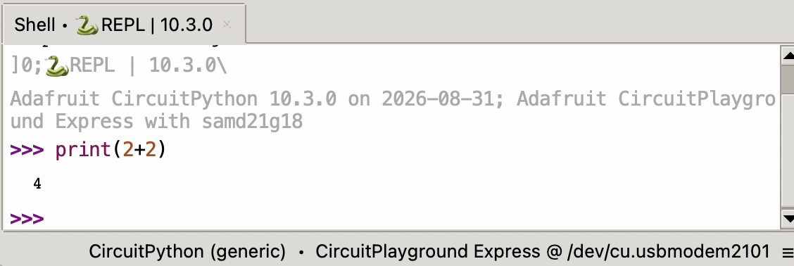

This **uses the computer on board the CPX** to calculate 2+2.

::: {.callout-note}
## Python features
Unlike MATLAB, semicolons are irrelevant. Don't use them!

:::

### The Adafruit Library

The CPX comes with a library of programs to control it, but you have to load it. Enter:

```{.python}
from adafruit_circuitplayground.express import cpx
```

Find the documentation for this library [here](https://docs.circuitpython.org/projects/circuitplayground/en/latest/index.html).

:::{.callout-note}
## Express vs. non-Express

Much of the code we use is shared between the 'express' and 'non-express' versions. You can often do

```{.python}
from adafruit_circuitplayground import cp
```
instead of 

```{.python}
from adafruit_circuitplayground.express import cpx
```
:::


::: {.callout-tip}
Keep this snippet of code handy if you're slow to type; you'll have to copy-and-paste it many times!
:::

### Reading Sensors on the CPX

::: {.nonincremental}
1. Light Sensor: `cpx.light`
2. Acceleration: `cpx.acceleration`
3. Temperature: `cpx.temperature`
4. Touch sensors: `cpx.touch_A4`, `cpx.touch_A3` etc.

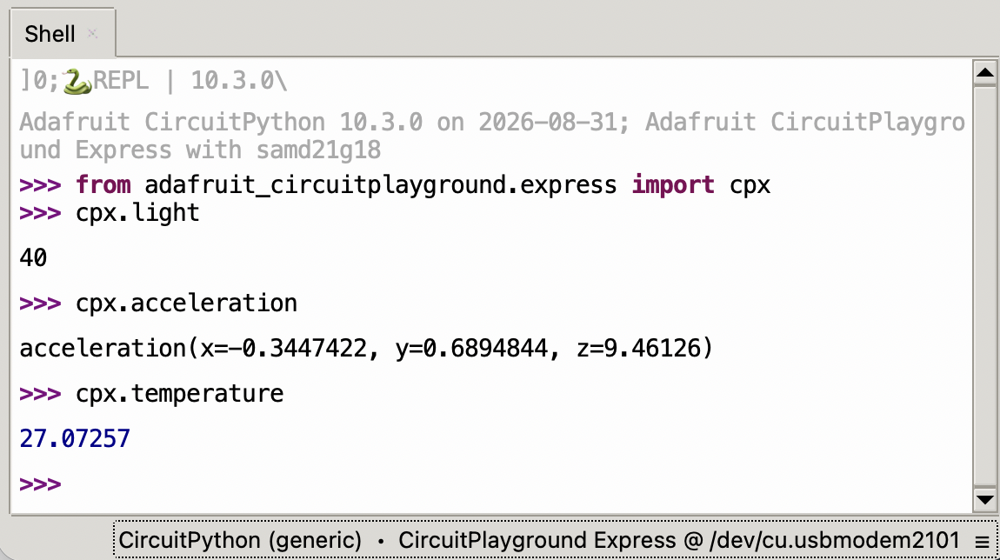
:::

### Output with the CPX

::: {.nonincremental}
1. Play a tone at x Hertz for y seconds: `cpx.play_tone(x,y)`
2. Light up pixel number N with a light made up of Red, Green, and Blue elements:
   
   `cpx.pixels[4] = (30,100,20)`
   
   This will produce light on pixel number 4 with the following components:
   
   Red: 30, Green: 100, Blue: 20
:::

### Python preliminaries

- Like MATLAB, Python is an **interpreted** language.
  - by contrast, C is a 'compiled' language

- Unlike MATLAB, indentation matters!

::: {.callout-note}
## Variable Assignment

Assigning a value to a variable in Python occurs with `=`. Thus `a = 5` takes the value `5` and assigns it to the variable named `a`. 
:::

### Conditionals

A _conditional_ is a statement that evaluates to **True** or **False**.

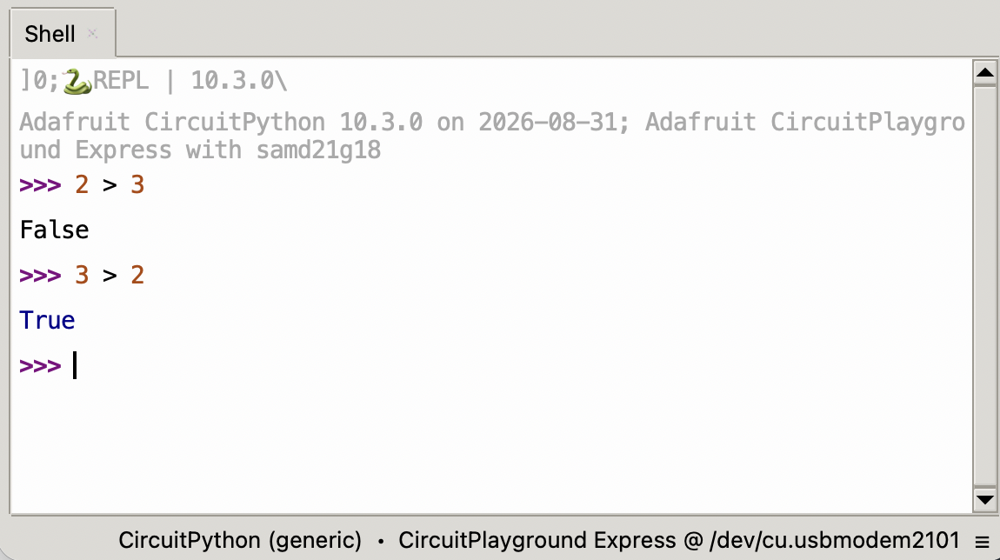{width="75%"}

::: {.callout-tip}
## Conditional operators --- comparing two numbers
- `>`: Greater than
- `<`: Less than
- `==`: Equal to
- `!=`: Not equal to
- `>=`: Greater than or equal to
- `<=`: Less than or equal to
:::

### Trying out conditional operators on CPX

:::{.fragment}
Try the following code:

`cpx.light > 100`
:::

::: {.fragment}
Next, try this with a cell phone flashlight shining on the CPX.

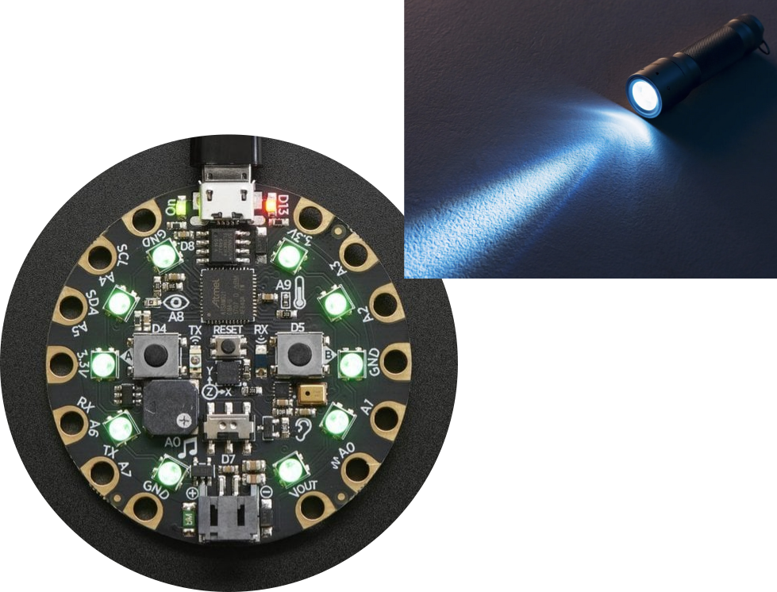{width="40%"}
:::

### Practice with conditionals

Try the following lines of code inside **Thonny Code Editor** in interactive mode.

```{.python}
>>> True == 'True'
>>> 3 == ‘3’
>>> None == 0
>>> None == None
>>> 0.1 + 0.2 == 0.3
>>> 1 == 0.9999
>>> 1 == 0.999999…
>>> (3 + 2j) > (2 + 1j)
>>> [] == []
>>> ‘’ == ‘’
>>> [] == ‘’
>>> [1,2] < [3,4,5]
>>> True == 1
>>> False == 0
>>> (3 > 2) != (5 < 4)
>>> 1.0 == 1
```

### Variable Types: Boolean

- A conditional statement of the form `cpx.light > 100` [checks whether the variable `cpx.light` is more than `100`]{.underline} and returns an answer: **True** or **False**

- This is a special type of variable called a **Boolean**

:::{.fragment}
:::{.callout-tip}
## Boolean variables
are either **True** or **False**. There are no maybe's!
:::
:::

- Some examples of Boolean variables:
  - `True` (without quotes)
  - `False` (without quotes)
  - `(2 > 3)` with or without parantheses
  - `(cpx.light < 100)`


### Logical Operations on conditionals

Python has two main **binary logical operators** that operate on two Boolean variables on either side:

::: {.nonincremental}
1. `x and y`
2. `a or b`
:::

There is also a **logical operator** that operates on only one Boolean variable:

::: {.nonincremental}
3. `not c`
:::

Try the following code line by line:

```x = True```

```y = False```

```z = True```

Then try using `and`, `or` and `not` on the three variables `x`, `y` and `z` and observe the results.


### Truth Tables for binary logical operators

[for the `and` operator]{.underline}

| Variable `A` | Variable `B` | Result of `A and B` |
| ------------ | ------------ | ------------------- |
| `True`       | `True`       | `True`              |
| `True`       | `False`      | `False`             |
| `False`      | `True`       | `False`             |
| `False`      | `False`      | `False`             |

[for the `or` operator]{.underline}

| Variable `A` | Variable `B` | Result of `A or B` |
| ------------ | ------------ | ------------------- |
| `True`       | `True`       | `True`              |
| `True`       | `False`      | `True`              |
| `False`      | `True`       | `True`              |
| `False`      | `False`      | `False`             |


### Common variable types in Python

| Type                   | Name    | Purpose                   |
| ---------------------- | ------- | ------------------------- |
| String                 | `str`   | String of text            |
| Integer                | `int`   | Whole numbers             |
| Floating-point numbers | `float` | Decimals                  |
| Boolean                | `bool`  | Truth value               |
| List                   | `list`  | Ordered list of variables |
| Tuple                  | `tuple` | Un-alterable list         |
| Range                  | `range` | A sequence of numbers     |


Check the type of a variable `x` using `type(x)`

::: {.callout-note}
## Python features
Parantheses around a single variable don't do anything.

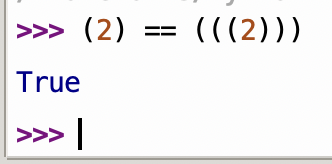{width="25%" fig-align="center"}
:::


### Numbers in Python: `float` and `int`

- In Python, it is important to distinguish between `int`s and `float`s.
- In MATLAB, numbers default to being floating-point.

::: {.callout-important}
## What's a floating-point number?
We will get to this later in E21!
:::

::: {layout="[50, 50]"}
`int` is a whole number. <br>
`float` is a decimal number.

```{.python}
>>> a = 5     # this is an int
>>> a = 5.0   # this is a float

>>> type(6)
<class 'int'>
>>> type(6.0)
<class 'float'>

```
:::

### The `list` and `tuple` types

::: {layout="[50, 50]"}
Lists and tuples in Python are **zero-indexed**. <br> Lists can be modified. <br> Tuples, once set, cannot be changed.

```{.python}
>>> a = [1,3,5,7,10]
>>> type(a)
<class ‘list’>
>>> a[0]
1
>>> a[3]
7
>>> b = [4, 2.4, 2+4j]
>>> type(b[0])
<class ‘int’>
>>> type(b[1])
<class ‘float’>
>>> type(b[2])
<class ‘complex’>
>>> s = (3,4,5)
>>> s[1]
4
```
:::

### The `range` type

::: {layout="[50, 50]"}
Refers to a range of **whole numbers**. <br> You can access different elements of a `range` the same way you would access elements of a list. <br> <br> Your computer saves memory if you use `range` instead of `list`. <br> <br>

```{.python}
>>> a = [1,3,5,7,9,11,13]
>>> b = range(1,13,2)
>>> a[3]
7
>>> b[3]
7
>>> c = range(13)
>>> c[9]
9
>>> d = range(5,13)
>>> d[0]
5
>>> d[7]
12
```
:::

::: {.content-visible when-meta="uncover"}
::: {.content-visible when-format="revealjs"}
::: {.fragment}
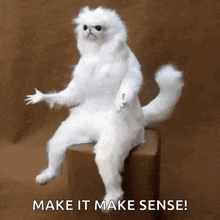{.absolute top=450 left=600 width="300"}
:::
:::
:::

| Usage                                             | Code           |
| ------------------------------------------------- | -------------- |
| From `0` to `N-1`                                 | `range(N)`     |
| From `a` to `b-1`                                 | `range(a,b)`   |
| From `a` to `b` in steps of `c` but excluding `b` | `range(a,b,c)` |


### While Loops

- A `while` loop makes code run for ever... [**while** the loop's condition is `True`]{.fragment}
- In words: "While **condition is true**, keep **doing thing**"

::: {.fragment}
```{.python}
# This program makes the Circuit Playground Express 
# play middle A (440 Hz) and then a higher note (880 Hz)
# until you touch pin A4. Then, it plays a low note once.
while not cpx.touch_A4:
    cpx.play_tone(440,1)
    cpx.play_tone(880,0.5)
cpx.play_tone(220,1)
```
:::

- Some things to notice about **while** loops:
  - What happens when the condition is not true?
  - Indentation and colon symbol

::: {style="font-size: 70%"}
1. Check if the condition is true. If yes:
2. Execute `cpx.play_tone(440,1)`
3. Execute `px.play_tone(880,0.5)`
4. Check if the condition is (still) true:
   - If yes: return to step 2.
   - If no: **exit the loop**
:::


### You can indent as much as you want

But be consistent.

```{.python}

while True:
  cpx.play_tone(440,1)
  cpx.play_tone(880,0.5)

while True:
      cpx.play_tone(440,1)
      cpx.play_tone(880,0.5)

while True:
              cpx.play_tone(440,1)
              cpx.play_tone(880,0.5)

```

### You can [nest]{.underline} one while loop inside the other

[Nested Loops]{.underline}

```{.python}
while not cpx.touch_A4:
  cpx.play_tone(440,1)
  while True:
    cpx.play_tone(220,1)
```

Two loops at the same indentation level are **not** nested:

```{.python}
while not cpx.touch_A4:
  cpx.play_tone(440,1)
while True:
    cpx.play_tone(220,1)
```


