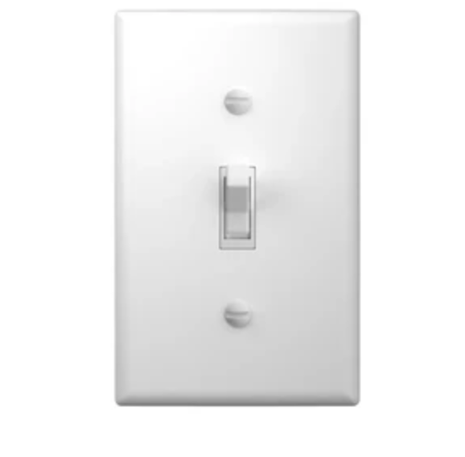
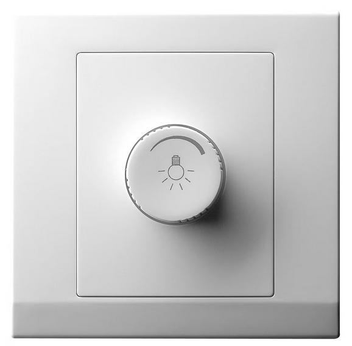
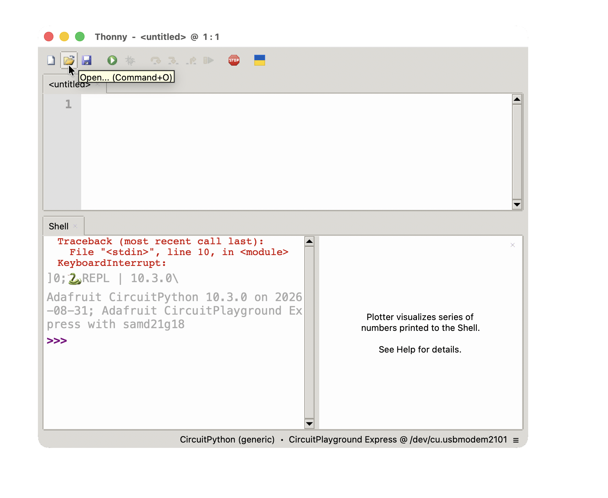
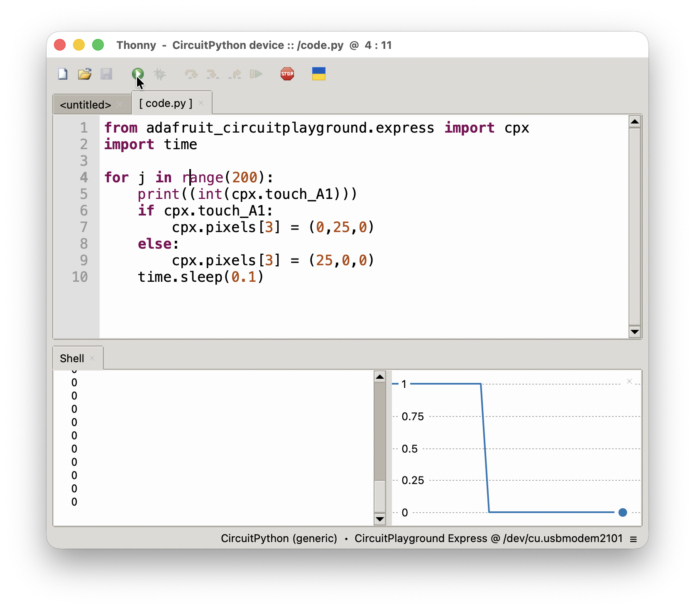

### Lab Section Assignments

See [Google Sheet](https://docs.google.com/spreadsheets/d/1HvjXx8n-77pGVphuhDs-Ih6Q8M8EpT8X141fMiJJnDc/edit?gid=0#gid=0) sent out by Prof. Zucker!

Labs start Thursday

### Numbers with Base N

#### For Decimal numbers, $N = 10$

- Decimal numbers run from zero to nine
- The largest single-digit number is nine ($=10^1 - 1$)
- The largest two-digit number is ninety-nine ($=10^2 - 1$)
- The symbol `10` represents the number ten

#### For Base-N numbers

- [Base N]{.underline} numbers run from zero to [`N-1`]{.underline}
- The largest single-digit number is ($=N^1 - 1$)
- The largest two-digit number is ($=N^2 - 1$)
- The symbol `10` represents the number [`N`]{.underline}

### Base Systems

| Property                | Decimal    | Binary    | Hexadecimal |
| ----------------------- | ---------- | --------- | ----------- |
| Digits                  | 0 to 9     | 0 to 1    | 0 to 15     |
| Base                    | Ten        | Two       | Sixteen     |
| Smallest <br> 3-digit number | $10^{3-1}$ <br> $= 100$| $2^{3-1}$ <br> $=4$ | $16^{3-1}$ <br> $=256$  |


### How (decimal) numbers work

#### The place-value system

Number: One hundred and thirty seven

| Power of 10 | 2                 | 1                 | 0                 |
| ----------- | ----------------- | ----------------- | ----------------- |
| Digit       | 1                 | 3                 | 7                 |
| Units       |                   |                   | $7 \times 10^{0}$ |
| Tens        |                   | $3 \times 10^{1}$ |                   |
| Hundreds    | $1 \times 10^{2}$ |                   |                   |
| Total       | $100+$            | $30+$             | $7$         |

::: {.fragment}
$$\boxed{=137}$$
:::

### Features of the place-value system

Number: One hundred and thirty seven

$$\boxed{=137}$$

- The digit on the right is the "least significant digit"
- The left-most digit is the "most significant digit"
- Zeros can be added to the left without changing the value.
- Zeros cannot be added to the right.

::: {.fragment}
These features apply to [all]{.underline} place-value systems, not just base-ten.
:::


### Binary Number System

The only symbols are 0 and 1

1. `00001`
2. `00010`
3. `00011`
4. `00100`
5. `00101`
6. `00110`
7. `00111`
8. `01000`

...

::: {layout="[35, 65]"}
- 35: `0000100011`
- [$2^0 + 2^1 + 2^5 = 35$]{.content-visible when-meta="uncover"}

::: {.fragment}
| Power of 2 | 5 | 4 | 3 | 2 | 1 | 0 |
| ---------- | - | - | - | - | - | - |
| Digit      | 1 | 0 | 0 | 0 | 1 | 1 |
| Value      | $2^5$| 0 | 0 | 0 | $2^1$ | $2^0$ |
:::
:::

### Practice with the Binary Number System

[Find the value of the following binary numbers:]{.inclass}

1. `11110`
2. `1001001001`
3. `111111`

### Converting from Decimal to Binary

[How would you convert the number thirteen to binary?]{.inclass}

::: {.content-hidden unless-meta="uncover"}
**One approach**:

- Look for closest power of 2.
  - 13 lies between $2^3$ and $2^4$
  - The number will have 4 digits
- Successively divide by 2 using **integer division**
  - $13 \div 2 = 6 \text{ remainder } 1$
  - $6  \div 2 = 3 \text{ rem. } 0$
  - $3  \div 2 = 1 \text{ rem. } 1$
  - $1  \div 2 = 0 \text{ rem. } 1$
- Binary representation of thirteen is `1101`
:::

- [Convert the number 54 to binary.]{.inclass}

### Hexadecimal Number system

- Because the _base_ is sixteen, the symbol `10` represents the number sixteen, not the number ten.
- More symbols are needed for ten, eleven, twelve, thirteen, fourteen and fifteen.

::: {.columns}

::: {.column width="50%"}

- Eight: `8`
- Nine: `9`
- Ten: `A`
- Eleven: `B`
- Twelve: `C`
- Thirteen: `D`
- Fourteen: `E`
- Fifteen: `F`
- Sixteen: `10`
- Seventeen: `11`

:::

::: {.column width="50%"}

- Twenty-four: `18`
- Twenty-five: `19`
- Twenty-six: `1A`
- Twenty-seven: `1B`
- Twenty-eight: `1C`
- Twenty-nine: `1D`
- Thirty: `1E`
- Thirty-one: `1F`
- Thirty-two: `20`
- Thirty-three: `21`

:::

:::

### Disambiguating number systems

- Usually, all numbers we write are decimal numbers.
- When using different base systems, ambiguities can arise.
- The number '101' could mean:
  - One hundred and one, if read as decimal
  - Five, if read as binary
  - Two hundred and fifty seven, if read as hexadecimal

::: {.fragment}
The notation `0b` and `0x` is used for **b**inary and he**x**adecimal numbers respectively.

- `101` means one hundred and one
- `0b101` means five
- `0x101` means two hundred and fifty-seven
:::

- An alternative approach is $101_{10}$ for decimal, $101_{2}$ for binary and $101_{16}$ for hexadecimal.

### Interpreting Hexadecimal numbers

Let's interpret the hexadecimal number `3D`, a.k.a. `0x3D`.

::: {.content-visible unless-meta="uncover"}
::: {.fragment}

| Power of 16 | 1 | 0          |
| ----------- | - | ---------- |
| Digit       | 3 | $D (= 13)$ |
| Value       |   |            |
| Total       |   |            |

:::
:::

::: {.content-visible when-meta="uncover"}
::: {.fragment}

| Power of 16 | 1                  | 0                   |
| ----------- | ------------------ | ------------------- |
| Digit       | 3                  | $D (= 13)$            |
| Value       | $3 \times 16^{1}$ | $13 \times 16^{0}$ |
| Total       | $48$ | $13$ |

:::
:::

so `0x3D` is equal to the number sixty-one.

::: {.fragment}
[Now interpret the hexadecimal number `1D4`]{.inclass}
:::

### Converting from Decimal to Hexadecimal

[How would you convert the number three hundred and seventeen to hexadecimal?]{.inclass}

::: {.content-hidden unless-meta="uncover"}
**One approach**:

- Look for closest power of 16.
  - 317 lies between $16^2$ and $16^3$
  - The number will have 3 digits
- Successively divide by 16 using **integer division**
  - $317 \div 16 = 19 \text{ remainder } 13$, which has symbol `D`
  - $19  \div 16 = 1 \text{ rem. } 3$
  - $1  \div 16 = 0 \text{ rem. } 1$
- Hex representation of three hundred and seventeen is `13D`
:::

- [Convert the number 417 to hex.]{.inclass}

### Analog vs. Digital Sensors

- A sensor with a **digital input** has two possible values: True or False
- A sensor with an **analog input** has many possible values.

::: {.fragment}
::: {.columns}
::: {.column width="45%"}

:::
::: {.column width="10%"}
:::
::: {.column width="45%"}

:::
:::
:::

### Analog vs. Digital inputs on the CPX {.scrollable}

[Copy the following code into `code.py` on your Circuit Playground Express and **run**]{.inclass}

::: {.columns}

::: {.column width="45%"}
#### Digital Read
```{.python}
from adafruit_circuitplayground.express import cpx
import time

while True:
    print((int(cpx.touch_A1)))
    if cpx.touch_A1:
        cpx.pixels[3] = (0,25,0) # Green Light
    else:
        cpx.pixels[3] = (25,0,0) # Red Light
    time.sleep(0.1)
```

:::

::: {.column width="10%"}
:::

::: {.column width="45%"}
#### Analog Read
```{.python}
from adafruit_circuitplayground.express import cpx
import time
import analogio
import board

pin_a1 = analogio.AnalogIn(board.A1)
while True:
    print(pin_a1.value)
    time.sleep(0.01)
```

:::
:::

::: {.columns}

::: {.column width="45%"}
{width="95%"}
:::

::: {.column width="45%"}
On the toolbar, go to **View** > **Plotter**.

{width="95%"}
:::

:::


