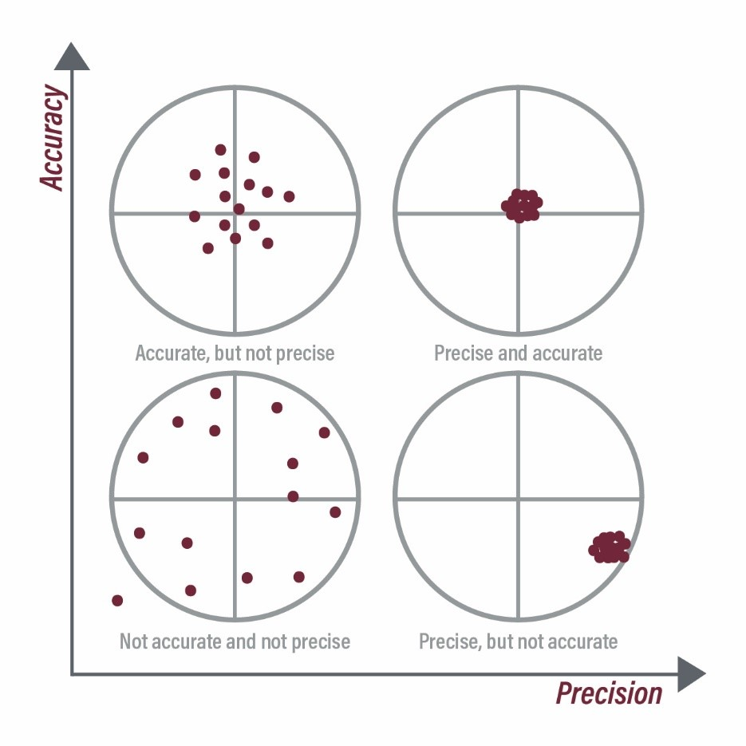
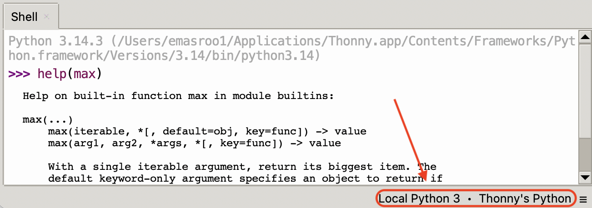

### Loops and Delays {}

[Write a program and save to `code.py`. Your program should:]{.inclass .fragment}

- Light up a blue pixel for as long as button A is pressed.
- Light up a yellow pixel for as long as button B is pressed.
- If a button is not being pressed, the corresponding light should be **off**
- Print a statement about which button is currently pressed every `x` seconds, where `x` is a small number less than one.

::: {.content-hidden unless-meta="uncover"}
#### Solution
```{.python}
from adafruit_circuitplayground.express import cpx
import time

x = 0.2

while True:
    time.sleep(x)
    # This part checks for button A
    if cpx.button_a:
        cpx.pixels[4] = (0,0,50)
        print("Button A pressed")
    else:
        cpx.pixels[4] = (0,0,0)
    
    # This part checks for button B
    if cpx.button_b:
        cpx.pixels[8] = (50,50,0)
        print("Button B pressed")
    else:
        cpx.pixels[8] = (0,0,0)
```
:::

### More about delays inside loops {.scrollable}

- So far, we have used **the same** delay for the print statement and for the logic that checks the buttons
- It is possible to use a different delay for both parts of the code
- [Run the following code]{.inclass}, which will be part of HW 3.
  ```{.python}
  from adafruit_circuitplayground.express import cpx
  import time

  print_freq = 3 # printing should occur once every <-- secs
  loop_interval = 0.1 # while loop should run once every <-- secs

  start_time = time.monotonic()
  while True:
      time.sleep(loop_interval)
      now_time = time.monotonic()-start_time
      # This part checks for button A
      if cpx.button_a:
          cpx.pixels[4] = (0,0,50)
      else:
          cpx.pixels[4] = (0,0,0)
      
      # This part checks for button B
      if cpx.button_b:
          cpx.pixels[8] = (50,50,0)
      else:
          cpx.pixels[8] = (0,0,0)
      
      if abs((now_time % print_freq) - print_freq) < loop_interval:
          # now, print or not.
          if cpx.button_a:
              print("Button A is pressed")
          if cpx.button_b:
              print("Button B is pressed")
          if not cpx.button_a and not cpx.button_b:
              print("No button pressed")
  ```

### Precision and Accuracy of measurements

- Accuracy refers to how close a measurement is to the true value
- A measurement can be _precise_ without necessarily being accurate.

{width="70%" fig-align="center"}

### Quantifying error

- When the true value is known:
  - $\text{Absolute error} = \left|{\text{Measured value }- \text{True Value}} \right|$
  - $\text{Relative error} = \left| \frac{\text{Measured Value }- \text{True Value}}{\text{True value}} \right|$
- These quantify the [accuracy]{.bold}, not the precision
- When the true value is not known a priori:

  - Accuracy cannot be known, but precision can be
  - Quantify the 'spread' of the data to determine how precise measurements are
    - Standard deviation
    - Range (max minus min)
    - Percent spread $\frac{\text{max value }-\text{ min value} }{\text{mean value}} \times 100 \%$

### Functions in Python

- In Python, a function is a piece of code that is packaged into a single command, and can be 'called' --- i.e., the code inside the function can be run using the name of the function.
- The inputs to a function are called its _arguments_
- The output of a function is said to be _returned_ by the function.
- A function with just one input:
  ```{.python}
  def square(a):
    b = a*a
    return b
  ```
- A function with no inputs:
  ```{.python}
  def approx_pi():
    return 3.14
  ```
- A function with two inputs:
  ```{.python}
  def power(a,b):
    return a**b # Python notation for 'power'
  ```

### Where to place functions

#### In the same file

In Python, functions can be placed in the same `.py` file as the rest of your code.

```{.python}
def add(c,d):
  reutrn c + d

print(add(4,5))
```

#### In a different file

Another option is to create a separate file to store all of your functions.

```{.bash}
emasroo1@DXFMY22D36 CIRCUITPY % tree
.
├── boot_out.txt
├── code.py
└── myfuncs.py

1 directory, 3 files
```

Then, you can **import** functions using `from <file name without .py> import <function name>`

```{.python}
from myfuncs import add
print(add(4,5))
```

### Functions and interactive mode (REPL)

- Functions must be **defined** before they can be **used**
- In interactive mode, you must define your functions after every restart
- This is tedious, so you're encouraged to put your functions in a file if you need to use functions in interactive mode.

### Built-in functions and how to use them

You should look up functions in:

- Official Python documentation 
- Official Circuit Python documentation
- The `help` command
  ```{.python}
  >>> help(max)
  Help on built-in function max in module builtins:

  max(...)
      max(iterable, *[, default=obj, key=func]) -> value
      max(arg1, arg2, *args, *[, key=func]) -> value

      With a single iterable argument, return its biggest item. The
      default keyword-only argument specifies an object to return if
      the provided iterable is empty.
      With two or more positional arguments, return the largest argument.
  ```
  - Note that you may need to switch to 'Local Python' because Circuit Python saves space by having smaller documentation files.

    {width="60%"}


### Practice writing functions {.scrollable}

[Write a function that determines the nth Fibonacci sequence number]{.inclass}

Recall that the Fibonacci sequence is $$\{ 1, 1, 2, 3, 5, 8, 13, 21, ... \}$$ where every number is the sum of the two preceding numbers in the sequence.

Hints:

- The `append` function adds on an element to the end of a list
- Access the `n`th element of a list using `name_of_list[n]`
- 'Hardcode' the first two elements of the sequence.
- The last element of a list is accessed by `name_of_list[-1]`.

::: {.content-hidden unless-meta="uncover"}
::: {.fragment}
```{.python}
def fib(n):
    listn = [1,1]
    for i in range(2,n):
        new_num = listn[i-1]+listn[i-2]
        listn.append(new_num)
    return listn[-1]
```
:::
:::


### Measuring $g$ using the Circuit Playground Express {.scrollable}

[Write a program for the Circuit Playground Express]{.inclass} that prints the value of $g$ to the screen, using (1) the z-component of acceleration $a_z$, and (2) the magnitude of acceleration $\sqrt{a_x^2 + a_y^2 + a_z^2}$.

- A function that calculates $\sqrt{a^2 + b^2 + c^2}$
  ```{.python}
  def magnitude(a,b,c):
      return (a**2 + b**2 + c**2)**(1/2)
  ```

- Initialize an empty list
  ```{.python}
  readings = []
  ```

- Decide on the frequency of data collection
  ```{.python}
  delay = 0.1
  ```

- Start collecting data on button press
- Use a `while` or `for` loop to keep collecting data until another button press
  ```{.python}
  # Wait for button A to be pressed to start:
  while not cpx.button_a:
      pass
  # Collect data
  while True:
    # Code to collect data
    if cpx.button_b:
      break
  ```

:::{.content-hidden unless-meta="uncover"}

#### Solution

```{.python}
from adafruit_circuitplayground.express import cpx
import time

def magnitude(a,b,c):
    return (a**2 + b**2 + c**2)**(1/2)


# Create an empty list that will store the readings
readings_z = []
readings = []

# Time delay between measurements
delay = 0.1

while not cpx.button_a:
    pass
    
# Collect data
while True:
    accel_z = cpx.acceleration.z
    accel   = magnitude(cpx.acceleration.x, cpx.acceleration.y,cpx.acceleration.z)
    print(accel_z,accel)
    readings.append(accel)
    readings_z.append(accel)
    time.sleep(delay)
    if cpx.button_b:
        break
```
:::

### Precision + Accuracy of Accelerometer

[Characterize the precision and accuracy of the on-board accelerometer]{.inclass}

Look up the correct value of $g$ at the website of the [National Institute of Standards and Technology](https://physics.nist.gov/cuu/Constants/index.html).

- Use Python to calculate relative error --- this tells us the accuracy.
- Also determine the precision of your measurement, using
  - difference between the largest and smallest values of $g$, as a proportion of the mean value
  - the following functions might help: `max`, `min`, `sum`
- Add print statements to report to user.

