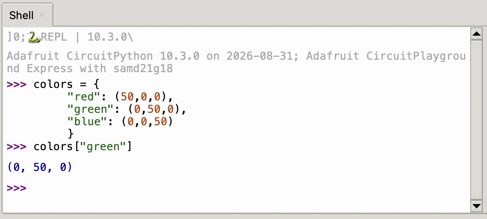
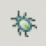
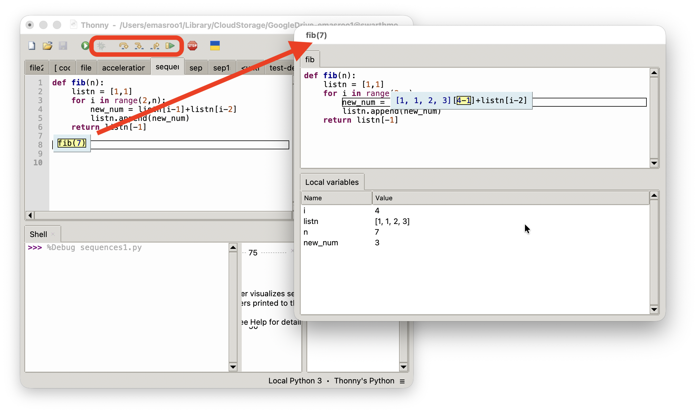
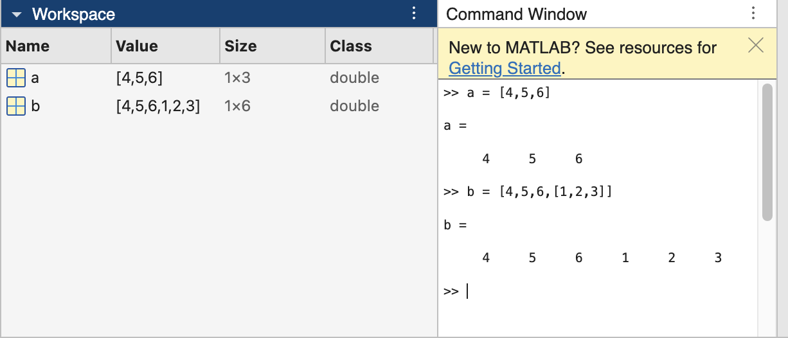
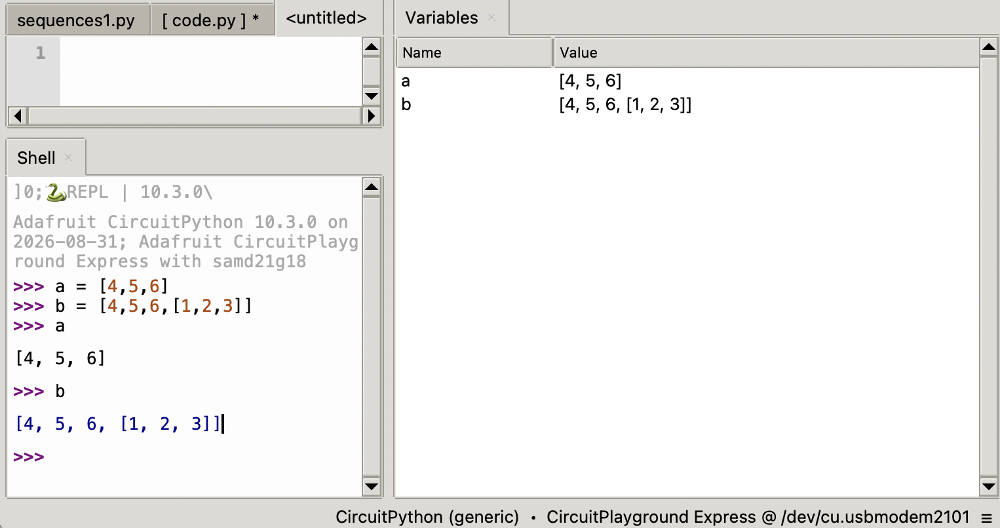

### Announcements

- Test 1 is on Tuesday, Sep 22 8:30 --- 8:55 AM in SCI 199
- Based on Lectures 1 through 4 and HW 1 and 2
- Handwritten, closed-book, closed-notes
- No calculators allowed

### Precision + Accuracy of Accelerometer

[Characterize the precision and accuracy of the on-board accelerometer.]{.inclass} Find true value [here](https://physics.nist.gov/cuu/Constants/index.html).

Download [statisticalfunctions.py](statisticalfunctions.py) and store on `CIRCUITPY`.

- Use the following skeleton code
  ```{.python}
  from adafruit_circuitplayground.express import cpx
  from statisticalfunctions import stdev
  import time

  def magnitude(a,b,c):
      return (a**2 + b**2 + c**2)**(1/2)

  # Create an empty list that will store the readings
  readings = []

  # Time delay between measurements
  delay = 0.1
      
  # Collect data until button b is pressed
  while True:
      # Your code here

  true_value = 9.806
  # Your code here
  ```

Your program should print, for example:

```
After 99 readings, the accelerometer reports 9.417 m/s^2 with standard deviation 0.254 and a spread of 17.4%
```


### Dictionaries in Python

- A dictionary is a collection of key-value pairs.

- For example, we can define a dictionary with RGB values for common colors.
  ```{.python}
  colors = {
      "red": (50,0,0),
      "green": (0,50,0),
      "blue": (0,0,50)
      }
  ```

- To use this dictionary,
  

### Constructing dictionaries

There are two equivalent approaches:

1. Curly braces followed by `key: value` pairs separated by commas:
   ```{.python}
   colors = {"red": (50,0,0),"green": (0,50,0),"blue": (0,0,50)}
   ```
2. The `dict` function
   ```{.python}
   colors = dict([('red', (50,0,0)), ('green', (0,50,0)), ('blue', (0,0,50))])
   ```

::: {.fragment}
::: {.callout-note}
Python allows optional new lines to make code more readable:

- Code all in one line:
  ```{.python}
  colors = dict([('red', (50,0,0)), ('green', (0,50,0)), ('blue', (0,0,50))])
  ```

- Code separated by new lines
  ```{.python}
  colors = dict(
      [
          ('red', (50,0,0)),
          ('green', (0,50,0)),
          ('blue', (0,0,50))
      ])
  ```

:::
:::

### Writing a function to control NeoPixels

[Write a **function** for the Circuit Playground Express that]{.inclass}:

- takes three arguments: 
  - a string denoting the color (choose 5 colors from [`https://rgbcolorpicker.com/`](https://rgbcolorpicker.com/))
  - a number from 0 to 9 denoting which pixel to switch on.
  - a number from 0 to 1 denoting the brightness
    ```{.python}
    cpx.pixels.brightness = 0.5 # sets the brightness to half
    ```
- makes use of a dictionary 

::: {.content-hidden unless-meta="uncover"}
::: {.fragment}

```{.python}
from adafruit_circuitplayground.express import cpx

# Color definitions

mycolors = {
    "red":    (255,0,0),
    "green":  (0,255,0),
    "blue":   (0,0,255),
    "orange": (255,160,0),
    "teal":   (0,255,236)
    }

def lightup(colorname,pixelnum,b):
    color_tuple = mycolors[colorname]
    cpx.pixels[pixelnum] = color_tuple
    cpx.pixels.brightness=b
    return None
```

:::
:::

### Debugging code using Thonny Code Editor

By pressing the  button, Thonny enters debugging mode

::: {.fragment}



:::

### More about Python lists + tuples

- A Python iterable, such as a list or tuple, can contain another iterable
- Python allows lists of lists, etc; MATLAB does not.

::::: {.fragment}
:::: {.columns}
::: {.column width="45%"}

:::
::: {.column width="10%"} 
:::
::: {.column width="45%"}

:::
::::
:::::

- Python allows chaining multiple `[]` commands:

::::: {.fragment}
```{.python}
>>> from adafruit_circuitplayground.express import cpx
>>> cpx.pixels
[(0, 0, 0), (0, 0, 0), (0, 0, 0), (0, 0, 0), (0, 0, 0), (0, 0, 0), (0, 0, 0), (0, 0, 0), (0, 0, 0), (0, 0, 0)]
>>> cpx.pixels[4] = (45,50,2)
>>> cpx.pixels
[(0, 0, 0), (0, 0, 0), (0, 0, 0), (0, 0, 0), (45, 50, 2), (0, 0, 0), (0, 0, 0), (0, 0, 0), (0, 0, 0), (0, 0, 0)]
>>> cpx.pixels[4][1]
50
>>> 
```
:::::

### Reviewing lists vs tuples

Why does this work:
```{.python}
cpx.pixels[6] = (40,0,0)
```

But this does not?
```{.python}
cpx.pixels[6][0] = 40
```


### The Nested `for` loop over a list$^*$ of lists$^*$

$^*$ or any iterables (list, range, tuple)

- Consider the list of lists:
  ```{.python}
  a = [[5,6,7],
       [1,2,9],
       [4,8,3]]
  ```
- [Write a `for` loop]{.inclass} that prints every element in `a`
- [Solution]{.content-hidden unless-meta="uncover"}

  ::: {.content-hidden unless-meta="uncover"}
  ::: {.fragment}
  ```{.python}
  for j in a:
    print(j)
  ```
  :::
  :::

- [Write a pair of nested `for` loops]{.inclass} that print every element inside every element in `a` with the order: 5, 6, 7, ...
- [Solution]{.content-hidden unless-meta="uncover"}

  ::: {.content-hidden unless-meta="uncover"}
  ::: {.fragment}
  ```{.python}
  for thing in a:
      for thing2 in thing:
          print(thing2)
  ```
  :::
  :::

### Nested `for` loops using **indices**

We can print every element in `a` using

```{.python}
  for j in a:
    print(j)
```

- Another approach is to use the **index**:
  ```{.python}
  for k in range(len(a)):
    print(a[k])
  ```
- Use the indices to [print every element inside every element in `a`]{.inclass}:
- [Solution]{.content-hidden unless-meta="uncover"}

  ::: {.content-hidden unless-meta="uncover"}
  ::: {.fragment}
  ```{.python}
  for k in range(len(a)):
      element = a[k]
      for m in range(len(element)):
          entry = element[m]
          print(entry)
  ```
  :::
  :::

- Print every element inside every element in `a` **without using indices**, i.e. no `[]` notation.
- [Solution]{.content-hidden unless-meta="uncover"}

  ::: {.content-hidden unless-meta="uncover"}
  ::: {.fragment}
  ```{.python}
  for thing in a:
      for entry in thing:
          print(entry)
  ```
  :::
  :::

### Two-level loops for the Circuit Playground {.scrollable}

- [Download]{.inclass} the file [`pixelpatterns.py`](pixelpatterns.py) and save it on the `CIRCUITPY` drive

- [Enter the following command]{.inclass} on the Circuit Playground:
  ```{.python}
  from pixelpatterns import *
  ```

- You now have access to three functions: `pattern1()`, `pattern2()` and `pattern_random()`. [Try them out!]{.inclass}

- [Write a program for the CPX]{.inclass} that prints the R, G, and B value of every pixel on a new line. The output of your program should look like this:
  ```
  Pixel number 0, index number 0 has value 76
  Pixel number 0, index number 1 has value 5
  ...
  Pixel number 3, index number 2 has value 21
  Pixel number 4, index number 0 has value 73
  ...
  Pixel number 9, index number 1 has value 2
  Pixel number 9, index number 2 has value 14
  ```

::: {.content-hidden unless-meta="uncover"}
::: {.fragment}
#### Solution

```{.python}
from adafruit_circuitplayground.express import cpx
from pixelpatterns import *
pattern_random() # sets a random pattern
# Read the RGB value for each pixel
for pixel_num in [0,1,2,3,4,5,6,7,8,9]:
    # The variable `pixel_num` is now equal to
    # an integer between 0 and 9 inclusive
    for index in [0,1,2]:
        # The variable `index` is now equal to
        # an integer 0, 1 or 2
        print(f"Pixel number {pixel_num}, index number {index} has value {cpx.pixels[pixel_num][index]}")
```
:::
:::


