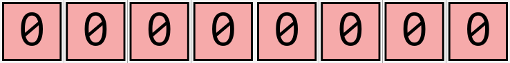
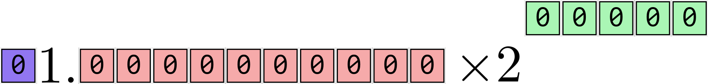
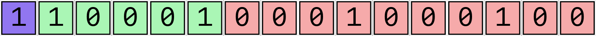
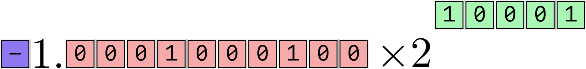
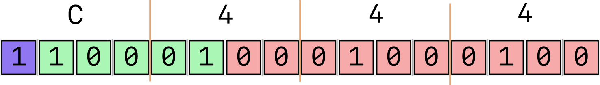

### Test 1 8:30 --- 8:55

- If you are done early you may leave and return by 9:00

### How many 'digits' are needed to store a large number?

[Determine how many 'digits'/bits you need]{.inclass} to represent the number one billion in:

:::: {layout="[0.2, 0.5, 0.3]"}

:::{#}
Decimal

:::{.content-hidden unless-meta="uncover" }
:::{.fragment}
**Answer**: 

`1000000000`

10 digits

:::
:::
:::

:::{#}
Binary

:::{.content-hidden unless-meta="uncover" }
:::{.fragment}
**Answer**: 

`0b111011100110101100101000000000`

30 bits.
:::
:::
:::

:::{#}
Hexadecimal

:::{.content-hidden unless-meta="uncover" }
:::{.fragment}
**Answer**: 

`0x3B9ACA00`

8 bits.
:::
:::
:::

::::

### Range of positive / negative numbers

{width="60%" fig-align="center"}

- With 8 bits, how many binary integers can be stored? [[256]{.emph}]{.fragment}
- Which 256 numbers should we choose?
  - If we only care about positive numbers, we could choose
    - `0`, `1`, `2`, ..., `255`
    - `1000`, `1001`, `1002`, ..., `1255`
  - If we care about positive and negative numbers:
    - `-1`, `0`, `1`, `2`, ... `254`
    - `-2`, `-1`, `0`, `1`, `2`, ... `253`
    - `-10`, `-9`, `-8`, `-7`, `-6`, ... `245`
    - `-128`, `-127`, `-126`, ... `0` ...  `126`, `127`
  - Makes sense to evenly distribute your numbers around zero

### The Sign-Magnitude Representation

[The sign-magnitude representation is one way to represent integers in binary.]{.fragment}

[The most significant bit is reserved for the sign. `1` $\implies$ negative.]{.fragment}

::: {.fragment}

The number $9$

| Sign | $2^7$ | $2^6$ | $2^5$ | $2^4$ | $2^3$ | $2^2$ | $2^1$ | $2^0$ |
| ---- | ---- | ---- | ---- | ---- | ---- | ---- | ---- | ---- | ---- |
| `0` | `0` | `0` | `0` |  `0` |  `1` |  `0` |  `0` |  `1` |

:::

::: {.fragment}

The number $-56$

| Sign | $2^7$ | $2^6$ | $2^5$ | $2^4$ | $2^3$ | $2^2$ | $2^1$ | $2^0$ |
| ---- | ---- | ---- | ---- | ---- | ---- | ---- | ---- | ---- | ---- |
| `1` | `0` | `0` | `1` |  `1` |  `1` |  `0` |  `0` |  `0` |

:::

### Fixed Point Representation of numbers

A **fixed point** number has a 'decimal point' located at a fixed position in the place-value scheme.

Consider two different fixed point decimal representations of the number one hundred, both with 6 decimal digits.

:::: {layout="[0.5, 0.5]"}

:::{#}
A) Decimal point fixed at position 3

[`100.000`]{.fragment}
:::

:::{#}
B) Decimal point fixed at position 2

[`0100.00`]{.fragment}
:::
::::

[Questions to consider:]{.inclass}

1. What is the largest (+) number that can be shown using A and B ? A: `999.999` B: `9999.99`
2. What is the smallest difference between two numbers that can be represented using A and B ? A: `0.001` B: `0.01`

### A rudimentary 'floating point' number system

- With 6 digits and decimal point **fixed** in middle:

::: {.fragment}

| Quantity                | Value     |
| ----------------------- | --------- |
| Largest + Number        | `999.999` |
| Smallest + Number       | `000.001` |
| Increment               | `000.001` |
| Pieces of info to store | six       |

:::

- With 6 digits and decimal point can **float** anywhere:

:::{.fragment}

| Quantity                | Value     |
| ----------------------- | --------- |
| Largest + Number        | `999999.` |
| Smallest + Number       | `.000001` |
| Increment               | depends   |
| Pieces of info to store | six + one |

:::

### A 6-digit decimal floating-point representation needs to tell you ...

1. What each of the 6 digits are. 
   - Possibilities: 0 to 9

2. Where the decimal point is:
   - 7 options 
     - `000000.`
     - `00000.0`
     - `0000.00`
     - `000.000`
     - `00.0000`
     - `0.00000`
     - `.000000`

### Instead ... use 'Scientific Notation'

Recall the scientific notation of numbers: $$-2.34 \times 10^5$$

- This conveys three pieces of information:
  - The sign
  - 3 digits for the number
  - 1 digit for the exponent
- Note that the $a \times 10^{b}$ structure is **assumed** and does not need to be stored every time the computer stores a number.

### Standard (IEEE) Format for 16-bit floating-point binary numbers

{width=90% fig-align="center"} 

- 1 bit stores the sign
- 10 bits store the number, known as the _significand_. $1$ is assumed to be the 11th bit, but it is **not stored**.
- 5 bits store the exponent.
  - Smallest 5-bit binary number `00000`$= 0$ and largest 5-bit binary number `11111`$=$ 31
  - To get **negative exponents**, we assume a [bias]{.emph} in the exponent bits.
  - Subtract fifteen from the exponent.
- The _structure_ of the number is assumed; only the 16-bit _content_ is stored in computer's memory.
- Need 16 bits of memory to store this number.

### Place Value Notation for numbers smaller than 1

- 1 is a special number in the place value system. 
- A 'decimal point' --- a more ecumenical name would be 'fractional point' --- is needed to show any numbers smaller than 1.
- To interpret the number `003.0025`,

::: {.fragment}

| Place | $10^2$ | $10^{1}$ | $10^{0}$ | $.$ | $10^{-1}$ | $10^{-2}$ | $10^{-3}$ | $10^{-4}$ |
| ----- | ------ | -------- | -------- | --- | --------- | --------- | --------- | --------- |
| Value | `0`    | `0`      | `3`      | `.` | `0`       | `0`       | `2`       | `5`       |
|       | `0`    | `0`      | $3\times 10^{0}$      |  | `0`       | `0`       | $2 \times 10^{-3}$       | $5 \times 10^{-4}$       |

:::

### Interpreting a 16-bit binary float {.scrollable}

[Float Toy](https://evanw.github.io/float-toy/){.fragment}

[With the IEEE format, the 16 bits]{.fragment}

{.fragment}

[represent the number]{.fragment}

{.fragment}

[which, in binary form, should be intepreted as $$-1.0001000100_2 \times 2^{(10001_2 \text{ minus fifteen})}$$]{.fragment}

[The exponent is `0b10001` minus fifteen, i.e., $17 - 15 = 2$]{.fragment}

[The significand is $$- \left( 1 \times 2^{0} + 1 \times 2^{-4} + 1 \times 2^{-8} \right) $$]{.fragment}

[$$ = - \left( 1 + \frac{1}{16} + \frac{1}{256} \right)$$]{.fragment}

[$$ = - \left( \frac{256}{256} + \frac{16}{256} + \frac{1}{256} \right) = - \frac{273}{256} = -1.066406250$$]{.fragment}

[So the number is $-1.066406250 \times 2^{2} = \fbox{-4.265625}$]{.fragment}

### Hex short-form

- Binary numbers are very long
- Hexadecimal is often used as a short form.
- A 16-bit binary number is a 4-bit hexadecimal number

{.fragment}

- So the number `0b1100010001000100` is often written as `0xC444`.

### Practice with 16-bit binary floats

- [Find the binary representation of `0x5248` and convert it to decimal form using the IEEE standard.]{.fragment}

In binary, this number is: 

- `5`: `0101`
- `2`: `0010`
- `4`: `0100`
- `8`: `1000`
- `0x5248` = `0b0101001001001000`

Interpreting it using the IEEE standard, we get

which is $$+1.1001001000_2 \times 2^{5}$$

$$= 1 \times 2^{0} + 1 \times 2^{-1} + 1 \times 2^{-4} + 1 \times 2^{-7} = 1 + \frac{1}{2} + \frac{1}{16} + \frac{1}{128}$$

$$= \frac{128}{128} + \frac{64}{128} + \frac{8}{128} + \frac{1}{128}$$

$$ = \frac{201}{128} = 1.5703125$$

### The IEEE Standard for floating-point numbers

| Size   | Sign | Significand | Exponent | Bias | Colloquial     |
| ------ | ---- | ----------- | -------- | ---- | -------------- |
| 16-bit | 1    | 10          | 5        | 15   | Half precision |
| 32-bit | 1    | 23          | 8        | 127  | Half precision |
| 64-bit | 1    | 52          | 11       | 1023 | Half precision |

