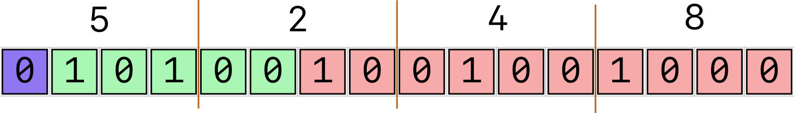
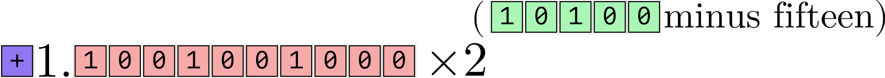
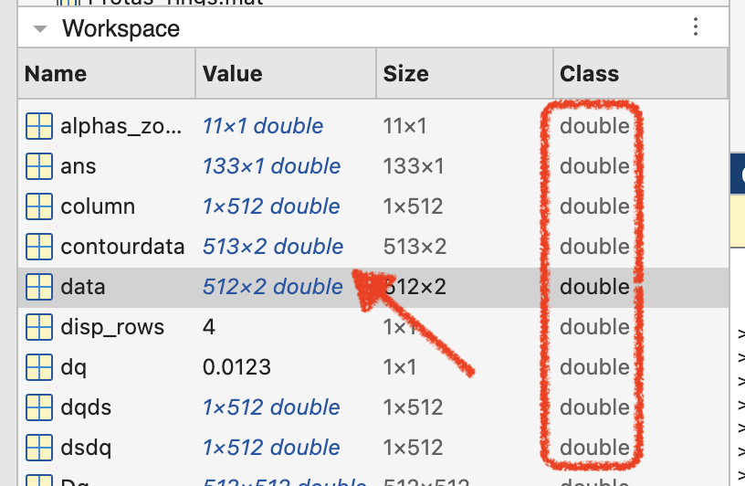
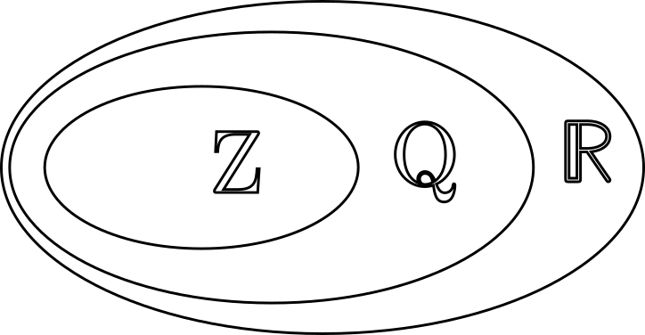
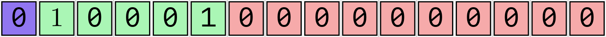
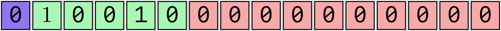
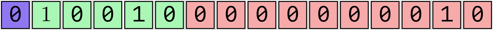
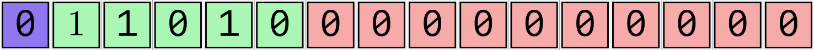
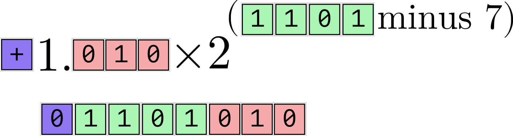
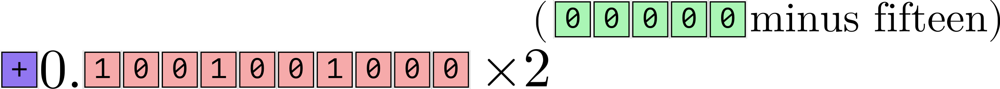

### Practice with 16-bit binary floats {.scrollable}

[[Find the binary representation]{.inclass} of `0x5248` and convert it to decimal form using the IEEE standard.]{.fragment}

:::: {.content-visible when-meta="uncover"}

[In binary, this number is:]{.fragment}

[`5`: `0101` ---]{.fragment} [`2`: `0010` ---]{.fragment} [`4`: `0100` ---]{.fragment} [`8`: `1000`]{.fragment}

[`0x5248` = `0b0101001001001000`]{.fragment}

{.fragment}

[Interpreting it using the IEEE standard, we get]{.fragment}

{.fragment}

[which is $$+1.1001001000_2 \times 2^{5}$$]{.fragment}

[$$= 2^5 \times \left( 1 \times 2^{0} + 1 \times 2^{-1} + 1 \times 2^{-4} + 1 \times 2^{-7} \right)$$]{.fragment} 

[$$= 32 \times \left(1 + \frac{1}{2} + \frac{1}{16} + \frac{1}{128} \right)$$]{.fragment}

[$$= 32 \times \left( \frac{128}{128} + \frac{64}{128} + \frac{8}{128} + \frac{1}{128} \right) $$]{.fragment}

[$$ = 32 \times \frac{201}{128} = \frac{201}{4} =  50.25$$]{.fragment}

::::

### 8-, 16-, 32- and 64- bit floating point numbers {.smaller}

- 16-bit floating point binary numbers are limited in their range and precision.
- Early computers used to use 8-bit numbers
- Modern computations are usually done in 64-bit.
  (That's why MATLAB calls numbers `double`)

  {width="25%"}

::: {.fragment}

#### The [IEEE 754](https://en.wikipedia.org/wiki/IEEE_754) Standard

| Size   | Sign | Significand | Exponent | Bias | Colloquial       |
| ------ | ---- | ----------- | -------- | ---- | ---------------- |
| 8-bit  | 1    | 3           | 4        | 7    | Minifloat        |
| 16-bit | 1    | 10          | 5        | 15   | Half precision   |
| 32-bit | 1    | 23          | 8        | 127  | Single precision |
| 64-bit | 1    | 52          | 11       | 1023 | Double precision |

:::

- [Use [Float Toy](https://evanw.github.io/float-toy/) to find the largest possible number of each kind.]{.inclass}

### Procedure for interpreting IEEE Floats

1. Interpret exponent bits as an integer
2. Subtract bias from this integer to get the exponent, or power of 2.
3. Interpret significand as the binary digits in the number $1.xxxxxxxxxx$
   (unless it's a subnormal number)
4. Multiply significand with $2^{\text{exponent}}$
5. Interpret sign bit as negative if `1`, positive if `0`.

### The need for floating-point numbers

- [Real numbers]{.emph} $\mathbb{R}$ are an uncountably infinite set.
- [Rational numbers]{.emph} $\mathbb{Q}$ form a dense subset of $\mathbb{R}$
  - You can squeeze an infinite number of rational numbers between any two given real numbers
    {width="50%"}
- All [integers]{.emph} $\mathbb{Z}$ are also rational numbers.

::: {.fragment}
{.absolute bottom=300 right=0 width="40%"}
:::

- Floating point numbers are rational numbers !!!!!

### Floating Point numbers on the number line

::: {.fragment}

:::

- Between $2^{-14}$ and $2^{+16}$, there are $2^{10} = 1,024$ **16-bit floats** between **each** successive power of 2.
  - There are 1,024 '16-bit floats' between 4 and 8. Seems enough to cover any quantity we would need (?)
    - The number 4 is:
      
      [$1.00...00 \times 2^{17-15} = 4$]{.content-visible when-meta="uncover"}
    - The next-biggest number is:
      
      [$1.00...01_2 \times 2^{17-15} = \left( 1 + \frac{1}{2^{10}}\right) \times 2^2$]{.content-visible when-meta="uncover"}

      [$= \frac{1025}{1024} \times 4 = \frac{1025}{256} \approx 4.0039$]{.content-visible when-meta="uncover"}

### Increments of Floating Point Numbers {.scrollable}

Let's look at three consecutive floating point numbers.

- The number 8:

  :::: {.columns}
  ::: {.column width="50%"}
  
  :::

  ::: {.column width="50%"}
  $1.00...00 \times 2^{18-15} = 8$
  :::
  ::::
- The next-bigger 16-bit float:

  :::: {.columns}
  ::: {.column width="50%"}
  
  :::

  ::: {.column width="50%"}
  $1.00...01_2 \times 2^{18-15}$

  $= \left(1 + \frac{1}{2^{10}} \right) \times 2^{3}$

  $= \frac{1025}{1024} \times 8 = \frac{1025}{128} \approx 8.0078$
  :::
  ::::
- The next-bigger 16-bit float:

  :::: {.columns}
  ::: {.column width="50%"}
  
  :::

  ::: {.column width="50%"}
  ::: {.content-visible when-meta="uncover"}
  $1.00...010_2 \times 2^{18-15}$

  $= \left(1 + \frac{1}{2^{9}} \right) \times 2^{3}$

  $= \frac{513}{512} \times 8 = \frac{513}{64} \approx 8.0156$
  :::
  :::
  ::::
- Increment between successive numbers:
  $$ 8 \rightarrow 8.0078 \rightarrow 8.0156 \rightarrow \dots $$
- Putting this into fractions
  $$ 8 \rightarrow \frac{1025}{128} \rightarrow \frac{513}{64} \rightarrow \dots $$
- or, even better:
  $$ \frac{1024}{128} \rightarrow \frac{1025}{128} \rightarrow \frac{1026}{128} \rightarrow \dots $$
- [Increment between $2^3$ and below $2^4$ is $\frac{1}{128} = 2^{-7} = 0.0078125$]{.emph}

### Floating Point numbers on the number line

::: {.fragment}

:::

- There are 1,024 '16-bit floats' between 2048 and 4096. Seems enough to cover any quantity we would need (????)
  - The number 2048 is:
    
    $1.00...00 \times 2^{26-15} = 2048$
  - The next-biggest number is:
    
    [$1.00...01_2 \times 2^{27-15} = \left( 1 + \frac{1}{2^{10}}\right) \times 2^12$]{.content-visible when-meta="uncover"}

    [$= \frac{1025}{1024} \times 2048 = 2050$]{.content-visible when-meta="uncover"}
- The increment between $2^{11}$ and $2^{12}$ appears to be ... $2$

### Loss of precision in Floating Point Numbers

- IEEE Floating point numbers are the most precise near 1.0
  - e.g., near $1.0$, the 16- bit floating point numbers are:

    [$\displaystyle \left( 1, 1 + \frac{1}{1024}, 1 + \frac{1}{512}, 1 + \frac{1}{512} + \frac{1}{1024} \right)$]{.fragment}

    [$\displaystyle = \left( \frac{1024}{1024}, \frac{1025}{1024}, \frac{1026}{1024}, \frac{1027}{1024}\right)$]{.fragment}

    [$\approx \left(1, 1.001, 1.002, 1.003, ... \right)$]{.fragment}
  - For large values, they start losing precision. Near 2048:

    [$\left( 2048, 2050, 2052, ...\right)$]{.fragment}
- All floats lose precision the further away you get from 1
- Solution: Use more bits!

### Note: Floating Point numbers can be positive or negative

- The sign bit ensures that for every positive number there is a corresponding negative number
- Floats are arranged symmetrically about zero.
- There is a 'negative zero' and a 'positive zero'
- `NaN`s show up on both positive and negative sides of the number line

### Floating point numbers on a linear-scale number line

**(Instead of using a log scale like before)**

- For illustrative purposes, let's use 8-bit floats:
  
  
  
  - 8-bit floats have 4 exponent bits (bias 7), 1 sign bit, and 3 significand bits.

{.fragment}

### Machine Epsilon

- Machine Epsilon ($\varepsilon$) is a measure of how precise a floating-point number system is.
- The smaller the $\varepsilon$, the more precise your number system is.
- Machine Epsilon for a floating point number system is defined as [the difference between 1 and the next-bigger number]{.emph} in that system.

| Number System             | Machine Epsilon                        |
| ------------------------- | -------------------------------------- |
| Minifloat (8 bit)         | $2^{-3} = 1.25 \times 10^{-1}$         |
| Half Precision (16 bit)   | $2^{-10} \approx 9.77 \times 10^{-4}$  |
| Single Precision (32 bit) | $2^{-23} \approx 1.19 \times 10^{-7}$  |
| Double Precision (64 bit) | $2^{-52} \approx 2.22 \times 10^{-16}$ |

### Subnormal numbers and `NaN`s

- `NaN` stands for 'Not A Number'. For example, the result of dividing by zero.
  - The largest exponent (`11111` for 16-bit numbers) is reserved for `NaN`.
  - [Find the largest possible 16-bit floating-point number]{.inclass}
- The smallest exponent (`00000` for 16-bit numbers) is treated specially.
  - Normally, we would expect to interpret them as $2^{0-15} \times 1.0001000101_2$ etc.
  - Instead, the smallest exponent (`00000`) is assumed to represent $2^{-14}$, the same as `00001`. To get smaller numbers, the _significand_ is changed from, e.g., $1.0001000101_2$ to $0.0001000101_2$

::: {.fragment}
::: {.columns}
::: {.column width="50%"}

#### Regular 16-bit floats

:::
::: {.column width="50%"}

#### Subnormal 16-bit floats

:::
:::
:::

