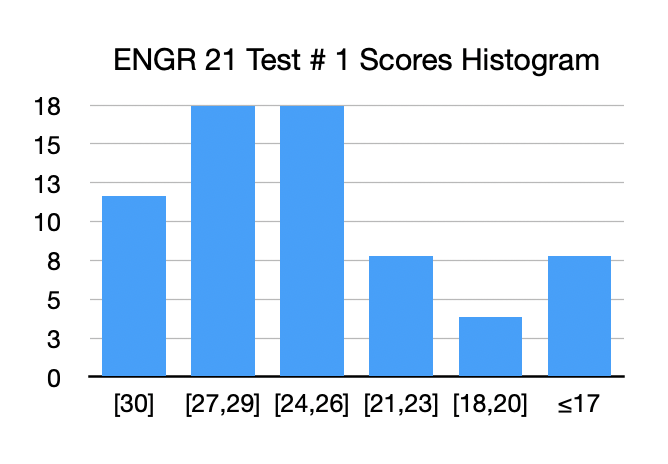
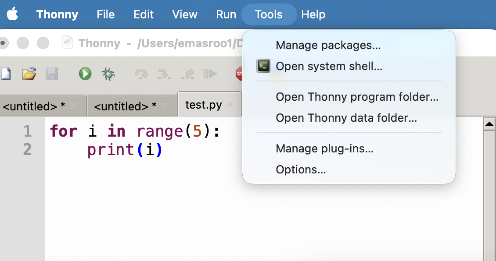
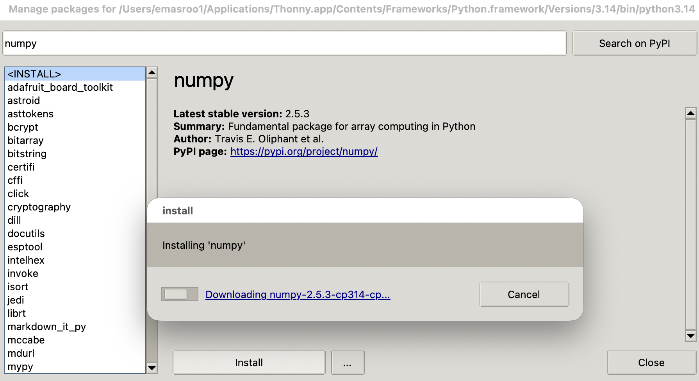
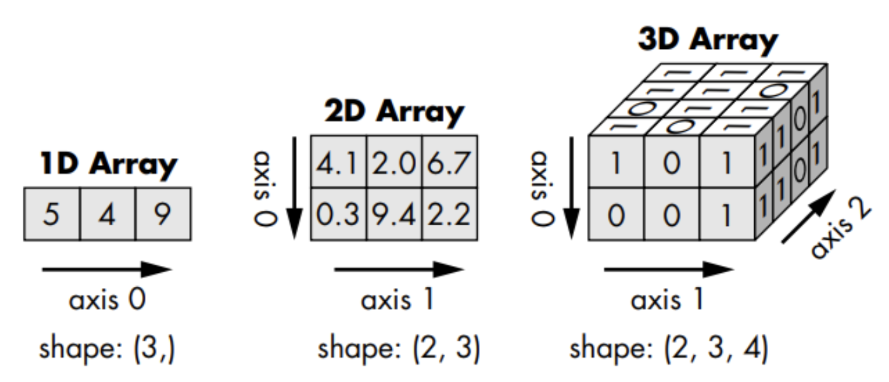

### Test 1 + Survey

::: {.content-hidden unless-meta="uncover"}
{width="50%" fig-align="center"}
:::

[Mid-semester survey](https://forms.gle/MFhkMcsvSU9Uq7Q5A)

### Installing `numpy` with Thonny Code Editor

::: {layout-ncol=2}
 


:::

### `numpy` arrays

::: {layout-ncol=2}
- `numpy` arrays are objects of type `numpy.ndarray`

- The `numpy.array()` function creates `numpy.ndarray` objects

::: {.fragment}
```{.python}
>>> a = numpy.array([0.4, 6, -0.9])
>>> a
array([ 0.4,  6. , -0.9])
>>> type(a)
<class 'numpy.ndarray'>
>>> 
```
:::
:::

- Arrays in `numpy` are similar to lists.
  - They can be indexed
  - Their elements are mutable
  - They are iterable --- can be used with `for` loops
- Arrays also have some differences compared to lists
  - Unlike lists, one array can have only one type of element
  - Appending is [possible](https://numpy.org/doc/stable/reference/generated/numpy.append.html#numpy-append) but discouraged --- pre-allocate!

### Importing the package

- After installing `numpy` for your version of Python, you need to **import** `numpy` in any code you write.
- A common approach is:
  ```{.python}
  import numpy as np
  a = np.array([1,2.5,3])
  ```
  This shortens `numpy.<function name>` to `np.<function name>` and has no other function.
- Other approaches that work:
  - Import using full name
    ```{.python}
    import numpy
    a = numpy.array([1,2.5,3])
    ```
  - Import specific functions only
    ```{.python}
    from numpy import array
    a = array([1,2.5,3])
    ```

### `numpy` arrays are inherently n-dimensional

- In Python lists, we used the concept of a _list of lists_ to encode two-dimensional information.

::: {layout-ncol=2}
::: {.fragment}
#### Native Python Approach
```{.python}
pattern3 = [["p", "p", "t", "g"],
            ["p", "p", "g", "t"],
            ["t", "g", "p", "p"],
            ["g", "t", "p", "p"]]
print(pattern3[1][2])
```
:::

::: {.fragment}
#### `numpy` Approach
```{.python}
p= np.array([["p", "p", "t", "g"],
            ["p", "p", "g", "t"],
            ["t", "g", "p", "p"],
            ["g", "t", "p", "p"]])
print(p[1,2])
```
:::
:::

- Looks similar, but now you should think **matrix**
- Access multi-dimensional arrays using the `[row,column]` syntax
- For example, `p[1,2]` will give  the string`"g"`

### `numpy` arrays support vectorized operations

- In regular Python, lists aren't very useful for manipulating many numbers.
- By default, the mathematical/boolean operators work element by element.

::: {layout-ncol=2}
::: {.fragment}
#### Native Python Approach
```{.python}
>>> f1 = [[0.3, 0.5, 0.6],
          [0.2, -0.3, 0.7]]
>>> f1 + 100
Traceback (most recent call last):
  File "<stdin>", line 1, in <module>
TypeError: can only concatenate list ...
```
:::

::: {.fragment}
#### `numpy` Approach
```{.python}
>>> f = np.array([[0.3, 0.5, 0.6],
                  [0.2,-0.3, 0.7]])
>>> f + 100
array([[100.3, 100.5, 100.6],
       [100.2,  99.7, 100.7]])
>>> f ** 2
array([[0.09, 0.25, 0.36],
       [0.04, 0.09, 0.49]])
>>> f = np.array([[0.3, 0.5, 0.6],
                  [0.2,-0.3, 0.7]])
>>> g = np.array([[0.2, 0.5, -0.6],[0.2,-0.3,1.9]])
>>> f == g
array([[False,  True, False],
       [ True,  True, False]])
```
:::
:::


### More about n-dimensional arrays



Numpy arrays have a property **shape**

::: {.fragment}
```{.python}
>>> f = np.array([[0.3, 0.5, 0.6],
                  [0.2,-0.3, 0.7]])
>>> f.shape
(2, 3)
>>> np.shape(f)
(2, 3)
```
:::

- The **shape** tells you how many rows and columns an array has.
- If there are more than two dimensions, there is no name for the third and higher 'rows/columns'.

### `numpy` and floating-point binary numbers

- By default, all numbers in `numpy` are 64-bit floating point binary numbers.
  ```{.python}
  >>> a = np.array([0.3])
  >>> type(a)
  <class 'numpy.ndarray'>
  >>> type(a[0])
  <class 'numpy.float64'>
  >>> 
  ```
- You can choose numbers with a different precision.
  ```{.python}
  a1 = np.float16(3.2)
  a2 = np.float32(4.2)
  a3 = np.float64(5.2)
  ```

### One-dimensional arrays vs. Two-dimensional arrays

```{.python}
from numpy.random import random
```

::: {layout-ncol=2}
#### A 5-element 1-dimensional array
```{.python}
>>> a = random(5)
>>> a
array([0.57549695, 
       0.81646336, 
       0.80189814, 
       0.11415026, 
       0.62458897])
```

#### A 5x1-element 2-dimensional array
```{.python}
>>> b = random((5,1))
>>> b
array([[0.32551251],
       [0.54539388],
       [0.97696562],
       [0.53288049],
       [0.13886612]])
```

:::

### Manipulating Data in `numpy`

[Download the data file [here](Temp_data.txt)]{.inclass} and look at the official documentation [here](https://numpy.org/doc/)

Consists of 3 days of temperature data recorded at half-hour intervals.

::: {layout-ncol=2}
1. Reformat the data in the form of an N rows, 2 column `numpy` array.
2. Save the data as `csv` files for the three days separately.


  - `array()`
  - `zeros()`
  - `reshape`
  - `append`
  - `flatten`
  - `transpose`
  - `savetxt`
  - `loadtxt`
:::

### Exploring floating-point numbers with `numpy`

[Try out the following code and explain the behavior]{.inclass}. Make sure you use `immport numpy as np` first.

::: {layout-ncol=2}
```{.python}
z  = np.float16(128)
z1 = np.float16(0.2)
print(z + z1 + z1 + z1)
```

```{.python}
y  = np.float16(16)
y1 = np.float16(0.2)
print(y + y1 + y1 + y1)
```

:::

::: {layout-ncol=2}
```{.python}
v  = np.float32(1048576)
v1 = np.float32(0.2)
v2 = v + v1 + v1 + v1
print(f"{v2:9.2f}")
```


:::
